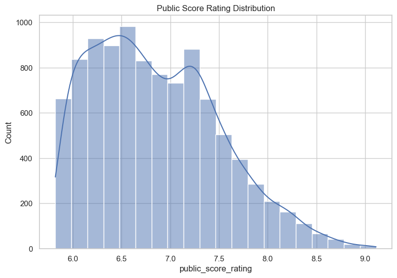
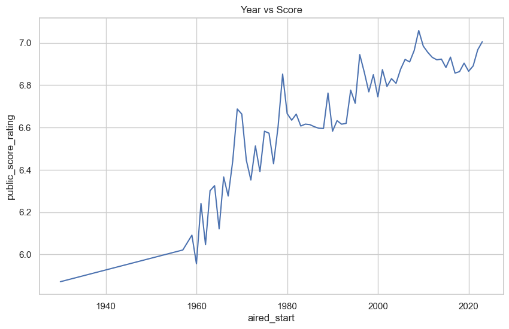
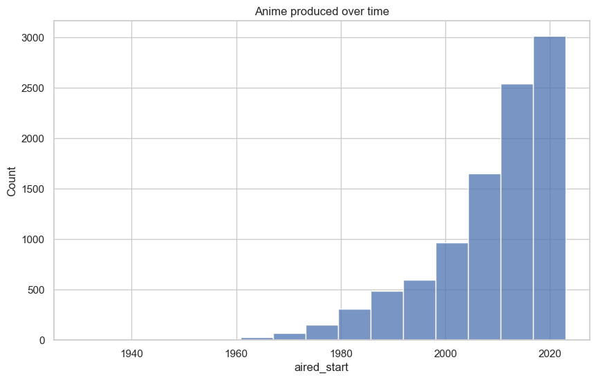
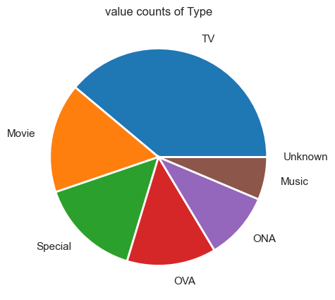
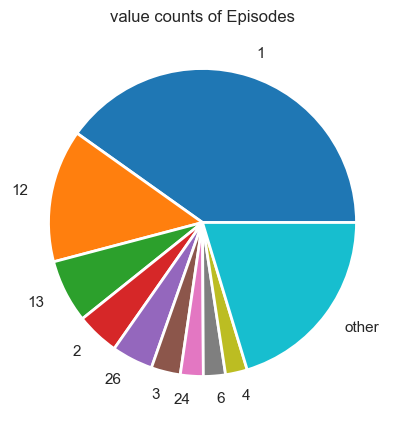
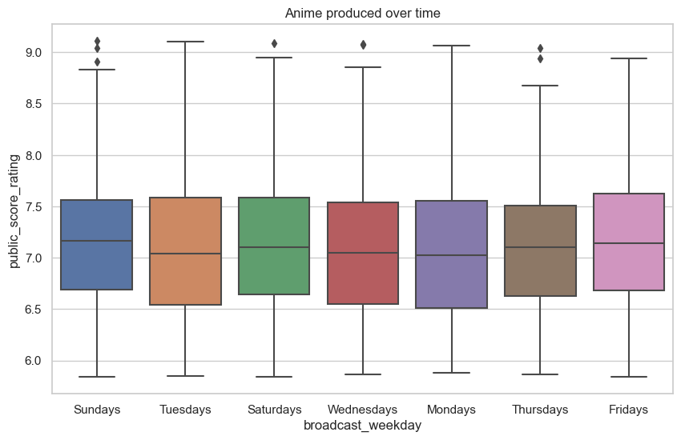
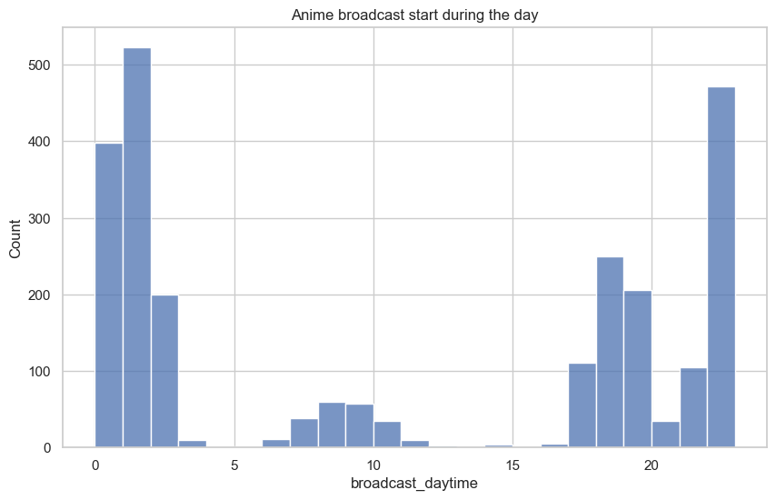
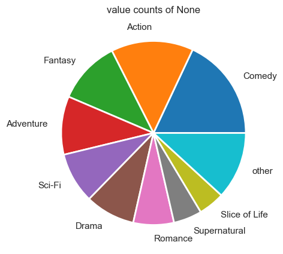
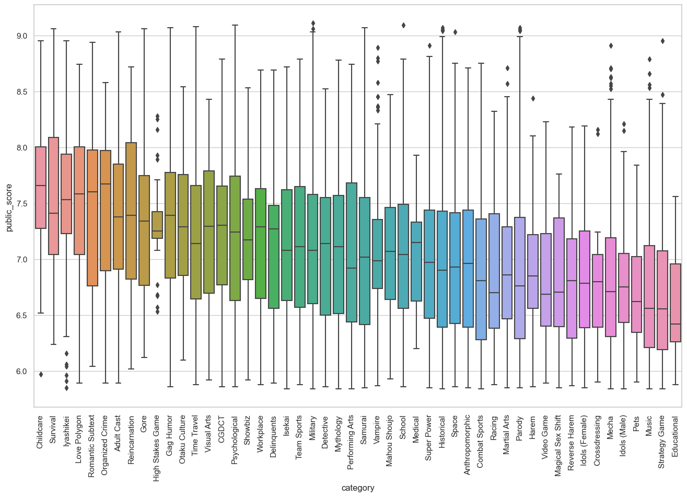
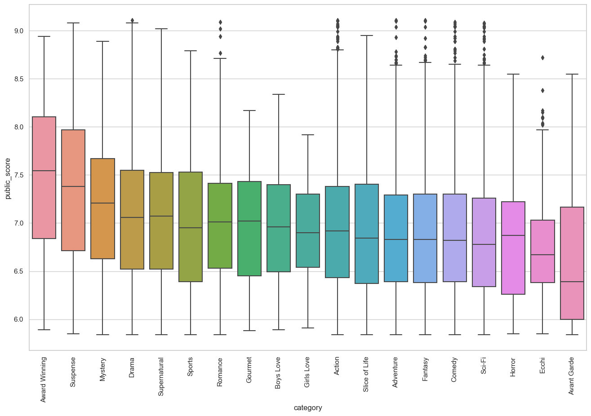

# Anime Recomendations systems

The data science team at myanimelist.net wants to improve their site and create a recommendation system using machine learning techniques to recommend animes to users. Information is webscraped to construct an anime database, then two recommendation systems are built using a content filtering system and a collaborative filtering system.  

A recommender using content-based filtering was constructed using the features of the anime, such as genre, and description. The content-based recommendation system is proficient at detecting the sequels of the anime based on their plot lines, however, it led to a dry and repetitive user experience as the recommended content is too similar. 
Next, user information was gathered and a recommender using the collaborative filtering was built. Five different algorithms were cross validated, of which, the SVD algorithm performed the best and was implemented into the system. The results were investigated using a sample user, and the results from this method were accurate in their predictions. 

Given the already robust database that myanimelist.net has, both approaches would have no restrictions if they are implemented, although a collaborative filtering approach seems to produce the more accurate results and is the favoured approach to use. However, based on the results of this study, a hybrid approach may need to be used to take the strengths of each method. 


# Building Concent reccomendation system

The first section of this report will focus on building a content-based recommender system. A content filtering recommendation system works by analyzing the content of the items and using that information to identify other items that are similar in terms of their content. In this case, this could be features such as the plot of the series, similar genres, characters, etc. 
 
The analysis for the content recommendation systems will be as follows:  

1. Data on the 10,000 anime will be scraped and cleaned. This notebook uses the results from the webscraping code, which can be found in other notebooks
2. Data exploration and feature engineering will be performed to find outliers, trends, and correlations.  
3. A content recommendation system will be built by finding similar shows in specific categories.


```python
import numpy as np
from bs4 import BeautifulSoup
import requests
import re
import requests
import lxml.html as lh
import pandas as pd
import pickle
import os 
import scipy.stats as stats
import seaborn as sns
import matplotlib.pyplot as plt

pd.options.mode.chained_assignment = None  # default='warn'

from sklearn.feature_extraction.text import CountVectorizer, TfidfVectorizer
from sklearn.cluster import KMeans
from sklearn.metrics.pairwise import cosine_similarity, linear_kernel
from sklearn.decomposition import PCA
```

## EDA: Exploring the data 

The purpose of this segment is to get familiar with the data. This is to see if the human eye can detect any outliers and manually remove them. Also, this is a good chance to do some feature engineering and see if any of the features are a strong indicator of score. 

Some things to explore might be: 

1. Are there any outliers in each of the categories: 
    - are there anime with more than x studios, producers, demographics
2. If the featuers are categorical, What are the categories of each feature and how many? 

Some questions might include: 
1. is studio correlated with score? 
2. is time of production correlated with score? 
3. does genre have a correlation with score? 
4. can I analyze the top 100 anime of all time and see what common trends I see. 
5. average studio production rating. 


Another key process is feature engineering, which is the process of selecting the most relevant features, or variables for a model. During this process, it is also worth investigating if any of the features would be a key predictor in determining the public rating. 
Below, the outputs printed shows the percentage of missing values for each of the features in the anime details dataframe. To reduce the number of variables, features can be eliminated based on their lack of data and whether or not they duplicate information from another column. For instance, the column “aired_start” which is the start broadcast date, is reliable, while its counterpart “aired_end”  can be removed as it has too many missing values. It can also be observed that combining the columns from “genre” and “genres” into “genres_overall” did have a significant effect because the null values in the column were reduced to 7%. Although ‘genres_overall’ has the majority of the records filled, “themes_overall” and “demographics_overall” still have many missing values. Since themes and demographics has somewhat of an overlap with the information provided by genres, they will be removed due to the data being relatively unreliable. 


```python
top_anime_all_table = pd.read_csv('/Users/rayenfeng/Documents/code/anime_rec_project/data_sources_pickle/all_anime_directory.csv')
#top_anime_all_table.head()
```


```python
# import clean frame 
with open('/Users/rayenfeng/Documents/code/anime_rec_project/data_sources_pickle/all_anime_details_frame_no_nan_cvas.pkl', 'rb') as f:
    all_anime_details_frame_no_nan_cvas = pickle.load(f)
```


```python
with open('/Users/rayenfeng/Documents/code/anime_rec_project/data_sources_pickle/anime_info_frame_cleaned_main.pkl', 'rb') as f:
    anime_info_frame_cleaned = pickle.load(f)
```


```python
# percentage of missing values per column, use columns with less missing for more data reliability. 

print("Percent Missing")
anime_info_frame_cleaned.isna().sum() * 100/ len(anime_info_frame_cleaned)
```

    Percent Missing


    English                 42.77
    Type                     0.00
    Episodes                 0.00
    Status                   0.00
    aired_start              1.99
    aired_end               44.28
    premiered               61.09
    broadcast_weekday       74.20
    broadcast_daytime       74.72
    producers               35.44
    studios                 12.27
    source                   0.00
    genres_multi            30.69
    genres_singular         76.99
    genres_overall           7.68
    themes_singular         60.54
    themes_multi            70.29
    themes_overall          30.83
    demographic_singular    64.40
    demographics_multi      99.21
    demographics_overall    63.61
    duration_in_min          0.08
    public_score_rating      0.00
    popularity               0.00
    Favorites                0.00
    Completed                0.00
    On-Hold                  0.00
    Dropped                  0.00
    Plan to Watch            0.00
    Total                    0.00
    dtype: float64


### Score distribution 

A key feature is “public_score_rating”, which is the average score that users give a certain anime. This can be plotted on a histogram to see the rating distribution. The below figure shows the rating score distribution and as expected, the distribution is skewed to the right, with the average score being about 6.9. It is important to note that this data was scraped in order of user ranking, therefore, the expected mean is slightly lower than what is shown.


```python
plt.subplots(figsize=(9,6))
sns.set_theme(style="whitegrid")
sns.histplot(data=anime_info_frame_cleaned, x="public_score_rating", bins = 20, kde = True)
plt.title('Public Score Rating Distribution')
anime_info_frame_cleaned.describe().round(1)
```


<div>
<style scoped>
    .dataframe tbody tr th:only-of-type {
        vertical-align: middle;
    }

    .dataframe tbody tr th {
        vertical-align: top;
    }

    .dataframe thead th {
        text-align: right;
    }
</style>
<table border="1" class="dataframe">
  <thead>
    <tr style="text-align: right;">
      <th></th>
      <th>Episodes</th>
      <th>aired_start</th>
      <th>aired_end</th>
      <th>duration_in_min</th>
      <th>public_score_rating</th>
      <th>popularity</th>
      <th>Favorites</th>
      <th>Completed</th>
      <th>On-Hold</th>
      <th>Dropped</th>
      <th>Plan to Watch</th>
      <th>Total</th>
    </tr>
  </thead>
  <tbody>
    <tr>
      <th>count</th>
      <td>10000.0</td>
      <td>9801</td>
      <td>5572</td>
      <td>9992.0</td>
      <td>10000.0</td>
      <td>10000.0</td>
      <td>10000.0</td>
      <td>10000.0</td>
      <td>10000.0</td>
      <td>10000.0</td>
      <td>10000.0</td>
      <td>10000.0</td>
    </tr>
    <tr>
      <th>mean</th>
      <td>14.4</td>
      <td>2008-12-17 17:05:49.311294720</td>
      <td>2008-12-19 11:16:03.962670336</td>
      <td>29.0</td>
      <td>6.9</td>
      <td>6324.2</td>
      <td>982.0</td>
      <td>53621.1</td>
      <td>2119.5</td>
      <td>2567.1</td>
      <td>19067.7</td>
      <td>82313.8</td>
    </tr>
    <tr>
      <th>min</th>
      <td>1.0</td>
      <td>1929-10-14 00:00:00</td>
      <td>1962-02-25 00:00:00</td>
      <td>0.2</td>
      <td>5.8</td>
      <td>1.0</td>
      <td>0.0</td>
      <td>0.0</td>
      <td>0.0</td>
      <td>1.0</td>
      <td>13.0</td>
      <td>180.0</td>
    </tr>
    <tr>
      <th>25%</th>
      <td>1.0</td>
      <td>2003-08-01 00:00:00</td>
      <td>2003-09-25 00:00:00</td>
      <td>13.0</td>
      <td>6.3</td>
      <td>2610.5</td>
      <td>3.0</td>
      <td>1054.8</td>
      <td>55.0</td>
      <td>92.0</td>
      <td>878.0</td>
      <td>2452.8</td>
    </tr>
    <tr>
      <th>50%</th>
      <td>4.0</td>
      <td>2012-04-07 00:00:00</td>
      <td>2012-01-26 00:00:00</td>
      <td>24.0</td>
      <td>6.8</td>
      <td>5624.5</td>
      <td>17.0</td>
      <td>5472.5</td>
      <td>219.0</td>
      <td>221.5</td>
      <td>3588.0</td>
      <td>10733.0</td>
    </tr>
    <tr>
      <th>75%</th>
      <td>13.0</td>
      <td>2017-10-06 00:00:00</td>
      <td>2017-09-26 06:00:00</td>
      <td>26.0</td>
      <td>7.3</td>
      <td>9680.2</td>
      <td>148.0</td>
      <td>32157.0</td>
      <td>1110.2</td>
      <td>1184.0</td>
      <td>15501.8</td>
      <td>55669.0</td>
    </tr>
    <tr>
      <th>max</th>
      <td>3057.0</td>
      <td>2022-12-01 00:00:00</td>
      <td>2023-01-08 00:00:00</td>
      <td>168.0</td>
      <td>9.1</td>
      <td>18239.0</td>
      <td>210883.0</td>
      <td>3133727.0</td>
      <td>168119.0</td>
      <td>203501.0</td>
      <td>586370.0</td>
      <td>3580542.0</td>
    </tr>
    <tr>
      <th>std</th>
      <td>49.2</td>
      <td>NaN</td>
      <td>NaN</td>
      <td>27.3</td>
      <td>0.7</td>
      <td>4332.2</td>
      <td>6279.9</td>
      <td>167132.2</td>
      <td>6788.4</td>
      <td>7588.8</td>
      <td>40923.0</td>
      <td>224824.1</td>
    </tr>
  </tbody>
</table>
</div>


    

    


### Date vs score

Another feature is the air date, which is the date which an anime started it’s broadcast. Figure 8 is a plot showing the average anime score in each year. As shown in the graph, it can be seen that the average anime rating seems to increase over time, especially starting from 1970. This is most likely because over the years, the production quality advanced with available technology. This along with anime being more popular in recent times may be a factor for the increase in score. This is shown by Figure 9, where the number of anime produced every year increases.


```python
# rating by year 

info_by_year = anime_info_frame_cleaned.groupby(pd.Grouper(key='aired_start', axis=0, freq='Y'))['public_score_rating'].mean()
plt.subplots(figsize=(10,6))
sns.set_theme(style="whitegrid")
plt.title('Year vs Score')
sns.lineplot(data=info_by_year)

plt.show()

plt.subplots(figsize=(10,6))
plt.title('Anime produced over time')
sns.histplot(data=anime_info_frame_cleaned, x="aired_start", bins = 15)
```


    

    


    <Axes: title={'center': 'Anime produced over time'}, xlabel='aired_start', ylabel='Count'>


    

    


```python
# anime produced in 1929 seems to be an outlier, this is highlighted
anime_info_frame_cleaned[anime_info_frame_cleaned['aired_start'] == anime_info_frame_cleaned['aired_start'].min()]
```


<div>
<style scoped>
    .dataframe tbody tr th:only-of-type {
        vertical-align: middle;
    }

    .dataframe tbody tr th {
        vertical-align: top;
    }

    .dataframe thead th {
        text-align: right;
    }
</style>
<table border="1" class="dataframe">
  <thead>
    <tr style="text-align: right;">
      <th></th>
      <th>English</th>
      <th>Type</th>
      <th>Episodes</th>
      <th>Status</th>
      <th>aired_start</th>
      <th>aired_end</th>
      <th>premiered</th>
      <th>broadcast_weekday</th>
      <th>broadcast_daytime</th>
      <th>producers</th>
      <th>...</th>
      <th>demographics_overall</th>
      <th>duration_in_min</th>
      <th>public_score_rating</th>
      <th>popularity</th>
      <th>Favorites</th>
      <th>Completed</th>
      <th>On-Hold</th>
      <th>Dropped</th>
      <th>Plan to Watch</th>
      <th>Total</th>
    </tr>
  </thead>
  <tbody>
    <tr>
      <th>5875</th>
      <td>The Stolen Lump</td>
      <td>Movie</td>
      <td>1</td>
      <td>Finished Airing</td>
      <td>1929-10-14</td>
      <td>NaT</td>
      <td>NaN</td>
      <td>NaN</td>
      <td>NaT</td>
      <td>NaN</td>
      <td>...</td>
      <td>NaN</td>
      <td>10.0</td>
      <td>5.871</td>
      <td>8952</td>
      <td>2</td>
      <td>2581</td>
      <td>18</td>
      <td>75</td>
      <td>448</td>
      <td>3177</td>
    </tr>
  </tbody>
</table>
<p>1 rows × 30 columns</p>
</div>


### Data information on Episode Number and Type 


```python
def plot_pie_value_counts(series, sep_num):

    val_counts = series.value_counts()#.sort_values(ascending = False)
    first_sec = val_counts[:sep_num]
    other_sec = val_counts[sep_num:].sum()
    
    
    if other_sec > 0: 

        first_sec['other'] = other_sec

    plt.subplots(figsize=(6, 5))
    colors = sns.color_palette('tab10')
    plt.pie(first_sec,
            labels=first_sec.index,
            labeldistance=1.15,
            wedgeprops = { 'linewidth' : 2, 'edgecolor' : 'white'},
           colors = colors,)
    plt.title('value counts of ' + str(series.name))
    plt.show()

```


```python
plot_pie_value_counts(anime_info_frame_cleaned['Type'], 7) 
```


    

    


```python
plot_pie_value_counts(anime_info_frame_cleaned['Episodes'], 9)
```


    

    


### Aired time and weekday vs score 

Another feature to investigate is the effect of broadcast time on the user score. Below is a boxplot that shows the average user score by weekday, while the following plot is a distribution of the number of shows that are broadcast during the day. It can be seen that the weekday does not make a significant difference in determining the score, however, it does seem that there are popular times to broadcast anime. As expected, there is a strong correlation with broadcast time with the school schedule, with most shows start broadcasting when students come home from school or stay up late into the night.


```python
plt.subplots(figsize=(10,6))
plt.title('Anime produced over time')
sns.boxplot(data = anime_info_frame_cleaned, x= 'broadcast_weekday', y="public_score_rating") #, order=my_order)

#data=info_by_year, x = info_by_year.index,  y="public_score_rating")
```


    <Axes: title={'center': 'Anime produced over time'}, xlabel='broadcast_weekday', ylabel='public_score_rating'>


    

    


```python
hour_counts = anime_info_frame_cleaned['broadcast_daytime'].apply(lambda x: x.hour)

plt.subplots(figsize=(10,6))
plt.title('Anime broadcast start during the day')
sns.histplot(data=hour_counts, bins = 23)
```


    <Axes: title={'center': 'Anime broadcast start during the day'}, xlabel='broadcast_daytime', ylabel='Count'>


    

    


```python
# print(anime_info_frame_cleaned['studios'].dropna().apply(lambda y: len(y)).value_counts())
# print(anime_info_frame_cleaned['producers'].dropna().apply(lambda y: len(y)).value_counts())

# get list of anime with studios greater than 3 
len_of_studios = anime_info_frame_cleaned['studios'].dropna().apply(lambda y: len(y))
len_greater_studio = list(len_of_studios[len_of_studios > 3].index)
anime_info_frame_cleaned[anime_info_frame_cleaned['studios'].index.isin(len_greater_studio)]
```


<div>
<style scoped>
    .dataframe tbody tr th:only-of-type {
        vertical-align: middle;
    }

    .dataframe tbody tr th {
        vertical-align: top;
    }

    .dataframe thead th {
        text-align: right;
    }
</style>
<table border="1" class="dataframe">
  <thead>
    <tr style="text-align: right;">
      <th></th>
      <th>English</th>
      <th>Type</th>
      <th>Episodes</th>
      <th>Status</th>
      <th>aired_start</th>
      <th>aired_end</th>
      <th>premiered</th>
      <th>broadcast_weekday</th>
      <th>broadcast_daytime</th>
      <th>producers</th>
      <th>...</th>
      <th>demographics_overall</th>
      <th>duration_in_min</th>
      <th>public_score_rating</th>
      <th>popularity</th>
      <th>Favorites</th>
      <th>Completed</th>
      <th>On-Hold</th>
      <th>Dropped</th>
      <th>Plan to Watch</th>
      <th>Total</th>
    </tr>
  </thead>
  <tbody>
    <tr>
      <th>10178</th>
      <td>NaN</td>
      <td>Special</td>
      <td>4</td>
      <td>Finished Airing</td>
      <td>2011-01-07</td>
      <td>2013-03-24</td>
      <td>NaN</td>
      <td>NaN</td>
      <td>NaT</td>
      <td>[NHK]</td>
      <td>...</td>
      <td>[Josei]</td>
      <td>25.0</td>
      <td>7.371</td>
      <td>4292</td>
      <td>51</td>
      <td>7407</td>
      <td>886</td>
      <td>507</td>
      <td>10460</td>
      <td>20787</td>
    </tr>
    <tr>
      <th>42161</th>
      <td>Pokétoon</td>
      <td>ONA</td>
      <td>8</td>
      <td>Finished Airing</td>
      <td>2020-06-04</td>
      <td>2021-12-28</td>
      <td>NaN</td>
      <td>NaN</td>
      <td>NaT</td>
      <td>[Nintendo, Creatures Inc.]</td>
      <td>...</td>
      <td>[Kids]</td>
      <td>8.0</td>
      <td>7.351</td>
      <td>7228</td>
      <td>14</td>
      <td>1732</td>
      <td>682</td>
      <td>247</td>
      <td>1443</td>
      <td>5779</td>
    </tr>
    <tr>
      <th>28149</th>
      <td>Japan Anima(tor)'s Exhibition</td>
      <td>ONA</td>
      <td>35</td>
      <td>Finished Airing</td>
      <td>2014-11-07</td>
      <td>2015-10-09</td>
      <td>NaN</td>
      <td>NaN</td>
      <td>NaT</td>
      <td>[Dwango]</td>
      <td>...</td>
      <td>NaN</td>
      <td>8.0</td>
      <td>7.341</td>
      <td>3198</td>
      <td>123</td>
      <td>12289</td>
      <td>4178</td>
      <td>1963</td>
      <td>15517</td>
      <td>38424</td>
    </tr>
    <tr>
      <th>49357</th>
      <td>Star Wars: Visions</td>
      <td>ONA</td>
      <td>9</td>
      <td>Finished Airing</td>
      <td>2021-09-22</td>
      <td>NaT</td>
      <td>NaN</td>
      <td>NaN</td>
      <td>NaT</td>
      <td>[Twin Engine]</td>
      <td>...</td>
      <td>NaN</td>
      <td>15.0</td>
      <td>7.131</td>
      <td>2122</td>
      <td>379</td>
      <td>46872</td>
      <td>2900</td>
      <td>2486</td>
      <td>20000</td>
      <td>78538</td>
    </tr>
    <tr>
      <th>6867</th>
      <td>Halo Legends</td>
      <td>ONA</td>
      <td>8</td>
      <td>Finished Airing</td>
      <td>2009-11-07</td>
      <td>2010-02-16</td>
      <td>NaN</td>
      <td>NaN</td>
      <td>NaT</td>
      <td>[Casio Entertainment]</td>
      <td>...</td>
      <td>NaN</td>
      <td>14.0</td>
      <td>6.991</td>
      <td>3154</td>
      <td>192</td>
      <td>28256</td>
      <td>699</td>
      <td>895</td>
      <td>8662</td>
      <td>39534</td>
    </tr>
    <tr>
      <th>4094</th>
      <td>Batman: Gotham Knight</td>
      <td>OVA</td>
      <td>6</td>
      <td>Finished Airing</td>
      <td>2008-07-08</td>
      <td>NaT</td>
      <td>NaN</td>
      <td>NaN</td>
      <td>NaT</td>
      <td>[Cyclone Graphics]</td>
      <td>...</td>
      <td>NaN</td>
      <td>12.0</td>
      <td>6.941</td>
      <td>3749</td>
      <td>62</td>
      <td>21344</td>
      <td>250</td>
      <td>325</td>
      <td>5776</td>
      <td>28174</td>
    </tr>
    <tr>
      <th>2832</th>
      <td>NaN</td>
      <td>Special</td>
      <td>15</td>
      <td>Finished Airing</td>
      <td>2007-06-07</td>
      <td>2007-06-27</td>
      <td>NaN</td>
      <td>NaN</td>
      <td>NaT</td>
      <td>NaN</td>
      <td>...</td>
      <td>NaN</td>
      <td>1.0</td>
      <td>6.721</td>
      <td>4201</td>
      <td>9</td>
      <td>13809</td>
      <td>446</td>
      <td>277</td>
      <td>6981</td>
      <td>21996</td>
    </tr>
    <tr>
      <th>38022</th>
      <td>Monster Strike the Animation</td>
      <td>ONA</td>
      <td>63</td>
      <td>Finished Airing</td>
      <td>2018-07-08</td>
      <td>2019-12-31</td>
      <td>NaN</td>
      <td>NaN</td>
      <td>NaT</td>
      <td>[XFLAG]</td>
      <td>...</td>
      <td>NaN</td>
      <td>10.0</td>
      <td>6.681</td>
      <td>7681</td>
      <td>8</td>
      <td>863</td>
      <td>239</td>
      <td>349</td>
      <td>2844</td>
      <td>5042</td>
    </tr>
    <tr>
      <th>37290</th>
      <td>Animation × Paralympic: Who Is Your Hero?</td>
      <td>Special</td>
      <td>15</td>
      <td>Finished Airing</td>
      <td>2017-11-10</td>
      <td>2022-08-22</td>
      <td>NaN</td>
      <td>NaN</td>
      <td>NaT</td>
      <td>[NHK, NHK Enterprises]</td>
      <td>...</td>
      <td>NaN</td>
      <td>5.0</td>
      <td>6.481</td>
      <td>11999</td>
      <td>2</td>
      <td>146</td>
      <td>100</td>
      <td>128</td>
      <td>392</td>
      <td>1043</td>
    </tr>
  </tbody>
</table>
<p>9 rows × 30 columns</p>
</div>


### Genre, Theme and Demographic vs Score?


```python
themes_overall_s_1 = anime_info_frame_cleaned['themes_overall'].dropna()
themes_overall_df_1 = pd.DataFrame(item for item in themes_overall_s_1).set_index(themes_overall_s_1.index)

demographics_overall_s_1 = anime_info_frame_cleaned['demographics_overall'].dropna()
demographics_overall_df_1 = pd.DataFrame(item for item in demographics_overall_s_1).set_index(demographics_overall_s_1.index)

genres_overall_s_1 = anime_info_frame_cleaned['genres_overall'].dropna()
genres_overall_df_1 = pd.DataFrame(item for item in genres_overall_s_1).set_index(genres_overall_s_1.index)

print('\n*********** Themes value counts ***********\n')
print(pd.Series(themes_overall_df_1.values.flatten()).value_counts())
print('\n*********** demographics value counts ***********\n')
print(pd.Series(demographics_overall_df_1.values.flatten()).value_counts())
print('\n*********** Genres value counts ***********\n')
print(pd.Series(genres_overall_df_1.values.flatten()).value_counts())

```

    
    *********** Themes value counts ***********
    
    School               1410
    Music                1024
    Mecha                 855
    Historical            737
    Military              489
    Super Power           444
    Mythology             387
    Martial Arts          362
    Space                 355
    Adult Cast            341
    Parody                340
    Harem                 320
    Psychological         297
    Isekai                217
    Detective             213
    Team Sports           197
    Mahou Shoujo          197
    Idols (Female)        196
    Gag Humor             183
    Strategy Game         182
    CGDCT                 176
    Iyashikei             173
    Samurai               143
    Gore                  123
    Vampire               120
    Anthropomorphic       114
    Workplace             105
    Time Travel           102
    Video Game             98
    Idols (Male)           86
    Racing                 74
    Performing Arts        72
    Love Polygon           68
    Combat Sports          67
    Otaku Culture          67
    Reincarnation          64
    Visual Arts            62
    Survival               57
    Pets                   55
    Reverse Harem          55
    Childcare              43
    Organized Crime        40
    Romantic Subtext       38
    Educational            34
    Medical                32
    High Stakes Game       30
    Delinquents            29
    Showbiz                26
    Crossdressing          25
    Magical Sex Shift      22
    Name: count, dtype: int64
    
    *********** demographics value counts ***********
    
    Shounen    1729
    Seinen      704
    Kids        650
    Shoujo      550
    Josei        85
    Name: count, dtype: int64
    
    *********** Genres value counts ***********
    
    Comedy           3951
    Action           3161
    Fantasy          2436
    Adventure        2246
    Sci-Fi           1957
    Drama            1917
    Romance          1560
    Supernatural     1090
    Slice of Life    1008
    Mystery           645
    Ecchi             624
    Sports            461
    Horror            269
    Suspense          144
    Award Winning     136
    Boys Love          90
    Gourmet            79
    Avant Garde        75
    Girls Love         73
    Name: count, dtype: int64


```python
genre_val = pd.Series(genres_overall_df_1.values.flatten()).dropna()
plot_pie_value_counts(genre_val, 9)
```


    

    


```python
# function to convert dataframe to long form for easier manipulation 

def convert_to_long(overall_df_1):
    
    public_score_series = top_anime_all_table[['id', 'public_score']].set_index('id')
    public_score_series

    df_stacked = overall_df_1.stack().to_frame()

    a = pd.DataFrame(df_stacked[0].values.tolist(), index = df_stacked.index)
    stacked_df = a.reset_index().drop(columns = ['level_1']).rename(columns={"level_0": "id", 0: "category"})
    b = stacked_df.set_index('id').join(public_score_series)

    return b
```


```python
# function to plot category

def plot_category(b):
    
    sns.set(rc={'figure.figsize':(16,10)})
    sns.set_theme(style="whitegrid", palette="Set2")
    plt.xticks(rotation = 90)
    
    # Find the order
    my_order = b.groupby(by=["category"])["public_score"].mean().sort_values(ascending = False).index

    # plot boxplot
    sns.boxplot(data=b, x="category", y="public_score", order=my_order)

    plt.show()

```


```python
genres_overall_long = convert_to_long(genres_overall_df_1)
demographics_overall_long = convert_to_long(demographics_overall_df_1)
themes_overall_long = convert_to_long(themes_overall_df_1)
```


```python
plot_category(themes_overall_long)
```


    

    


```python
plot_category(genres_overall_long)
```


    

    


The above is a boxplot showing the average score of a show separated by genre. As expected, there seems to be minor differences in the average rating of the shows in relation to the genre. For instance, shows that have the “Award winning” genre score significantly better than those with “Avant Garde” genre. However, with the shows in the middle, it’s hard to tell a significant difference between the averages of the scores. For examples, genres such as mystery accounts for a small percentage of shows while shows with comedy as its genre can have an extremely wide range of ratings since people have different senses of humor. Due to the variance between the samples and the broad range that can be labeled with a genre, it is hard to attribute genre as a determining factor for the score of the anime.

### Production Studio vs Score


```python
# get list of studio by score. 

studios_s_1 = anime_info_frame_cleaned['studios'].dropna()
studios_df_1 = pd.DataFrame(item for item in studios_s_1).set_index(studios_s_1.index)
studios_overall_long = convert_to_long(studios_df_1)
studios_overall_long =studios_overall_long.rename(columns={"category": "studio"})

studio_mean_scores = studios_overall_long.groupby('studio').mean().sort_values(by = 'public_score', ascending = False)
studio_prod_counts = studios_overall_long['studio'].value_counts().rename('counts')#.head(50)

studio_avg_score_rank = studio_mean_scores.join(studio_prod_counts).reset_index()

print('------ Studios with highest average ranking anime ------\n  ')
display(studio_avg_score_rank.head(10))
print('------ Studios with highest average anime score with more than 20 animes produced ------\n  ')
studio_avg_score_rank[studio_avg_score_rank['counts'] > 20].head(20)
```

    ------ Studios with highest average ranking anime ------
      


<div>
<style scoped>
    .dataframe tbody tr th:only-of-type {
        vertical-align: middle;
    }

    .dataframe tbody tr th {
        vertical-align: top;
    }

    .dataframe thead th {
        text-align: right;
    }
</style>
<table border="1" class="dataframe">
  <thead>
    <tr style="text-align: right;">
      <th></th>
      <th>studio</th>
      <th>public_score</th>
      <th>counts</th>
    </tr>
  </thead>
  <tbody>
    <tr>
      <th>0</th>
      <td>K-Factory</td>
      <td>8.403333</td>
      <td>3</td>
    </tr>
    <tr>
      <th>1</th>
      <td>Studio Bind</td>
      <td>8.350000</td>
      <td>3</td>
    </tr>
    <tr>
      <th>2</th>
      <td>Egg Firm</td>
      <td>8.292500</td>
      <td>4</td>
    </tr>
    <tr>
      <th>3</th>
      <td>Nippon Ramayana Film Co.</td>
      <td>8.250000</td>
      <td>1</td>
    </tr>
    <tr>
      <th>4</th>
      <td>Studio Signpost</td>
      <td>8.060000</td>
      <td>3</td>
    </tr>
    <tr>
      <th>5</th>
      <td>AHA Entertainment</td>
      <td>7.920000</td>
      <td>1</td>
    </tr>
    <tr>
      <th>6</th>
      <td>Studio Chizu</td>
      <td>7.917500</td>
      <td>4</td>
    </tr>
    <tr>
      <th>7</th>
      <td>Samsara Animation Studio</td>
      <td>7.870000</td>
      <td>1</td>
    </tr>
    <tr>
      <th>8</th>
      <td>Frontier One</td>
      <td>7.850000</td>
      <td>1</td>
    </tr>
    <tr>
      <th>9</th>
      <td>Studio Massket</td>
      <td>7.800000</td>
      <td>1</td>
    </tr>
  </tbody>
</table>
</div>


    ------ Studios with highest average anime score with more than 20 animes produced ------
      


<div>
<style scoped>
    .dataframe tbody tr th:only-of-type {
        vertical-align: middle;
    }

    .dataframe tbody tr th {
        vertical-align: top;
    }

    .dataframe thead th {
        text-align: right;
    }
</style>
<table border="1" class="dataframe">
  <thead>
    <tr style="text-align: right;">
      <th></th>
      <th>studio</th>
      <th>public_score</th>
      <th>counts</th>
    </tr>
  </thead>
  <tbody>
    <tr>
      <th>29</th>
      <td>Kyoto Animation</td>
      <td>7.433103</td>
      <td>116</td>
    </tr>
    <tr>
      <th>30</th>
      <td>Wit Studio</td>
      <td>7.425902</td>
      <td>61</td>
    </tr>
    <tr>
      <th>35</th>
      <td>CloverWorks</td>
      <td>7.383488</td>
      <td>43</td>
    </tr>
    <tr>
      <th>42</th>
      <td>Bones</td>
      <td>7.337361</td>
      <td>144</td>
    </tr>
    <tr>
      <th>43</th>
      <td>White Fox</td>
      <td>7.329070</td>
      <td>43</td>
    </tr>
    <tr>
      <th>45</th>
      <td>David Production</td>
      <td>7.322500</td>
      <td>44</td>
    </tr>
    <tr>
      <th>46</th>
      <td>MAPPA</td>
      <td>7.321475</td>
      <td>61</td>
    </tr>
    <tr>
      <th>55</th>
      <td>ufotable</td>
      <td>7.288906</td>
      <td>64</td>
    </tr>
    <tr>
      <th>57</th>
      <td>Bandai Namco Pictures</td>
      <td>7.287727</td>
      <td>44</td>
    </tr>
    <tr>
      <th>59</th>
      <td>Lerche</td>
      <td>7.265091</td>
      <td>55</td>
    </tr>
    <tr>
      <th>69</th>
      <td>Shaft</td>
      <td>7.235645</td>
      <td>124</td>
    </tr>
    <tr>
      <th>70</th>
      <td>Studio Ghibli</td>
      <td>7.234390</td>
      <td>41</td>
    </tr>
    <tr>
      <th>78</th>
      <td>Trigger</td>
      <td>7.203200</td>
      <td>25</td>
    </tr>
    <tr>
      <th>81</th>
      <td>A-1 Pictures</td>
      <td>7.199378</td>
      <td>209</td>
    </tr>
    <tr>
      <th>86</th>
      <td>GoHands</td>
      <td>7.186400</td>
      <td>25</td>
    </tr>
    <tr>
      <th>88</th>
      <td>Seven Arcs</td>
      <td>7.182857</td>
      <td>28</td>
    </tr>
    <tr>
      <th>92</th>
      <td>Production I.G</td>
      <td>7.177816</td>
      <td>293</td>
    </tr>
    <tr>
      <th>95</th>
      <td>Manglobe</td>
      <td>7.171935</td>
      <td>31</td>
    </tr>
    <tr>
      <th>98</th>
      <td>P.A. Works</td>
      <td>7.148367</td>
      <td>49</td>
    </tr>
    <tr>
      <th>100</th>
      <td>8bit</td>
      <td>7.135472</td>
      <td>53</td>
    </tr>
  </tbody>
</table>
</div>


An initial assumption was made stating that certain studios can influence the rating of the show, hence, an investigation was done to see if the production studio can predict the quality of work. At first, it can be seen certain studios do have a much higher rating, however, this is because the studios have worked on a fewer anime which have scored high. Since there are many factors that go into the enjoyment of the show such as plot, voice acting etc., it is hard to pinpoint the studio is the main factor for the anime’s success. Thus, with a small sample size of shows produced, it is hard to say that these studios have a impact on the score. The above tables show a list of 20 studios which have produced over 25 anime along with their overall rank and average score of all the anime they produced. This table shows that if the studios that have produced less than 20 anime are removed, there is no major difference in the scores, with the first of which being “Kyoto Animations” which is already ranked 29th. 

# Designing the content recommendation system. 

After the data has been cleaned and processed, the data can be used in a content recommendation system.  

As mentioned previously, the concept of a content-filtering recommendation method is to find similar shows similar to the current one that a user is interested in. The general methodology is to convert the text to vector format and then use cosine similarity to generate similarity matrix. This matrix would simple be ranked and then read to extract the top recommended shows.  

Again, the most relevant features need to be extracted. As explored in the previous sections, the most relevant information will be the following features of a given anime. The chosen features will include description, genres, studios, voice actors, staff, and characters as they are expected to have the highest impact when finding similar anime.  

The following procedure is to eliminate the null values. Any record with a null value from any category will be removed. This reduced the sample size by 30%, from the initial 10,000 anime records to a total of 6,975 records. The reduction effect was mitigated as features with many missing values such as “themes” or “demographic” were removed. The remaining sample size is reasonable considering that all the values for every feature was retained. A sample of this table is shown.


```python
anime_info_frame_cleaned
anime_info_frame_cleaned.isna().sum()
anime_info_f_master_fil = anime_info_frame_cleaned[['Type', 'Episodes', 'Status',
                                                    'aired_start', 'studios', 'source',
                                                    'genres_overall', 'duration_in_min', 
                                                    'public_score_rating','popularity']]

print('\n**** Filtered Frame NA counts ****\n')
print(anime_info_f_master_fil.isna().sum())
# dorp na values 
anime_info_f_master_fil_nona = anime_info_f_master_fil.dropna()
```

    
    **** Filtered Frame NA counts ****
    
    Type                      0
    Episodes                  0
    Status                    0
    aired_start             199
    studios                1227
    source                    0
    genres_overall          768
    duration_in_min           8
    public_score_rating       0
    popularity                0
    dtype: int64


```python
### make dataframe columns with list to text and format for machine learning 

# display(all_anime_details_frame_no_nan_cvas)

### join characters, staff and VA to info dataframe 
anime_info_dataset_master1 = anime_info_f_master_fil_nona.join(all_anime_details_frame_no_nan_cvas , how = 'inner')
anime_info_dataset_master_lists = anime_info_dataset_master1[['studios', 'genres_overall', 
                                                              'characters',  'voice_actors', 'staff']]

anime_info_dataset_master_lists2 = anime_info_dataset_master_lists.applymap(lambda xs: ', '.join(str(x) for x in xs))
anime_info_dataset_master1[['studios', 'genres_overall','characters',  'voice_actors', 'staff']] = anime_info_dataset_master_lists2[['studios', 'genres_overall', 'characters',  'voice_actors', 'staff']]
ds = anime_info_dataset_master1.reset_index()
ds
```


<div>
<style scoped>
    .dataframe tbody tr th:only-of-type {
        vertical-align: middle;
    }

    .dataframe tbody tr th {
        vertical-align: top;
    }

    .dataframe thead th {
        text-align: right;
    }
</style>
<table border="1" class="dataframe">
  <thead>
    <tr style="text-align: right;">
      <th></th>
      <th>index</th>
      <th>Type</th>
      <th>Episodes</th>
      <th>Status</th>
      <th>aired_start</th>
      <th>studios</th>
      <th>source</th>
      <th>genres_overall</th>
      <th>duration_in_min</th>
      <th>public_score_rating</th>
      <th>popularity</th>
      <th>characters</th>
      <th>voice_actors</th>
      <th>staff</th>
      <th>description</th>
    </tr>
  </thead>
  <tbody>
    <tr>
      <th>0</th>
      <td>5114</td>
      <td>TV</td>
      <td>64</td>
      <td>Finished Airing</td>
      <td>2009-04-05</td>
      <td>Bones</td>
      <td>Manga</td>
      <td>Action, Adventure, Drama, Fantasy</td>
      <td>24.0</td>
      <td>9.111</td>
      <td>3</td>
      <td>Edward_Elric, Alphonse_Elric, Roy_Mustang, Mae...</td>
      <td>Romi_Park, Rie_Kugimiya, Shinichiro_Miki, Keij...</td>
      <td>Justin_Cook, Noritomo_Yonai, Yasuhiro_Irie, Ma...</td>
      <td>After a horrific alchemy experiment goes wrong...</td>
    </tr>
    <tr>
      <th>1</th>
      <td>41467</td>
      <td>TV</td>
      <td>13</td>
      <td>Currently Airing</td>
      <td>2022-10-11</td>
      <td>Pierrot</td>
      <td>Manga</td>
      <td>Action, Adventure, Fantasy</td>
      <td>24.0</td>
      <td>9.101</td>
      <td>677</td>
      <td>Ichigo_Kurosaki, Rukia_Kuchiki, Renji_Abarai, ...</td>
      <td>Masakazu_Morita, Fumiko_Orikasa, Kentarou_Itou...</td>
      <td>Tomohisa_Taguchi, Yukio_Nagasaki, Hikaru_Murat...</td>
      <td>Substitute Soul Reaper Ichigo Kurosaki spends ...</td>
    </tr>
    <tr>
      <th>2</th>
      <td>43608</td>
      <td>TV</td>
      <td>13</td>
      <td>Finished Airing</td>
      <td>2022-04-09</td>
      <td>A-1 Pictures</td>
      <td>Manga</td>
      <td>Comedy, Romance</td>
      <td>23.0</td>
      <td>9.091</td>
      <td>239</td>
      <td>Kaguya_Shinomiya, Yuu_Ishigami, Chika_Fujiwara...</td>
      <td>Aoi_Koga, Ryouta_Suzuki, Konomi_Kohara, Makoto...</td>
      <td>Shinichi_Omata, Jin_Aketagawa, Masakazu_Obara,...</td>
      <td>The elite members of Shuchiin Academy's studen...</td>
    </tr>
    <tr>
      <th>3</th>
      <td>9253</td>
      <td>TV</td>
      <td>24</td>
      <td>Finished Airing</td>
      <td>2011-04-06</td>
      <td>White Fox</td>
      <td>Visual novel</td>
      <td>Drama, Sci-Fi, Suspense</td>
      <td>24.0</td>
      <td>9.081</td>
      <td>13</td>
      <td>Rintarou_Okabe, Kurisu_Makise, Mayuri_Shiina, ...</td>
      <td>Mamoru_Miyano, Asami_Imai, Kana_Hanazawa, Tomo...</td>
      <td>Justin_Cook, Gaku_Iwasa, Takeshi_Yasuda, Shins...</td>
      <td>Eccentric scientist Rintarou Okabe has a never...</td>
    </tr>
    <tr>
      <th>4</th>
      <td>28977</td>
      <td>TV</td>
      <td>51</td>
      <td>Finished Airing</td>
      <td>2015-04-08</td>
      <td>Bandai Namco Pictures</td>
      <td>Manga</td>
      <td>Action, Comedy, Sci-Fi</td>
      <td>24.0</td>
      <td>9.071</td>
      <td>337</td>
      <td>Gintoki_Sakata, Kagura, Shinpachi_Shimura, Kot...</td>
      <td>Tomokazu_Sugita, Rie_Kugimiya, Daisuke_Sakaguc...</td>
      <td>Youichi_Fujita, Chizuru_Miyawaki, Shinji_Takam...</td>
      <td>Gintoki, Shinpachi, and Kagura return as the f...</td>
    </tr>
    <tr>
      <th>...</th>
      <td>...</td>
      <td>...</td>
      <td>...</td>
      <td>...</td>
      <td>...</td>
      <td>...</td>
      <td>...</td>
      <td>...</td>
      <td>...</td>
      <td>...</td>
      <td>...</td>
      <td>...</td>
      <td>...</td>
      <td>...</td>
      <td>...</td>
    </tr>
    <tr>
      <th>6936</th>
      <td>8132</td>
      <td>Movie</td>
      <td>1</td>
      <td>Finished Airing</td>
      <td>2010-02-27</td>
      <td>Sunrise</td>
      <td>Original</td>
      <td>Action</td>
      <td>13.0</td>
      <td>5.841</td>
      <td>9944</td>
      <td>Chouhi_Gundam, Kan-u_Gundam, Ryuubi_Gundam</td>
      <td>Masayuki_Katou, Hiroki_Yasumoto, Yuuki_Kaji</td>
      <td>Hiroyuki_Satou, Kenichi_Suzuki, Kunihiro_Mori,...</td>
      <td>A Romance of the Three Kingdoms retelling usin...</td>
    </tr>
    <tr>
      <th>6937</th>
      <td>2754</td>
      <td>OVA</td>
      <td>3</td>
      <td>Finished Airing</td>
      <td>1989-04-28</td>
      <td>J.C.Staff</td>
      <td>Manga</td>
      <td>Action, Adventure, Sci-Fi</td>
      <td>37.0</td>
      <td>5.841</td>
      <td>8980</td>
      <td>Cleopatra_Corns, Suen, Marianne, Dr_Randol, Na...</td>
      <td>Maria_Kawamura, Hiromi_Tsuru, Yoshino_Takamori...</td>
      <td>Kazuo_Katou, Naoyuki_Yoshinaga, Sukehiro_Tomit...</td>
      <td>The Cleopatra Corns Group, aka Cleopatra DC, i...</td>
    </tr>
    <tr>
      <th>6938</th>
      <td>31318</td>
      <td>TV</td>
      <td>12</td>
      <td>Finished Airing</td>
      <td>2015-10-04</td>
      <td>8bit</td>
      <td>Original</td>
      <td>Action, Adventure, Fantasy</td>
      <td>23.0</td>
      <td>5.841</td>
      <td>1792</td>
      <td>Felia, Mo_Ritika_Tzetzes_Ura, Sougo_Amagi, Kao...</td>
      <td>Ayaka_Ohashi, Inori_Minase, Yuusuke_Kobayashi,...</td>
      <td>Youhei_Kisara, Yasuhito_Kikuchi, Atsushi_Nakay...</td>
      <td>In the world of Gift, the bowels of the planet...</td>
    </tr>
    <tr>
      <th>6939</th>
      <td>9862</td>
      <td>Movie</td>
      <td>1</td>
      <td>Finished Airing</td>
      <td>1992-08-08</td>
      <td>Production Reed, Asahi Production</td>
      <td>Original</td>
      <td>Adventure, Fantasy</td>
      <td>43.0</td>
      <td>5.841</td>
      <td>13444</td>
      <td>Mary_Bell, Yuuri</td>
      <td>Chieko_Honda, Satomi_Koorogi</td>
      <td>Shigeyuki_Yamamori</td>
      <td>Mary Bell, Yuri, Ken, Ribbon, and Tambourine g...</td>
    </tr>
    <tr>
      <th>6940</th>
      <td>34332</td>
      <td>TV</td>
      <td>12</td>
      <td>Finished Airing</td>
      <td>2019-01-11</td>
      <td>Fukushima Gaina</td>
      <td>Original</td>
      <td>Comedy, Slice of Life</td>
      <td>5.0</td>
      <td>5.841</td>
      <td>8489</td>
      <td>Miku, Nagisa, Mona, Moe, Shiina, Suzu, Fumi, M...</td>
      <td>Miku_Itou, Sarah_Emi_Bridcutt, Suzuko_Mimori, ...</td>
      <td>Yoshinori_Asao, Kisuke_Koizumi, AOP, Ryouzou_O...</td>
      <td>The anime will center on a group of young girl...</td>
    </tr>
  </tbody>
</table>
<p>6941 rows × 15 columns</p>
</div>


## Building The Algorithm 

### About Tf-idf Vectorization 

The selected columns of text were then converted to a vector format. For this, TfidfVectorizer in the sci-kit learn package in python was used. TfidfVectorizer is a class in scikit-learn that can be used to convert a collection of raw documents into a matrix of Tf-idf features. Tf-idf stands for term frequency-inverse document frequency, and it is a measure of the importance of a word in a document relative to a collection of documents. The goal of using Tf-idf is to down-weight the importance of words that are common to many documents and up-weight the importance of words that are rare or specific to a particular document.
The process of  TfidfVectorizer is as follows:


1. It tokenizes the input documents, meaning it breaks each document down into a list of individual words (also called tokens).
2. It removes stop words, which are words that are common and do not convey much meaning (e.g., "the," "a," "an").
3. It computes the term frequency (tf) for each token, which is the number of times the token appears in a document.
4. It computes the inverse document frequency (idf) for each token, which is a measure of how rare the token is across the entire collection of documents.
5. It computes the Tf-idf score for each token, which is the product of the tf and idf scores.
6. It returns a matrix where each row represents a document and each column represents a token, and the cell value is the Tf-idf score for that token in that document.


### About Cosine Similaritiy

In practical terms, cosine similarity is a measure of similarity between two vectors based on the angle between them. If the vectors are pointing in the same direction, their cosine similarity will be 1. If they are pointing in opposite directions, their cosine similarity will be -1. If the vectors are orthogonal to each other, their cosine similarity will be 0.  


```python
# return item name based on id 
def item(id1):  
    
    # display(top_anime_all_table[top_anime_all_table['id'] == id1])
    item_dis = top_anime_all_table.loc[top_anime_all_table['id'] == id1 ]

    return item_dis.loc[:,'Title'].item()
     
```


### Building the function

A function was built to iterate through each record of the anime information table and find the most similar items computed by the cosine similarity function. The top 100 similar items were extracted then sorted, excluding the first entry as it would be the anime itself. These values were then stored in a dictionary, then converted into a table. A sample of this table can be shown in  Figure 15 below, where “watch_id” is the watched show, and the “id” is the recommendation id along with its cosine similarity listed.


```python
# convert words in array to vector format

def find_similarity_cosine(ds, column = 'description'):
    
    tf = TfidfVectorizer(analyzer='word', ngram_range=(1, 3), min_df=0, stop_words='english')
    tfidf_matrix = tf.fit_transform(ds[column])

    # find cosine similarity 
    cosine_similarities = cosine_similarity(tfidf_matrix, tfidf_matrix)

    # itterate through results and find similar 

    results = {}

    for idx, row in ds.iterrows():

        # sort top 100 
        similar_indices = cosine_similarities[idx].argsort()[:-100:-1] 
        # get similaries 
        similar_items = [(cosine_similarities[idx][i], ds['index'][i]) for i in similar_indices] 
        results[row['index']] = similar_items[1:]
        
        
    # convert to dataframe
    content_rec_des = pd.DataFrame.from_dict(results, orient="index").stack().to_frame()
    content_rec_des = pd.DataFrame(content_rec_des[0].values.tolist(), index = content_rec_des.index)

    content_rec_des = content_rec_des.reset_index(level=[0,1])

    content_rec_des = content_rec_des.rename(columns = {'level_0': 'watch_id' ,
                                                        'level_1' :'rec_no',
                                                        0 : 'cos_sim',
                                                        1: 'id'})

    content_rec_des['unique_key'] = content_rec_des['watch_id'].astype(str) + content_rec_des['id'].astype(str)

    return content_rec_des
```


```python
def reccomend_content(results_df, a_id, number_of_rec): 
    
    a_df = results_df[results_df['watch_id'] == a_id]
    a_df_sort = a_df.sort_values(by = ['cos_sim'], ascending = False)
    
    anime_ids_list = list(a_df_sort['id'][:number_of_rec])
    
    # print('reccomendations for ' + item(a_id) + 'id = ' + str(a_id))
    
    display(top_anime_all_table[top_anime_all_table['id'] == a_id])
    
    return top_anime_all_table[top_anime_all_table['id'].isin(anime_ids_list)]
```


```python
# generate similar series based on these categories. 
# plot / description seems to work the best. 
results_des = find_similarity_cosine(ds,'description')
results_genres = find_similarity_cosine(ds,'genres_overall')
results_stu = find_similarity_cosine(ds,'studios')
results_va = find_similarity_cosine(ds,'voice_actors')
results_staff = find_similarity_cosine(ds,'staff')
results_char = find_similarity_cosine(ds,'characters')

```


```python
results_des
```


<div>
<style scoped>
    .dataframe tbody tr th:only-of-type {
        vertical-align: middle;
    }

    .dataframe tbody tr th {
        vertical-align: top;
    }

    .dataframe thead th {
        text-align: right;
    }
</style>
<table border="1" class="dataframe">
  <thead>
    <tr style="text-align: right;">
      <th></th>
      <th>watch_id</th>
      <th>rec_no</th>
      <th>cos_sim</th>
      <th>id</th>
      <th>unique_key</th>
    </tr>
  </thead>
  <tbody>
    <tr>
      <th>0</th>
      <td>5114</td>
      <td>0</td>
      <td>0.158597</td>
      <td>121</td>
      <td>5114121</td>
    </tr>
    <tr>
      <th>1</th>
      <td>5114</td>
      <td>1</td>
      <td>0.089567</td>
      <td>9135</td>
      <td>51149135</td>
    </tr>
    <tr>
      <th>2</th>
      <td>5114</td>
      <td>2</td>
      <td>0.077452</td>
      <td>430</td>
      <td>5114430</td>
    </tr>
    <tr>
      <th>3</th>
      <td>5114</td>
      <td>3</td>
      <td>0.040949</td>
      <td>6421</td>
      <td>51146421</td>
    </tr>
    <tr>
      <th>4</th>
      <td>5114</td>
      <td>4</td>
      <td>0.026087</td>
      <td>1266</td>
      <td>51141266</td>
    </tr>
    <tr>
      <th>...</th>
      <td>...</td>
      <td>...</td>
      <td>...</td>
      <td>...</td>
      <td>...</td>
    </tr>
    <tr>
      <th>680213</th>
      <td>34332</td>
      <td>93</td>
      <td>0.017632</td>
      <td>30988</td>
      <td>3433230988</td>
    </tr>
    <tr>
      <th>680214</th>
      <td>34332</td>
      <td>94</td>
      <td>0.017347</td>
      <td>1175</td>
      <td>343321175</td>
    </tr>
    <tr>
      <th>680215</th>
      <td>34332</td>
      <td>95</td>
      <td>0.017303</td>
      <td>17409</td>
      <td>3433217409</td>
    </tr>
    <tr>
      <th>680216</th>
      <td>34332</td>
      <td>96</td>
      <td>0.017286</td>
      <td>1254</td>
      <td>343321254</td>
    </tr>
    <tr>
      <th>680217</th>
      <td>34332</td>
      <td>97</td>
      <td>0.017284</td>
      <td>32171</td>
      <td>3433232171</td>
    </tr>
  </tbody>
</table>
<p>680218 rows × 5 columns</p>
</div>


```python
### manual checking 
# full metal alchemist id = 5114, 
# code geass id = 1575
# gintama id = 9969
# kimi no na wa, move id = 32281

an_id = 32281
by_des = reccomend_content(results_char, an_id, 5)
by_des
```


<div>
<style scoped>
    .dataframe tbody tr th:only-of-type {
        vertical-align: middle;
    }

    .dataframe tbody tr th {
        vertical-align: top;
    }

    .dataframe thead th {
        text-align: right;
    }
</style>
<table border="1" class="dataframe">
  <thead>
    <tr style="text-align: right;">
      <th></th>
      <th>Rank</th>
      <th>Title</th>
      <th>link</th>
      <th>id</th>
      <th>public_score</th>
      <th>prive_rating</th>
      <th>watch_status</th>
    </tr>
  </thead>
  <tbody>
    <tr>
      <th>24</th>
      <td>25</td>
      <td>Kimi no Na wa.</td>
      <td>https://myanimelist.net/anime/32281/Kimi_no_Na_wa</td>
      <td>32281</td>
      <td>8.85</td>
      <td>10.0</td>
      <td>Completed</td>
    </tr>
  </tbody>
</table>
</div>


<div>
<style scoped>
    .dataframe tbody tr th:only-of-type {
        vertical-align: middle;
    }

    .dataframe tbody tr th {
        vertical-align: top;
    }

    .dataframe thead th {
        text-align: right;
    }
</style>
<table border="1" class="dataframe">
  <thead>
    <tr style="text-align: right;">
      <th></th>
      <th>Rank</th>
      <th>Title</th>
      <th>link</th>
      <th>id</th>
      <th>public_score</th>
      <th>prive_rating</th>
      <th>watch_status</th>
    </tr>
  </thead>
  <tbody>
    <tr>
      <th>238</th>
      <td>239</td>
      <td>Tenki no Ko</td>
      <td>https://myanimelist.net/anime/38826/Tenki_no_Ko</td>
      <td>38826</td>
      <td>8.30</td>
      <td>7.0</td>
      <td>Completed</td>
    </tr>
    <tr>
      <th>699</th>
      <td>700</td>
      <td>Kotonoha no Niwa</td>
      <td>https://myanimelist.net/anime/16782/Kotonoha_n...</td>
      <td>16782</td>
      <td>7.91</td>
      <td>NaN</td>
      <td>Add to list</td>
    </tr>
    <tr>
      <th>2568</th>
      <td>2569</td>
      <td>Blend S</td>
      <td>https://myanimelist.net/anime/34618/Blend_S</td>
      <td>34618</td>
      <td>7.29</td>
      <td>7.0</td>
      <td>Completed</td>
    </tr>
    <tr>
      <th>2639</th>
      <td>2640</td>
      <td>Slayers: The Motion Picture</td>
      <td>https://myanimelist.net/anime/536/Slayers__The...</td>
      <td>536</td>
      <td>7.28</td>
      <td>NaN</td>
      <td>Add to list</td>
    </tr>
    <tr>
      <th>2648</th>
      <td>2649</td>
      <td>Watashi ni Tenshi ga Maiorita! Special</td>
      <td>https://myanimelist.net/anime/38999/Watashi_ni...</td>
      <td>38999</td>
      <td>7.28</td>
      <td>NaN</td>
      <td>Add to list</td>
    </tr>
  </tbody>
</table>
</div>


## Content Filtering Results Discussion 

The recommendation was also computed but with characters, genres, studios, voice actors and staff . A breakdown is listed for each below. 

- **Description:** Finding the cosine similarity for description seems to produce the best results. This is most likely because the description has the most words, hence the algorithm can find similar series better than the other features. However, as mentioned, as it simply finds the term frequency and may not recommend actually similar plotlines. 
- **Genres:** Due to the limited words given, the algorithm will recommend the first series that has an exact match with the show's current genre. Genres is generally not a good metric to use, however, it might be useful if the user shows interest in a certain genre. This can be combined with the public score to randomly recommend the top-rated one of the genre. 
- **Studio:** This category interacts in the same as it does with Genre, where the algorithm finds the closest match, for example, “Code Geass” is produced by Sunrise studio, and the algorithm will find the first 5 series with the same studio. Although “Code Geass R2” is the direct sequel, it didn't recommend it. As investigated previously, the studio does not correlate to any specific genre or the overall quality of the show and thus is not a good feature to find similarities between shows. 
- **Voice actors.** Similar voice actors often voice characters in related series, and this is also the case with movies. Some voice actors carry over to similar roles across movies, which makes voice actors a decent choice to find similar anime. 
- **Staff:** The same concept applies to staff As seen in the anime “Your Name” the top recommendations are “Tenki no ko” and “Suzume no Tojimari”, which are all highly rated anime movies produced by director “Makoto Shinkai”. The art style, music, and style are quite similar to one another, which can make staff a decent correlating factor when finding similar series. 
- **Characters:** Using the characters in the show are perfect for finding a sequel, and in some cases, might even be more accurate than the description given its low word density. However, this feature may severely lack in terms when a standalone movie is introduced as there are no shared characters.  

Although content-based recommendation systems will always recommend similar items, which the user would have a high chance to enjoy, the weakness is that this system leaves no room to discover new shows. For instance, most of the series that are recommended are sequels to the originals, however, it is not as good as recommending series that are outside this range. This would ultimately lead to a repetitive user experience, hence the need for collaborative filtering. 


# Collaborative filtering approach

Collaborative filtering is a method of recommending items to users based on the preferences of similar users. It works by identifying users who have similar preferences and uses those preferences to recommend items to the active user. There are two main types of collaborative filtering systems:
- **Memory-based collaborative filtering:** This method uses the entire user-item dataset to compute the similarity between users or items and make recommendations. The advantage of this approach is that it can make recommendations for any item, even those that are new or have no ratings yet. The disadvantage is that it may be computationally expensive and may not scale well with a very large dataset.
- **Model-based collaborative filtering:** This method uses machine learning techniques to learn the relationships between different users and items and make recommendations. The advantage of this approach is that it can scale better with a large dataset and may be able to provide more accurate recommendations. The disadvantage is that it may be more difficult to implement and may not be able to make recommendations for new or unrated items.

This notebook will investigate model-based collaborative filtering. One of the advantages of a model-based collaborative filtering system is that it does not need to rely on understanding the item content. 
A major downside to this method is the cold start problem, where the system does not recommend new items well when there has been no user-item interaction with it. This implies that the sample size and database must be very robust in order to make an accurate prediction. 

This notebook will also be using user data scraped from myanimelist, the code for which can be found under another notebook


```python
import numpy as np
from bs4 import BeautifulSoup
import requests
import re
import requests
import lxml.html as lh
import pandas as pd
import pickle
import os 
import scipy.stats as stats
import seaborn as sns
import matplotlib.pyplot as plt

pd.options.mode.chained_assignment = None  # default='warn'
```


```python
top_anime_all_table = pd.read_csv('/Users/rayenfeng/Documents/code/anime_rec_project/data_sources_pickle/all_anime_directory.csv')
top_anime_all_table.head()
```


<div>
<style scoped>
    .dataframe tbody tr th:only-of-type {
        vertical-align: middle;
    }

    .dataframe tbody tr th {
        vertical-align: top;
    }

    .dataframe thead th {
        text-align: right;
    }
</style>
<table border="1" class="dataframe">
  <thead>
    <tr style="text-align: right;">
      <th></th>
      <th>Rank</th>
      <th>Title</th>
      <th>link</th>
      <th>id</th>
      <th>public_score</th>
      <th>prive_rating</th>
      <th>watch_status</th>
    </tr>
  </thead>
  <tbody>
    <tr>
      <th>0</th>
      <td>1</td>
      <td>Fullmetal Alchemist: Brotherhood</td>
      <td>https://myanimelist.net/anime/5114/Fullmetal_A...</td>
      <td>5114</td>
      <td>9.11</td>
      <td>10.0</td>
      <td>Completed</td>
    </tr>
    <tr>
      <th>1</th>
      <td>2</td>
      <td>Bleach: Sennen Kessen-hen</td>
      <td>https://myanimelist.net/anime/41467/Bleach__Se...</td>
      <td>41467</td>
      <td>9.10</td>
      <td>NaN</td>
      <td>Add to list</td>
    </tr>
    <tr>
      <th>2</th>
      <td>3</td>
      <td>Kaguya-sama wa Kokurasetai: Ultra Romantic</td>
      <td>https://myanimelist.net/anime/43608/Kaguya-sam...</td>
      <td>43608</td>
      <td>9.09</td>
      <td>10.0</td>
      <td>Completed</td>
    </tr>
    <tr>
      <th>3</th>
      <td>4</td>
      <td>Steins;Gate</td>
      <td>https://myanimelist.net/anime/9253/Steins_Gate</td>
      <td>9253</td>
      <td>9.08</td>
      <td>10.0</td>
      <td>Completed</td>
    </tr>
    <tr>
      <th>4</th>
      <td>5</td>
      <td>Gintama°</td>
      <td>https://myanimelist.net/anime/28977/Gintama°</td>
      <td>28977</td>
      <td>9.07</td>
      <td>NaN</td>
      <td>Completed</td>
    </tr>
  </tbody>
</table>
</div>


```python
# import scraped user information. 

all_user_rating_df1 = pd.read_csv('/Users/rayenfeng/Documents/code/anime_rec_project/data_sources_pickle/all_user_anime_ratings.csv')
all_user_rating_df1 = all_user_rating_df1.rename(columns = {'level_0' : 'username', 'level_1': 'sub_link', '0': 'user_rating'})

# import data scrape from the second file 

all_user_rating_df2 = pd.read_csv('/Users/rayenfeng/Documents/code/anime_rec_project/data_sources_pickle/all_user_anime_ratings2.csv')
all_user_rating_df2 = all_user_rating_df2.rename(columns = {'level_0' : 'username', 'level_1': 'sub_link', '0': 'user_rating'})

# combine both dataframes. 

all_user_rating_df = pd.concat([all_user_rating_df1, all_user_rating_df2], axis=0)
all_user_rating_df
```


<div>
<style scoped>
    .dataframe tbody tr th:only-of-type {
        vertical-align: middle;
    }

    .dataframe tbody tr th {
        vertical-align: top;
    }

    .dataframe thead th {
        text-align: right;
    }
</style>
<table border="1" class="dataframe">
  <thead>
    <tr style="text-align: right;">
      <th></th>
      <th>username</th>
      <th>sub_link</th>
      <th>user_rating</th>
    </tr>
  </thead>
  <tbody>
    <tr>
      <th>0</th>
      <td>tazillo</td>
      <td>/anime/47/Akira</td>
      <td>5</td>
    </tr>
    <tr>
      <th>1</th>
      <td>tazillo</td>
      <td>/anime/6547/Angel_Beats</td>
      <td>3</td>
    </tr>
    <tr>
      <th>2</th>
      <td>tazillo</td>
      <td>/anime/9989/Ano_Hi_Mita_Hana_no_Namae_wo_Bokut...</td>
      <td>-</td>
    </tr>
    <tr>
      <th>3</th>
      <td>tazillo</td>
      <td>/anime/11111/Another</td>
      <td>2</td>
    </tr>
    <tr>
      <th>4</th>
      <td>tazillo</td>
      <td>/anime/477/Aria_the_Animation</td>
      <td>-</td>
    </tr>
    <tr>
      <th>...</th>
      <td>...</td>
      <td>...</td>
      <td>...</td>
    </tr>
    <tr>
      <th>678738</th>
      <td>neongenesis92i</td>
      <td>/anime/1251/Fushigi_no_Umi_no_Nadia</td>
      <td>9</td>
    </tr>
    <tr>
      <th>678739</th>
      <td>sarah501689</td>
      <td>/anime/40421/Given_Movie</td>
      <td>10</td>
    </tr>
    <tr>
      <th>678740</th>
      <td>aReallyBigFan</td>
      <td>/anime/38088/Digimon_Adventure__Last_Evolution...</td>
      <td>10</td>
    </tr>
    <tr>
      <th>678741</th>
      <td>MauvaiseHerbe</td>
      <td>/anime/40911/Yuukoku_no_Moriarty</td>
      <td>3</td>
    </tr>
    <tr>
      <th>678742</th>
      <td>Storm9265</td>
      <td>/anime/32005/Detective_Conan_Movie_20__The_Dar...</td>
      <td>1</td>
    </tr>
  </tbody>
</table>
<p>1596003 rows × 3 columns</p>
</div>


### Dataset Cleaning


```python
# extract user ids into seperate column 

all_user_rating_df['id'] =  all_user_rating_df['sub_link'].apply(lambda x: int(x.split('/')[2]))

#print number of unique ids and animes
print('******* the number of unique users: ' + str(len(all_user_rating_df['username'].unique())) + ' *******\n')
print('******* the number of unique animes: ' + str(len(all_user_rating_df['id'].unique())) + ' *******\n')

### '-' means that user has not finished watching the show, can replace with nan. 
all_user_rating_df['user_rating'] = all_user_rating_df['user_rating'].replace('-', np.nan)

all_user_rating_df_no_null = all_user_rating_df.dropna()

print('******* null values: *******\n') 
print(all_user_rating_df_no_null.isna().sum())

all_user_rating_df_no_null_test = all_user_rating_df_no_null.copy()
all_user_rating_df_no_null_test.head()
```

    ******* the number of unique users: 4521 *******
    
    ******* the number of unique animes: 19056 *******
    
    ******* null values: *******
    
    username       0
    sub_link       0
    user_rating    0
    id             0
    dtype: int64


<div>
<style scoped>
    .dataframe tbody tr th:only-of-type {
        vertical-align: middle;
    }

    .dataframe tbody tr th {
        vertical-align: top;
    }

    .dataframe thead th {
        text-align: right;
    }
</style>
<table border="1" class="dataframe">
  <thead>
    <tr style="text-align: right;">
      <th></th>
      <th>username</th>
      <th>sub_link</th>
      <th>user_rating</th>
      <th>id</th>
    </tr>
  </thead>
  <tbody>
    <tr>
      <th>0</th>
      <td>tazillo</td>
      <td>/anime/47/Akira</td>
      <td>5</td>
      <td>47</td>
    </tr>
    <tr>
      <th>1</th>
      <td>tazillo</td>
      <td>/anime/6547/Angel_Beats</td>
      <td>3</td>
      <td>6547</td>
    </tr>
    <tr>
      <th>3</th>
      <td>tazillo</td>
      <td>/anime/11111/Another</td>
      <td>2</td>
      <td>11111</td>
    </tr>
    <tr>
      <th>5</th>
      <td>tazillo</td>
      <td>/anime/7817/B-gata_H-kei</td>
      <td>5</td>
      <td>7817</td>
    </tr>
    <tr>
      <th>6</th>
      <td>tazillo</td>
      <td>/anime/5081/Bakemonogatari</td>
      <td>7</td>
      <td>5081</td>
    </tr>
  </tbody>
</table>
</div>


```python
# import my ratings.  

my_ratings1 = top_anime_all_table.dropna(subset = ['prive_rating'])
my_ratings2 = my_ratings1[['link', 'id', 'prive_rating']]
my_ratings2['username'] = 'Destinyflame'
my_ratings2['sub_link'] = my_ratings2['link'].apply(lambda x: x.replace('https://myanimelist.net', ''))
my_ratings3 = my_ratings2.drop(columns=['link'])
my_ratings3 = my_ratings3[['username', 'sub_link', 'prive_rating', 'id']].rename(columns = {'prive_rating': 'user_rating'})


display(my_ratings3)

print('\n ******* null values: *******\n') 
print(all_user_rating_df_no_null.isna().sum())

```


<div>
<style scoped>
    .dataframe tbody tr th:only-of-type {
        vertical-align: middle;
    }

    .dataframe tbody tr th {
        vertical-align: top;
    }

    .dataframe thead th {
        text-align: right;
    }
</style>
<table border="1" class="dataframe">
  <thead>
    <tr style="text-align: right;">
      <th></th>
      <th>username</th>
      <th>sub_link</th>
      <th>user_rating</th>
      <th>id</th>
    </tr>
  </thead>
  <tbody>
    <tr>
      <th>0</th>
      <td>Destinyflame</td>
      <td>/anime/5114/Fullmetal_Alchemist__Brotherhood</td>
      <td>10.0</td>
      <td>5114</td>
    </tr>
    <tr>
      <th>2</th>
      <td>Destinyflame</td>
      <td>/anime/43608/Kaguya-sama_wa_Kokurasetai__Ultra...</td>
      <td>10.0</td>
      <td>43608</td>
    </tr>
    <tr>
      <th>3</th>
      <td>Destinyflame</td>
      <td>/anime/9253/Steins_Gate</td>
      <td>10.0</td>
      <td>9253</td>
    </tr>
    <tr>
      <th>5</th>
      <td>Destinyflame</td>
      <td>/anime/38524/Shingeki_no_Kyojin_Season_3_Part_2</td>
      <td>10.0</td>
      <td>38524</td>
    </tr>
    <tr>
      <th>8</th>
      <td>Destinyflame</td>
      <td>/anime/15417/Gintama__Enchousen</td>
      <td>10.0</td>
      <td>15417</td>
    </tr>
    <tr>
      <th>...</th>
      <td>...</td>
      <td>...</td>
      <td>...</td>
      <td>...</td>
    </tr>
    <tr>
      <th>5904</th>
      <td>Destinyflame</td>
      <td>/anime/36407/Kenja_no_Mago</td>
      <td>6.0</td>
      <td>36407</td>
    </tr>
    <tr>
      <th>6529</th>
      <td>Destinyflame</td>
      <td>/anime/34934/Koi_to_Uso</td>
      <td>6.0</td>
      <td>34934</td>
    </tr>
    <tr>
      <th>7001</th>
      <td>Destinyflame</td>
      <td>/anime/38610/Tejina-senpai</td>
      <td>5.0</td>
      <td>38610</td>
    </tr>
    <tr>
      <th>7282</th>
      <td>Destinyflame</td>
      <td>/anime/36511/Tokyo_Ghoul_re</td>
      <td>7.0</td>
      <td>36511</td>
    </tr>
    <tr>
      <th>7307</th>
      <td>Destinyflame</td>
      <td>/anime/32901/Eromanga-sensei</td>
      <td>7.0</td>
      <td>32901</td>
    </tr>
  </tbody>
</table>
<p>298 rows × 4 columns</p>
</div>


    
     ******* null values: *******
    
    username       0
    sub_link       0
    user_rating    0
    id             0
    dtype: int64


```python
# combined my ratings with all user ratings
combined_anime_data = pd.concat([all_user_rating_df_no_null_test, my_ratings3], axis=0)

# keep anime with more than 25 review
combined_anime_data['reviews'] = combined_anime_data.groupby(['id'])['user_rating'].transform('count')

# diplay(combined_anime_data)

combined_anime_data1 = combined_anime_data[combined_anime_data['reviews'] > 25]

combined_anime_data2 = combined_anime_data1[['username', 'id', 'user_rating']].astype({'user_rating': 'int64'})
combined_anime_data2
```


<div>
<style scoped>
    .dataframe tbody tr th:only-of-type {
        vertical-align: middle;
    }

    .dataframe tbody tr th {
        vertical-align: top;
    }

    .dataframe thead th {
        text-align: right;
    }
</style>
<table border="1" class="dataframe">
  <thead>
    <tr style="text-align: right;">
      <th></th>
      <th>username</th>
      <th>id</th>
      <th>user_rating</th>
    </tr>
  </thead>
  <tbody>
    <tr>
      <th>0</th>
      <td>tazillo</td>
      <td>47</td>
      <td>5</td>
    </tr>
    <tr>
      <th>1</th>
      <td>tazillo</td>
      <td>6547</td>
      <td>3</td>
    </tr>
    <tr>
      <th>3</th>
      <td>tazillo</td>
      <td>11111</td>
      <td>2</td>
    </tr>
    <tr>
      <th>5</th>
      <td>tazillo</td>
      <td>7817</td>
      <td>5</td>
    </tr>
    <tr>
      <th>6</th>
      <td>tazillo</td>
      <td>5081</td>
      <td>7</td>
    </tr>
    <tr>
      <th>...</th>
      <td>...</td>
      <td>...</td>
      <td>...</td>
    </tr>
    <tr>
      <th>5904</th>
      <td>Destinyflame</td>
      <td>36407</td>
      <td>6</td>
    </tr>
    <tr>
      <th>6529</th>
      <td>Destinyflame</td>
      <td>34934</td>
      <td>6</td>
    </tr>
    <tr>
      <th>7001</th>
      <td>Destinyflame</td>
      <td>38610</td>
      <td>5</td>
    </tr>
    <tr>
      <th>7282</th>
      <td>Destinyflame</td>
      <td>36511</td>
      <td>7</td>
    </tr>
    <tr>
      <th>7307</th>
      <td>Destinyflame</td>
      <td>32901</td>
      <td>7</td>
    </tr>
  </tbody>
</table>
<p>1262257 rows × 3 columns</p>
</div>


### Training the first reccomendation model


```python
from surprise import NMF, SVD, SVDpp, KNNBasic, KNNWithMeans, KNNWithZScore, CoClustering, NormalPredictor
from surprise.model_selection import cross_validate
from surprise import Reader, Dataset
```


```python
reader = Reader(rating_scale=(1, 10))
data = Dataset.load_from_df(combined_anime_data2, reader)
```


```python
# get the list of the anime ids
unique_ids = combined_anime_data2['id'].unique()
# get the list of the ids that the username destinyflame has rated
ids_user_destinyflame = combined_anime_data2.loc[combined_anime_data2['username'] == 'Destinyflame', 'id']

# remove the rated movies for the recommendations
animes_to_predict = np.setdiff1d(unique_ids , ids_user_destinyflame)
```


```python
# define funciton that predicts how the user would score anime 
# inputs are username as string and algorithm as suprise algo, default is set to NMF. 

def find_user_reccomednations(user_name, algorithm = NMF()): 
    
    algo = algorithm
    algo.fit(data.build_full_trainset())
    my_recs = []

    for i_id in animes_to_predict:
        
        my_recs.append((i_id, algo.predict(uid = user_name ,iid = i_id).est))

    my_recs_df = pd.DataFrame(my_recs, columns = ['anime_ids', 'predictions']).sort_values('predictions', ascending=False)
    
    return my_recs_df
```


```python
# NMF, SVD, SVDpp, KNNBasic, KNNWithMeans, KNNWithZScore, CoClustering, NormalPredictor
```


```python
display(find_user_reccomednations('Destinyflame', SVD()))
```


<div>
<style scoped>
    .dataframe tbody tr th:only-of-type {
        vertical-align: middle;
    }

    .dataframe tbody tr th {
        vertical-align: top;
    }

    .dataframe thead th {
        text-align: right;
    }
</style>
<table border="1" class="dataframe">
  <thead>
    <tr style="text-align: right;">
      <th></th>
      <th>anime_ids</th>
      <th>predictions</th>
    </tr>
  </thead>
  <tbody>
    <tr>
      <th>3590</th>
      <td>28977</td>
      <td>9.787165</td>
    </tr>
    <tr>
      <th>2397</th>
      <td>9969</td>
      <td>9.555680</td>
    </tr>
    <tr>
      <th>5168</th>
      <td>42938</td>
      <td>9.422987</td>
    </tr>
    <tr>
      <th>4821</th>
      <td>39486</td>
      <td>9.370195</td>
    </tr>
    <tr>
      <th>4289</th>
      <td>35247</td>
      <td>9.368408</td>
    </tr>
    <tr>
      <th>...</th>
      <td>...</td>
      <td>...</td>
    </tr>
    <tr>
      <th>2769</th>
      <td>13405</td>
      <td>3.064923</td>
    </tr>
    <tr>
      <th>325</th>
      <td>413</td>
      <td>2.769959</td>
    </tr>
    <tr>
      <th>4758</th>
      <td>38853</td>
      <td>2.754034</td>
    </tr>
    <tr>
      <th>4048</th>
      <td>33394</td>
      <td>2.599562</td>
    </tr>
    <tr>
      <th>1596</th>
      <td>3287</td>
      <td>2.403478</td>
    </tr>
  </tbody>
</table>
<p>5476 rows × 2 columns</p>
</div>


```python
# Previewing results
top_anime_all_table[top_anime_all_table['id'].isin([50160, 28977])]
```


<div>
<style scoped>
    .dataframe tbody tr th:only-of-type {
        vertical-align: middle;
    }

    .dataframe tbody tr th {
        vertical-align: top;
    }

    .dataframe thead th {
        text-align: right;
    }
</style>
<table border="1" class="dataframe">
  <thead>
    <tr style="text-align: right;">
      <th></th>
      <th>Rank</th>
      <th>Title</th>
      <th>link</th>
      <th>id</th>
      <th>public_score</th>
      <th>prive_rating</th>
      <th>watch_status</th>
    </tr>
  </thead>
  <tbody>
    <tr>
      <th>4</th>
      <td>5</td>
      <td>Gintama°</td>
      <td>https://myanimelist.net/anime/28977/Gintama°</td>
      <td>28977</td>
      <td>9.07</td>
      <td>NaN</td>
      <td>Completed</td>
    </tr>
    <tr>
      <th>38</th>
      <td>39</td>
      <td>Kingdom 4th Season</td>
      <td>https://myanimelist.net/anime/50160/Kingdom_4t...</td>
      <td>50160</td>
      <td>8.77</td>
      <td>NaN</td>
      <td>Add to list</td>
    </tr>
  </tbody>
</table>
</div>


### Thoughts on previewed results: 

it's a good thing that it thinks i'll like gintama, I probably watched this series and didn't update the score. As seen in this image, the status is completed, but I forgot to score it, if I did, it would be a 9 or 10 because Gintama is one of my favourite shows 

### Comparing algorithms for collaborative filtering (improving results)

With each dataframe method, there is bound to be some sort of error within the predicted value and the actual value. For this, each reccomendation algorythm can be evaluated by first splitting the data into two subsets; the test and train dataframe. The training dataset will be used to train the algoythm. Then this algorythm will be applyed to the test dataset and will predict a rating. The accuracy with the actual score in the test datset will be computed.  

Python Surprise package default cross-validation system splits the data using and runs a cross validation x times. Then gets the RSME, which is the root squared mean error. The second measure is MAE, which is the Mean of Absolute value of Errors. The lower the number the better.  

	
For this segment, a recommendation system will be built with the surprise package in Python which is a package for building and analyzing recommender systems that deal with explicit rating data. After importing the packages, a simple function was built that predicts the score, given a username and a certain algorithm. 
The recommendation system will then be tested using 5 different recommendation algorithms, and these algorithms will be evaluated based on their prediction accuracy. The implementation of these algorithms will be focused on, as the mathematics behind them are complex in nature and a deep dive into them is beyond the score of this project, hence a brief description will be given below of each algorithm used. 

- **SVD:**  Singular Value Decomposition is an algorithm that takes a matrix and decomposes it into three smaller matrices that represent the underlying structure of the original matrix. These three matrices can be used to reconstruct the original matrix, and they provide a way to understand the relationships between the rows and columns of the original matrix.
- **NMF:**  Non-Negative Matrix Factorization is similar to other matrix factorization techniques, such as Singular Value Decomposition (SVD), but it has the additional constraint that the matrices it decomposes must be non-negative.
- **SVDpp:**  Singular Value Decomposition ++ is an algorithm identical to SVD however it takes into account implicit ratings. 
- **KNNWithZScore:** K-Nearest Neighbors with Z-score normalization is a machine learning approach that involves applying KNN to a dataset where the features have been standardized using the Z-score method. It is often used to improve the performance of the KNN algorithm by ensuring that the features are on the same scale and have similar statistical properties. 
- **CoClustering:** Co-clustering is a machine learning technique that involves simultaneously clustering the rows and columns of a matrix. It is a form of clustering that can be used to find patterns and structures in data that is arranged in a matrix format.

### More on cross validation, MAE and RMSE.

Cross-validation is a resampling procedure used to evaluate a machine learning model on a limited data sample. The goal of cross-validation is to tune the parameters (i.e., the hyperparameters) of a model in a way that maximizes the model's ability to predict the target variable. The algorithms will be validated with the k-fold cross validation technique. 

In k-fold cross-validation, the data sample is randomly partitioned into k smaller sets, or folds. The model is trained on k-1 folds and tested on the remaining fold. This process is repeated k times, with a different fold being used as the test set each time. The performance measure is then averaged across all k iterations.  

The average performance of the algorithms will be measured using MAE and RMSE. The computation time will also be considered during the evaluation but is not the main focus. MAE and RMSE are two different metrics that can be used to evaluate the performance of a machine-learning model during cross-validation.

**MAE** stands for mean absolute error. It is a measure of the average absolute difference between the predicted values and the true values. It is calculated as the sum of the absolute differences between the predicted and true values, divided by the total number of predictions. MAE is a simple and easy-to-understand metric, but it is sensitive to outliers because it does not square the differences before taking the mean. Equation (3 is the mathematical formula for MAE.

**RMSE** stands for root mean squared error. It is a measure of the average squared difference between the predicted values and the true values. It is calculated as the square root of the mean squared error (MSE), which is the average of the squared differences between the predicted and true values. RMSE is more sensitive to outliers than MAE because it squares the differences before taking the mean. Equation (4 is the mathematical formula for RMSE.

In general, a model with a lower MAE or RMSE is considered to be a better model because it is making predictions that are closer to the true values. 


```python
cross_validation_score = {}
# Iterate over all recommender system algorithms

for rec_system in [NMF(), SVD() , SVDpp(), KNNWithZScore(), CoClustering()]:
    
    # Perform cross validation
    
    cross_val_df = cross_validate(rec_system, data, cv = 3)
    method_name = str(rec_system).split(' ')[0].split('.')[-1]
    cross_validation_score[method_name] = cross_val_df
    
    

```

    Computing the msd similarity matrix...
    Done computing similarity matrix.
    Computing the msd similarity matrix...
    Done computing similarity matrix.
    Computing the msd similarity matrix...
    Done computing similarity matrix.


```python
cross_val_df_all_method = pd.DataFrame.from_dict(cross_validation_score, orient='index')
cross_val_df_all_method_means = cross_val_df_all_method.applymap(lambda x: np.array(x).mean())

cross_val_df_all_method_means.sort_values(by=['test_rmse'])
```


<div>
<style scoped>
    .dataframe tbody tr th:only-of-type {
        vertical-align: middle;
    }

    .dataframe tbody tr th {
        vertical-align: top;
    }

    .dataframe thead th {
        text-align: right;
    }
</style>
<table border="1" class="dataframe">
  <thead>
    <tr style="text-align: right;">
      <th></th>
      <th>test_rmse</th>
      <th>test_mae</th>
      <th>fit_time</th>
      <th>test_time</th>
    </tr>
  </thead>
  <tbody>
    <tr>
      <th>SVD</th>
      <td>1.285141</td>
      <td>0.955953</td>
      <td>9.375140</td>
      <td>3.445283</td>
    </tr>
    <tr>
      <th>SVDpp</th>
      <td>1.328549</td>
      <td>0.989146</td>
      <td>422.367654</td>
      <td>185.372463</td>
    </tr>
    <tr>
      <th>KNNWithZScore</th>
      <td>1.367502</td>
      <td>1.026495</td>
      <td>25.286533</td>
      <td>170.895483</td>
    </tr>
    <tr>
      <th>CoClustering</th>
      <td>1.424752</td>
      <td>1.070978</td>
      <td>19.545526</td>
      <td>3.579695</td>
    </tr>
    <tr>
      <th>NMF</th>
      <td>1.913623</td>
      <td>1.613487</td>
      <td>16.732938</td>
      <td>3.112131</td>
    </tr>
  </tbody>
</table>
</div>


The best performing algorithm is SVD and it also has the lowest fit time. Therfore, the SVD algorithm will be run. 


```python
ranked_user_reccomendations_df = find_user_reccomednations('Destinyflame', SVD())
# display(ranked_user_reccomendations_df)
top_anime_all_table[top_anime_all_table['id'].isin(ranked_user_reccomendations_df['anime_ids'][:50])]
```


<div>
<style scoped>
    .dataframe tbody tr th:only-of-type {
        vertical-align: middle;
    }

    .dataframe tbody tr th {
        vertical-align: top;
    }

    .dataframe thead th {
        text-align: right;
    }
</style>
<table border="1" class="dataframe">
  <thead>
    <tr style="text-align: right;">
      <th></th>
      <th>Rank</th>
      <th>Title</th>
      <th>link</th>
      <th>id</th>
      <th>public_score</th>
      <th>prive_rating</th>
      <th>watch_status</th>
    </tr>
  </thead>
  <tbody>
    <tr>
      <th>4</th>
      <td>5</td>
      <td>Gintama°</td>
      <td>https://myanimelist.net/anime/28977/Gintama°</td>
      <td>28977</td>
      <td>9.07</td>
      <td>NaN</td>
      <td>Completed</td>
    </tr>
    <tr>
      <th>6</th>
      <td>7</td>
      <td>Gintama'</td>
      <td>https://myanimelist.net/anime/9969/Gintama</td>
      <td>9969</td>
      <td>9.05</td>
      <td>NaN</td>
      <td>Completed</td>
    </tr>
    <tr>
      <th>7</th>
      <td>8</td>
      <td>Gintama: The Final</td>
      <td>https://myanimelist.net/anime/39486/Gintama__T...</td>
      <td>39486</td>
      <td>9.05</td>
      <td>NaN</td>
      <td>Add to list</td>
    </tr>
    <tr>
      <th>11</th>
      <td>12</td>
      <td>Fruits Basket: The Final</td>
      <td>https://myanimelist.net/anime/42938/Fruits_Bas...</td>
      <td>42938</td>
      <td>9.02</td>
      <td>NaN</td>
      <td>Add to list</td>
    </tr>
    <tr>
      <th>13</th>
      <td>14</td>
      <td>3-gatsu no Lion 2nd Season</td>
      <td>https://myanimelist.net/anime/35180/3-gatsu_no...</td>
      <td>35180</td>
      <td>8.95</td>
      <td>NaN</td>
      <td>Add to list</td>
    </tr>
    <tr>
      <th>22</th>
      <td>23</td>
      <td>Owarimonogatari 2nd Season</td>
      <td>https://myanimelist.net/anime/35247/Owarimonog...</td>
      <td>35247</td>
      <td>8.89</td>
      <td>NaN</td>
      <td>Add to list</td>
    </tr>
    <tr>
      <th>31</th>
      <td>32</td>
      <td>Kizumonogatari III: Reiketsu-hen</td>
      <td>https://myanimelist.net/anime/31758/Kizumonoga...</td>
      <td>31758</td>
      <td>8.80</td>
      <td>NaN</td>
      <td>Add to list</td>
    </tr>
    <tr>
      <th>32</th>
      <td>33</td>
      <td>Bocchi the Rock!</td>
      <td>https://myanimelist.net/anime/47917/Bocchi_the...</td>
      <td>47917</td>
      <td>8.79</td>
      <td>NaN</td>
      <td>Add to list</td>
    </tr>
    <tr>
      <th>40</th>
      <td>41</td>
      <td>Hajime no Ippo</td>
      <td>https://myanimelist.net/anime/263/Hajime_no_Ippo</td>
      <td>263</td>
      <td>8.75</td>
      <td>NaN</td>
      <td>Add to list</td>
    </tr>
    <tr>
      <th>41</th>
      <td>42</td>
      <td>Mushishi Zoku Shou 2nd Season</td>
      <td>https://myanimelist.net/anime/24701/Mushishi_Z...</td>
      <td>24701</td>
      <td>8.74</td>
      <td>NaN</td>
      <td>Add to list</td>
    </tr>
    <tr>
      <th>47</th>
      <td>48</td>
      <td>Rurouni Kenshin: Meiji Kenkaku Romantan - Tsui...</td>
      <td>https://myanimelist.net/anime/44/Rurouni_Kensh...</td>
      <td>44</td>
      <td>8.71</td>
      <td>NaN</td>
      <td>Add to list</td>
    </tr>
    <tr>
      <th>53</th>
      <td>54</td>
      <td>Fate/stay night Movie: Heaven's Feel - III. Sp...</td>
      <td>https://myanimelist.net/anime/33050/Fate_stay_...</td>
      <td>33050</td>
      <td>8.69</td>
      <td>NaN</td>
      <td>Add to list</td>
    </tr>
    <tr>
      <th>55</th>
      <td>56</td>
      <td>One Piece</td>
      <td>https://myanimelist.net/anime/21/One_Piece</td>
      <td>21</td>
      <td>8.68</td>
      <td>NaN</td>
      <td>Dropped</td>
    </tr>
    <tr>
      <th>61</th>
      <td>62</td>
      <td>Hajime no Ippo: New Challenger</td>
      <td>https://myanimelist.net/anime/5258/Hajime_no_I...</td>
      <td>5258</td>
      <td>8.66</td>
      <td>NaN</td>
      <td>Add to list</td>
    </tr>
    <tr>
      <th>66</th>
      <td>67</td>
      <td>Mob Psycho 100 III</td>
      <td>https://myanimelist.net/anime/50172/Mob_Psycho...</td>
      <td>50172</td>
      <td>8.65</td>
      <td>NaN</td>
      <td>Add to list</td>
    </tr>
    <tr>
      <th>72</th>
      <td>73</td>
      <td>Tengen Toppa Gurren Lagann</td>
      <td>https://myanimelist.net/anime/2001/Tengen_Topp...</td>
      <td>2001</td>
      <td>8.63</td>
      <td>NaN</td>
      <td>Add to list</td>
    </tr>
    <tr>
      <th>78</th>
      <td>79</td>
      <td>Seishun Buta Yarou wa Yumemiru Shoujo no Yume ...</td>
      <td>https://myanimelist.net/anime/38329/Seishun_Bu...</td>
      <td>38329</td>
      <td>8.61</td>
      <td>NaN</td>
      <td>Add to list</td>
    </tr>
    <tr>
      <th>81</th>
      <td>82</td>
      <td>Hajime no Ippo: Rising</td>
      <td>https://myanimelist.net/anime/19647/Hajime_no_...</td>
      <td>19647</td>
      <td>8.59</td>
      <td>NaN</td>
      <td>Add to list</td>
    </tr>
    <tr>
      <th>82</th>
      <td>83</td>
      <td>JoJo no Kimyou na Bouken Part 5: Ougon no Kaze</td>
      <td>https://myanimelist.net/anime/37991/JoJo_no_Ki...</td>
      <td>37991</td>
      <td>8.58</td>
      <td>NaN</td>
      <td>Add to list</td>
    </tr>
    <tr>
      <th>83</th>
      <td>84</td>
      <td>Kizumonogatari II: Nekketsu-hen</td>
      <td>https://myanimelist.net/anime/31757/Kizumonoga...</td>
      <td>31757</td>
      <td>8.58</td>
      <td>NaN</td>
      <td>Add to list</td>
    </tr>
    <tr>
      <th>90</th>
      <td>91</td>
      <td>Spy x Family Part 2</td>
      <td>https://myanimelist.net/anime/50602/Spy_x_Fami...</td>
      <td>50602</td>
      <td>8.57</td>
      <td>NaN</td>
      <td>Add to list</td>
    </tr>
    <tr>
      <th>104</th>
      <td>105</td>
      <td>Bakuman. 3rd Season</td>
      <td>https://myanimelist.net/anime/12365/Bakuman_3r...</td>
      <td>12365</td>
      <td>8.54</td>
      <td>NaN</td>
      <td>Add to list</td>
    </tr>
    <tr>
      <th>119</th>
      <td>120</td>
      <td>Fate/stay night Movie: Heaven's Feel - II. Los...</td>
      <td>https://myanimelist.net/anime/33049/Fate_stay_...</td>
      <td>33049</td>
      <td>8.51</td>
      <td>NaN</td>
      <td>Add to list</td>
    </tr>
    <tr>
      <th>135</th>
      <td>136</td>
      <td>Mahou Shoujo Madoka★Magica Movie 3: Hangyaku n...</td>
      <td>https://myanimelist.net/anime/11981/Mahou_Shou...</td>
      <td>11981</td>
      <td>8.47</td>
      <td>NaN</td>
      <td>Add to list</td>
    </tr>
    <tr>
      <th>143</th>
      <td>144</td>
      <td>Steins;Gate Movie: Fuka Ryouiki no Déjà vu</td>
      <td>https://myanimelist.net/anime/11577/Steins_Gat...</td>
      <td>11577</td>
      <td>8.46</td>
      <td>NaN</td>
      <td>Add to list</td>
    </tr>
    <tr>
      <th>148</th>
      <td>149</td>
      <td>Zoku Owarimonogatari</td>
      <td>https://myanimelist.net/anime/36999/Zoku_Owari...</td>
      <td>36999</td>
      <td>8.45</td>
      <td>NaN</td>
      <td>Add to list</td>
    </tr>
    <tr>
      <th>153</th>
      <td>154</td>
      <td>JoJo no Kimyou na Bouken Part 3: Stardust Crus...</td>
      <td>https://myanimelist.net/anime/26055/JoJo_no_Ki...</td>
      <td>26055</td>
      <td>8.44</td>
      <td>NaN</td>
      <td>Add to list</td>
    </tr>
    <tr>
      <th>162</th>
      <td>163</td>
      <td>Major S5</td>
      <td>https://myanimelist.net/anime/5028/Major_S5</td>
      <td>5028</td>
      <td>8.41</td>
      <td>NaN</td>
      <td>Add to list</td>
    </tr>
    <tr>
      <th>172</th>
      <td>173</td>
      <td>Kara no Kyoukai Movie 7: Satsujin Kousatsu (Go)</td>
      <td>https://myanimelist.net/anime/5205/Kara_no_Kyo...</td>
      <td>5205</td>
      <td>8.40</td>
      <td>NaN</td>
      <td>Add to list</td>
    </tr>
    <tr>
      <th>188</th>
      <td>189</td>
      <td>Kizumonogatari I: Tekketsu-hen</td>
      <td>https://myanimelist.net/anime/9260/Kizumonogat...</td>
      <td>9260</td>
      <td>8.37</td>
      <td>NaN</td>
      <td>Add to list</td>
    </tr>
    <tr>
      <th>198</th>
      <td>199</td>
      <td>Re:Zero kara Hajimeru Isekai Seikatsu 2nd Season</td>
      <td>https://myanimelist.net/anime/39587/Re_Zero_ka...</td>
      <td>39587</td>
      <td>8.35</td>
      <td>NaN</td>
      <td>Add to list</td>
    </tr>
    <tr>
      <th>199</th>
      <td>200</td>
      <td>Bakuman. 2nd Season</td>
      <td>https://myanimelist.net/anime/10030/Bakuman_2n...</td>
      <td>10030</td>
      <td>8.35</td>
      <td>NaN</td>
      <td>Add to list</td>
    </tr>
    <tr>
      <th>203</th>
      <td>204</td>
      <td>Gotcha!</td>
      <td>https://myanimelist.net/anime/42984/Gotcha</td>
      <td>42984</td>
      <td>8.34</td>
      <td>NaN</td>
      <td>Add to list</td>
    </tr>
    <tr>
      <th>220</th>
      <td>221</td>
      <td>Katanagatari</td>
      <td>https://myanimelist.net/anime/6594/Katanagatari</td>
      <td>6594</td>
      <td>8.32</td>
      <td>NaN</td>
      <td>Add to list</td>
    </tr>
    <tr>
      <th>222</th>
      <td>223</td>
      <td>Kemono no Souja Erin</td>
      <td>https://myanimelist.net/anime/5420/Kemono_no_S...</td>
      <td>5420</td>
      <td>8.32</td>
      <td>NaN</td>
      <td>Add to list</td>
    </tr>
    <tr>
      <th>239</th>
      <td>240</td>
      <td>World Trigger 3rd Season</td>
      <td>https://myanimelist.net/anime/44940/World_Trig...</td>
      <td>44940</td>
      <td>8.30</td>
      <td>NaN</td>
      <td>Add to list</td>
    </tr>
    <tr>
      <th>271</th>
      <td>272</td>
      <td>Stranger: Mukou Hadan</td>
      <td>https://myanimelist.net/anime/2418/Stranger__M...</td>
      <td>2418</td>
      <td>8.27</td>
      <td>NaN</td>
      <td>Add to list</td>
    </tr>
    <tr>
      <th>279</th>
      <td>280</td>
      <td>JoJo no Kimyou na Bouken Part 6: Stone Ocean</td>
      <td>https://myanimelist.net/anime/48661/JoJo_no_Ki...</td>
      <td>48661</td>
      <td>8.26</td>
      <td>NaN</td>
      <td>Add to list</td>
    </tr>
    <tr>
      <th>292</th>
      <td>293</td>
      <td>Gyakkyou Burai Kaiji: Hakairoku-hen</td>
      <td>https://myanimelist.net/anime/10271/Gyakkyou_B...</td>
      <td>10271</td>
      <td>8.25</td>
      <td>NaN</td>
      <td>Add to list</td>
    </tr>
    <tr>
      <th>295</th>
      <td>296</td>
      <td>Detective Conan: Episode One - The Great Detec...</td>
      <td>https://myanimelist.net/anime/34036/Detective_...</td>
      <td>34036</td>
      <td>8.24</td>
      <td>NaN</td>
      <td>Add to list</td>
    </tr>
    <tr>
      <th>417</th>
      <td>418</td>
      <td>Boku no Hero Academia 2nd Season</td>
      <td>https://myanimelist.net/anime/33486/Boku_no_He...</td>
      <td>33486</td>
      <td>8.13</td>
      <td>NaN</td>
      <td>Watching</td>
    </tr>
    <tr>
      <th>420</th>
      <td>421</td>
      <td>Mahou Shoujo Lyrical Nanoha: The Movie 2nd A's</td>
      <td>https://myanimelist.net/anime/10153/Mahou_Shou...</td>
      <td>10153</td>
      <td>8.13</td>
      <td>NaN</td>
      <td>Add to list</td>
    </tr>
    <tr>
      <th>428</th>
      <td>429</td>
      <td>Chuunibyou demo Koi ga Shitai! Movie: Take On Me</td>
      <td>https://myanimelist.net/anime/35608/Chuunibyou...</td>
      <td>35608</td>
      <td>8.12</td>
      <td>NaN</td>
      <td>Add to list</td>
    </tr>
    <tr>
      <th>450</th>
      <td>451</td>
      <td>One Piece Film: Strong World</td>
      <td>https://myanimelist.net/anime/4155/One_Piece_F...</td>
      <td>4155</td>
      <td>8.10</td>
      <td>NaN</td>
      <td>Add to list</td>
    </tr>
    <tr>
      <th>454</th>
      <td>455</td>
      <td>Tsukimonogatari</td>
      <td>https://myanimelist.net/anime/28025/Tsukimonog...</td>
      <td>28025</td>
      <td>8.10</td>
      <td>NaN</td>
      <td>Add to list</td>
    </tr>
    <tr>
      <th>541</th>
      <td>542</td>
      <td>Kara no Kyoukai Movie 3: Tsuukaku Zanryuu</td>
      <td>https://myanimelist.net/anime/3783/Kara_no_Kyo...</td>
      <td>3783</td>
      <td>8.03</td>
      <td>NaN</td>
      <td>Add to list</td>
    </tr>
    <tr>
      <th>625</th>
      <td>626</td>
      <td>One Piece Film: Red</td>
      <td>https://myanimelist.net/anime/50410/One_Piece_...</td>
      <td>50410</td>
      <td>7.96</td>
      <td>NaN</td>
      <td>Add to list</td>
    </tr>
    <tr>
      <th>658</th>
      <td>659</td>
      <td>Clannad: Mou Hitotsu no Sekai, Tomoyo-hen</td>
      <td>https://myanimelist.net/anime/4059/Clannad__Mo...</td>
      <td>4059</td>
      <td>7.94</td>
      <td>NaN</td>
      <td>Add to list</td>
    </tr>
    <tr>
      <th>686</th>
      <td>687</td>
      <td>Code Geass: Fukkatsu no Lelouch</td>
      <td>https://myanimelist.net/anime/34437/Code_Geass...</td>
      <td>34437</td>
      <td>7.92</td>
      <td>NaN</td>
      <td>Add to list</td>
    </tr>
    <tr>
      <th>2906</th>
      <td>2907</td>
      <td>Darling in the FranXX</td>
      <td>https://myanimelist.net/anime/35849/Darling_in...</td>
      <td>35849</td>
      <td>7.22</td>
      <td>NaN</td>
      <td>Add to list</td>
    </tr>
  </tbody>
</table>
</div>


### Yay, I got more shows to watch. 

Well, I hope all this work was worth it, just to find some anime to watch. It'll be annoying to update this dataset each time, so I hope I can find a way to integrate this with something else. 


# Final Approach Discussion

As explored, collaborative filtering and content-based filtering are two different techniques used to make recommendations in a recommendation system.  

Content-based filtering is a method of making recommendations based on the characteristics of the items being recommended. In order for it to do so, content-based filtering algorithms require information about the items being recommended, such as their features, descriptions, or genres.  

Collaborative filtering is a method of making recommendations based on the preferences of similar users by identifying users who have similar tastes and preferences and using those preferences to make recommendations to the current user. A strength of collaborative filtering algorithms is that it does not require any information about the items being recommended. In this case, only the user, anime id, and score were given to produce accurate recommendations.  
Both collaborative filtering and content-based filtering have their own strengths and weaknesses. Collaborative filtering can make personalized recommendations based on the preferences of similar users, but it may struggle to make recommendations for users who are new to the system or who have few ratings. Content-based filtering can make recommendations based on the characteristics of the items, but it may struggle to capture complex relationships between items or to make recommendations that are outside the user's usual interests.  

In this case, given the already robust database that myanimelist.net has, both approaches would have no restrictions if they were implemented, although a collaborative filtering approach seems to be produce more accurate results and is the favoured approach to use. However, based on the results of this study, a hybrid approach may need to be used to take the strengths of each method. 


## Conclusion 

This report compared content based and collaborative recommendation systems. For content-based systems, a model-based system was used. The database contained 10,000 anime and their data such as genres, characters, and descriptions. During the data exploration, outliers were found and it could be seen that no feature is a definite predictor of score. This process also identified five key features; description, genres, characters, staff, and voice actors which are expected to relate similar items. The cosine similarity between animes was found for each of the features and similar items were computed for each feature. It was found that content-based recommendation method was very proficient at find sequels of shows, however, as it searches by keywords and term frequency, it may ultimately lead to a repetitive user experience  

For a collaborative filtering method, information from over 4000 unique users containing 1.5 million anime ratings were gathered. Five different algorithms were cross validated and the SVD algorithm performed the best and was implemented into the system. The results were investigated using a sample user, and the results from this method were accurate in their predictions. 

## Reccomendations (haha get it?) on further work

The following section is outlined for the further development of the anime recommendation system. In this study, a user-user based method was used for collaborative filtering and a model-based method was used for content filtering. For the future, it can be good to strengthen the system by exploring an item-item based collaborative approach and a memory-based approach to content approach. Additionally, packages such as scikit learn and surprise were used, but a different approach such as using deep learning algorithms in the TensorFlow package might also provide good insight. Although it was outside the score of the project, a good addition may be to make the system interactive, and web based. By making this web-based, it can synchronize with the database which would increase user and item information. This increase in information can be ultimately used to make better recommendations using a hybrid method which combines the two systems and their strengths.


### References:


https://heartbeat.comet.ml/recommender-systems-with-python-part-i-content-based-filtering-5df4940bd831
https://towardsdatascience.com/hands-on-content-based-recommender-system-using-python-1d643bf314e4
https://heartbeat.comet.ml/recommender-systems-with-python-part-i-content-based-filtering-5df4940bd831
https://towardsdatascience.com/hands-on-content-based-recommender-system-using-python-1d643bf314e4  
https://predictivehacks.com/how-to-run-recommender-systems-in-python/  

Suprise Python Documentaion:  
https://surprise.readthedocs.io/en/stable/index.html  


For information on prediction algorithms package:  
https://surprise.readthedocs.io/en/stable/prediction_algorithms_package.html


MAE and RMSE documentation 
https://towardsdatascience.com/what-are-rmse-and-mae-e405ce230383#:~:text=Technically%2C%20RMSE%20is%20the%20Root,actual%20values%20of%20a%20variable.

