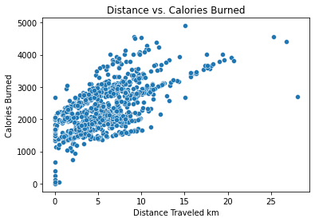
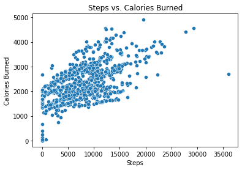
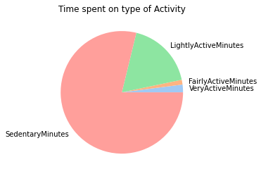
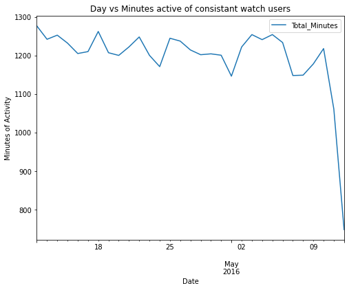
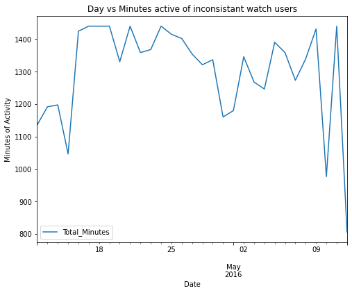
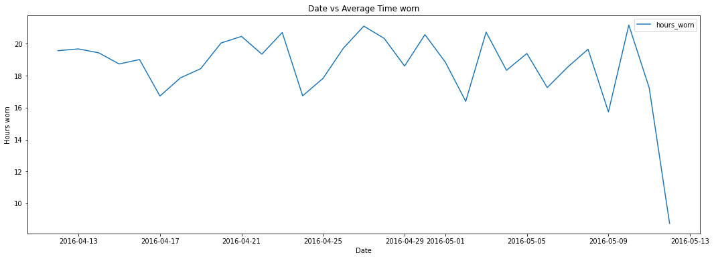

<a id="section-pre1"></a>
# Bella Beat Case Study

Analysis performed by: Rayen Feng  
Date: June 27, 2022  
As part of Google Data Analytics Certificate 


## Table of Contents

* [Introduction](#section-one)
* [Data preparation and processing](#section-two)
    - [Importing data](#section-three)
    - [Previewing core data trends ](#section-four)
    - [Preparing user data ](#section-five)
* [Analysis of specific questions  ](#section-six)
    - [Key Findings of user activity ](#section-seven)
* [Sleep vs activity tracking usage ](#section-eight)
* [ Watch wear time relationships ](#section-nine)
    - [ Finding average wear times ](#section-ten)
    - [ Start and end times analysis ](#section-11)
* [ Conclusion and Recomendations ](#section-12)


  
    
    

<a id="section-one"></a>
## Introduction 

Bellabeat is a high-tech manufacturer of heath products for women. By analyzing their smart products and using data-driven decision making can help discover and drive new opportunities for the company.  

In this analysis, one of Bellabeat's products will be chosen to undergo analysis using their smart device data to gain insight on how consumers are using smart devices. These insights will help guilde the marketing strategy for the company. High level reccomendations will be made to infrom Bellabeat's marketing stategy. For this, exisiting trends in user activity using Fitbit data will be used. 

The analysis hopes to seek to answer the following questions.

1. What are some trends in smart device usage?
2. How could these trends apply to Bellabeat customers?
3. How could these trends help influence Bellabeat marketing strategy?


1. A clear summary of the business task
2. A description of all data sources used
3. Documentation of any cleaning or manipulation of data
4. A summary of your analysis
5. Supporting visualizations and key findings
6. Your top high-level content recommendations based on your analysis

<a id="section-two"></a>
## Data Preperation and processing
As mentioned in the introduction, the following analysis will use the Kaggle dataset which contains personal fitness tracker from thirty fitbit users. Thirty eligible Fitbit users consented to the submission of personal tracker data, including minute-level output for physical activity, heart rate, and sleep monitoring. It includes information about daily activity, steps, and heart rate that can be used to explore users’ habits. For this analysis, python and the pandas dataframe package will be used for data cleaning, manipulation and analysis. Additionally, packages such as matplotlib and seaborn will be used to visualize and present the data. 


```python
import numpy as np
import pandas as pd
import seaborn as sns
import matplotlib.pyplot as plt
import datetime
pd.options.mode.chained_assignment = None  # default='warn'

import os
for dirname, _, filenames in os.walk('/kaggle/input'):
    for filename in filenames:
        print(os.path.join(dirname, filename))

```

    /kaggle/input/fitbit/Fitabase Data 4.12.16-5.12.16/minuteCaloriesNarrow_merged.csv
    /kaggle/input/fitbit/Fitabase Data 4.12.16-5.12.16/weightLogInfo_merged.csv
    /kaggle/input/fitbit/Fitabase Data 4.12.16-5.12.16/sleepDay_merged.csv
    /kaggle/input/fitbit/Fitabase Data 4.12.16-5.12.16/dailyIntensities_merged.csv
    /kaggle/input/fitbit/Fitabase Data 4.12.16-5.12.16/minuteIntensitiesWide_merged.csv
    /kaggle/input/fitbit/Fitabase Data 4.12.16-5.12.16/minuteMETsNarrow_merged.csv
    /kaggle/input/fitbit/Fitabase Data 4.12.16-5.12.16/dailyCalories_merged.csv
    /kaggle/input/fitbit/Fitabase Data 4.12.16-5.12.16/hourlyCalories_merged.csv
    /kaggle/input/fitbit/Fitabase Data 4.12.16-5.12.16/heartrate_seconds_merged.csv
    /kaggle/input/fitbit/Fitabase Data 4.12.16-5.12.16/minuteSleep_merged.csv
    /kaggle/input/fitbit/Fitabase Data 4.12.16-5.12.16/hourlyIntensities_merged.csv
    /kaggle/input/fitbit/Fitabase Data 4.12.16-5.12.16/hourlySteps_merged.csv
    /kaggle/input/fitbit/Fitabase Data 4.12.16-5.12.16/minuteStepsNarrow_merged.csv
    /kaggle/input/fitbit/Fitabase Data 4.12.16-5.12.16/dailySteps_merged.csv
    /kaggle/input/fitbit/Fitabase Data 4.12.16-5.12.16/minuteStepsWide_merged.csv
    /kaggle/input/fitbit/Fitabase Data 4.12.16-5.12.16/minuteIntensitiesNarrow_merged.csv
    /kaggle/input/fitbit/Fitabase Data 4.12.16-5.12.16/minuteCaloriesWide_merged.csv
    /kaggle/input/fitbit/Fitabase Data 4.12.16-5.12.16/dailyActivity_merged.csv


<a id="section-three"></a>
### Importing data 

After previewing the data, a few datasets were selected and imported to investigate further.


```python
activity_daily = pd.read_csv ('../input/fitbit/Fitabase Data 4.12.16-5.12.16/dailyActivity_merged.csv')
heart_rate = pd.read_csv ('../input/fitbit/Fitabase Data 4.12.16-5.12.16/heartrate_seconds_merged.csv')
sleepDay_merged = pd.read_csv ('../input/fitbit/Fitabase Data 4.12.16-5.12.16/sleepDay_merged.csv')
minuteSleep_merged = pd.read_csv ('../input/fitbit/Fitabase Data 4.12.16-5.12.16/minuteSleep_merged.csv')
minuteMETsNarrow_merged = pd.read_csv ('../input/fitbit/Fitabase Data 4.12.16-5.12.16/minuteMETsNarrow_merged.csv')
```

<a id="section-four"></a>
### Previewing core data trends

The first step will be to preview the main dataset, which is the daily_activity_merged dataset. This dataset contains the activity data of all 33 participlants and the breakdown for their activity for 30 days from April 12, 2016 to May 12, 2016. Looking at the rows shown below, the dataset contains the breakdown of the type of activity intensity, the logged distances and durations of summarized daily. 


```python
display(activity_daily)
```


<div>
<style scoped>
    .dataframe tbody tr th:only-of-type {
        vertical-align: middle;
    }

    .dataframe tbody tr th {
        vertical-align: top;
    }

    .dataframe thead th {
        text-align: right;
    }
</style>
<table border="1" class="dataframe">
  <thead>
    <tr style="text-align: right;">
      <th></th>
      <th>Id</th>
      <th>ActivityDate</th>
      <th>TotalSteps</th>
      <th>TotalDistance</th>
      <th>TrackerDistance</th>
      <th>LoggedActivitiesDistance</th>
      <th>VeryActiveDistance</th>
      <th>ModeratelyActiveDistance</th>
      <th>LightActiveDistance</th>
      <th>SedentaryActiveDistance</th>
      <th>VeryActiveMinutes</th>
      <th>FairlyActiveMinutes</th>
      <th>LightlyActiveMinutes</th>
      <th>SedentaryMinutes</th>
      <th>Calories</th>
    </tr>
  </thead>
  <tbody>
    <tr>
      <th>0</th>
      <td>1503960366</td>
      <td>4/12/2016</td>
      <td>13162</td>
      <td>8.500000</td>
      <td>8.500000</td>
      <td>0.0</td>
      <td>1.88</td>
      <td>0.55</td>
      <td>6.06</td>
      <td>0.00</td>
      <td>25</td>
      <td>13</td>
      <td>328</td>
      <td>728</td>
      <td>1985</td>
    </tr>
    <tr>
      <th>1</th>
      <td>1503960366</td>
      <td>4/13/2016</td>
      <td>10735</td>
      <td>6.970000</td>
      <td>6.970000</td>
      <td>0.0</td>
      <td>1.57</td>
      <td>0.69</td>
      <td>4.71</td>
      <td>0.00</td>
      <td>21</td>
      <td>19</td>
      <td>217</td>
      <td>776</td>
      <td>1797</td>
    </tr>
    <tr>
      <th>2</th>
      <td>1503960366</td>
      <td>4/14/2016</td>
      <td>10460</td>
      <td>6.740000</td>
      <td>6.740000</td>
      <td>0.0</td>
      <td>2.44</td>
      <td>0.40</td>
      <td>3.91</td>
      <td>0.00</td>
      <td>30</td>
      <td>11</td>
      <td>181</td>
      <td>1218</td>
      <td>1776</td>
    </tr>
    <tr>
      <th>3</th>
      <td>1503960366</td>
      <td>4/15/2016</td>
      <td>9762</td>
      <td>6.280000</td>
      <td>6.280000</td>
      <td>0.0</td>
      <td>2.14</td>
      <td>1.26</td>
      <td>2.83</td>
      <td>0.00</td>
      <td>29</td>
      <td>34</td>
      <td>209</td>
      <td>726</td>
      <td>1745</td>
    </tr>
    <tr>
      <th>4</th>
      <td>1503960366</td>
      <td>4/16/2016</td>
      <td>12669</td>
      <td>8.160000</td>
      <td>8.160000</td>
      <td>0.0</td>
      <td>2.71</td>
      <td>0.41</td>
      <td>5.04</td>
      <td>0.00</td>
      <td>36</td>
      <td>10</td>
      <td>221</td>
      <td>773</td>
      <td>1863</td>
    </tr>
    <tr>
      <th>...</th>
      <td>...</td>
      <td>...</td>
      <td>...</td>
      <td>...</td>
      <td>...</td>
      <td>...</td>
      <td>...</td>
      <td>...</td>
      <td>...</td>
      <td>...</td>
      <td>...</td>
      <td>...</td>
      <td>...</td>
      <td>...</td>
      <td>...</td>
    </tr>
    <tr>
      <th>935</th>
      <td>8877689391</td>
      <td>5/8/2016</td>
      <td>10686</td>
      <td>8.110000</td>
      <td>8.110000</td>
      <td>0.0</td>
      <td>1.08</td>
      <td>0.20</td>
      <td>6.80</td>
      <td>0.00</td>
      <td>17</td>
      <td>4</td>
      <td>245</td>
      <td>1174</td>
      <td>2847</td>
    </tr>
    <tr>
      <th>936</th>
      <td>8877689391</td>
      <td>5/9/2016</td>
      <td>20226</td>
      <td>18.250000</td>
      <td>18.250000</td>
      <td>0.0</td>
      <td>11.10</td>
      <td>0.80</td>
      <td>6.24</td>
      <td>0.05</td>
      <td>73</td>
      <td>19</td>
      <td>217</td>
      <td>1131</td>
      <td>3710</td>
    </tr>
    <tr>
      <th>937</th>
      <td>8877689391</td>
      <td>5/10/2016</td>
      <td>10733</td>
      <td>8.150000</td>
      <td>8.150000</td>
      <td>0.0</td>
      <td>1.35</td>
      <td>0.46</td>
      <td>6.28</td>
      <td>0.00</td>
      <td>18</td>
      <td>11</td>
      <td>224</td>
      <td>1187</td>
      <td>2832</td>
    </tr>
    <tr>
      <th>938</th>
      <td>8877689391</td>
      <td>5/11/2016</td>
      <td>21420</td>
      <td>19.559999</td>
      <td>19.559999</td>
      <td>0.0</td>
      <td>13.22</td>
      <td>0.41</td>
      <td>5.89</td>
      <td>0.00</td>
      <td>88</td>
      <td>12</td>
      <td>213</td>
      <td>1127</td>
      <td>3832</td>
    </tr>
    <tr>
      <th>939</th>
      <td>8877689391</td>
      <td>5/12/2016</td>
      <td>8064</td>
      <td>6.120000</td>
      <td>6.120000</td>
      <td>0.0</td>
      <td>1.82</td>
      <td>0.04</td>
      <td>4.25</td>
      <td>0.00</td>
      <td>23</td>
      <td>1</td>
      <td>137</td>
      <td>770</td>
      <td>1849</td>
    </tr>
  </tbody>
</table>
<p>940 rows × 15 columns</p>
</div>


```python
display(activity_daily.max())
activity_daily.min()
```


    Id                          8877689391
    ActivityDate                  5/9/2016
    TotalSteps                       36019
    TotalDistance                28.030001
    TrackerDistance              28.030001
    LoggedActivitiesDistance      4.942142
    VeryActiveDistance               21.92
    ModeratelyActiveDistance          6.48
    LightActiveDistance              10.71
    SedentaryActiveDistance           0.11
    VeryActiveMinutes                  210
    FairlyActiveMinutes                143
    LightlyActiveMinutes               518
    SedentaryMinutes                  1440
    Calories                          4900
    dtype: object


    Id                          1503960366
    ActivityDate                 4/12/2016
    TotalSteps                           0
    TotalDistance                      0.0
    TrackerDistance                    0.0
    LoggedActivitiesDistance           0.0
    VeryActiveDistance                 0.0
    ModeratelyActiveDistance           0.0
    LightActiveDistance                0.0
    SedentaryActiveDistance            0.0
    VeryActiveMinutes                    0
    FairlyActiveMinutes                  0
    LightlyActiveMinutes                 0
    SedentaryMinutes                     0
    Calories                             0
    dtype: object


A quick conversion of the activity date to datetime format can be done to clean the dataset.


```python
activity_daily['ActivityDate'] = pd.to_datetime(activity_daily['ActivityDate'])
```

To check the general validity and accuracy of this data, a quick check can be performed by plotting the relationship of two variables. It's known that generally, the more distance traveled or the more steps walked, the more calories are burned. By plotting these two variables in a scatterplot, a general upward trend of these two varibles is observed, which proves the validity of this data. 


```python
sns.scatterplot(
    x='TotalDistance',
    y='Calories',
    data = activity_daily,
)

plt.title("Distance vs. Calories Burned")
plt.xlabel("Distance Traveled km")
plt.ylabel("Calories Burned")

plt.show()

sns.scatterplot(
    x='TotalSteps',
    y='Calories',
    data = activity_daily,
)

plt.title("Steps vs. Calories Burned")
plt.xlabel("Steps")
plt.ylabel("Calories Burned")

plt.show()
```


    

    


    

    


<a id="section-five"></a>
### Preparing User data

The activity data can be grouped and then grouped by their user ID to find general average information of each user. Additionally, a quick check can be made to check that the total users in this dataset is 33. 


```python
activity_daily_indv = activity_daily.groupby(['Id']).mean()
display(activity_daily_indv.sort_values(by = ["Calories"], ascending = False).head(n=5))
print(len(activity_daily_indv))
```


<div>
<style scoped>
    .dataframe tbody tr th:only-of-type {
        vertical-align: middle;
    }

    .dataframe tbody tr th {
        vertical-align: top;
    }

    .dataframe thead th {
        text-align: right;
    }
</style>
<table border="1" class="dataframe">
  <thead>
    <tr style="text-align: right;">
      <th></th>
      <th>TotalSteps</th>
      <th>TotalDistance</th>
      <th>TrackerDistance</th>
      <th>LoggedActivitiesDistance</th>
      <th>VeryActiveDistance</th>
      <th>ModeratelyActiveDistance</th>
      <th>LightActiveDistance</th>
      <th>SedentaryActiveDistance</th>
      <th>VeryActiveMinutes</th>
      <th>FairlyActiveMinutes</th>
      <th>LightlyActiveMinutes</th>
      <th>SedentaryMinutes</th>
      <th>Calories</th>
    </tr>
    <tr>
      <th>Id</th>
      <th></th>
      <th></th>
      <th></th>
      <th></th>
      <th></th>
      <th></th>
      <th></th>
      <th></th>
      <th></th>
      <th></th>
      <th></th>
      <th></th>
      <th></th>
    </tr>
  </thead>
  <tbody>
    <tr>
      <th>8378563200</th>
      <td>8717.709677</td>
      <td>6.913548</td>
      <td>6.913548</td>
      <td>1.116158</td>
      <td>2.503548</td>
      <td>0.519032</td>
      <td>3.889355</td>
      <td>0.000000</td>
      <td>58.677419</td>
      <td>10.258065</td>
      <td>156.096774</td>
      <td>716.129032</td>
      <td>3436.580645</td>
    </tr>
    <tr>
      <th>8877689391</th>
      <td>16040.032258</td>
      <td>13.212903</td>
      <td>13.212903</td>
      <td>0.000000</td>
      <td>6.637419</td>
      <td>0.337742</td>
      <td>6.188710</td>
      <td>0.005161</td>
      <td>66.064516</td>
      <td>9.935484</td>
      <td>234.709677</td>
      <td>1112.870968</td>
      <td>3420.258065</td>
    </tr>
    <tr>
      <th>5577150313</th>
      <td>8304.433333</td>
      <td>6.213333</td>
      <td>6.213333</td>
      <td>0.000000</td>
      <td>3.113667</td>
      <td>0.658000</td>
      <td>2.428000</td>
      <td>0.000000</td>
      <td>87.333333</td>
      <td>29.833333</td>
      <td>147.933333</td>
      <td>754.433333</td>
      <td>3359.633333</td>
    </tr>
    <tr>
      <th>4388161847</th>
      <td>10813.935484</td>
      <td>8.393226</td>
      <td>8.393226</td>
      <td>0.000000</td>
      <td>1.719355</td>
      <td>0.901935</td>
      <td>5.396129</td>
      <td>0.000000</td>
      <td>23.161290</td>
      <td>20.354839</td>
      <td>229.354839</td>
      <td>836.677419</td>
      <td>3093.870968</td>
    </tr>
    <tr>
      <th>4702921684</th>
      <td>8572.064516</td>
      <td>6.955161</td>
      <td>6.955161</td>
      <td>0.000000</td>
      <td>0.417419</td>
      <td>1.304839</td>
      <td>5.225484</td>
      <td>0.000000</td>
      <td>5.129032</td>
      <td>26.032258</td>
      <td>237.483871</td>
      <td>766.419355</td>
      <td>2965.548387</td>
    </tr>
  </tbody>
</table>
</div>


    33


One last consideration to prepare this data is the participation rate of the users. Users who didn't wear the watch as much might have a negative impact on the data, especially when considering what the participants use the watch for. To account for this, the users that participated less will have to be filtered out. This threshold will be set at a 80% participation rate.  

By splitting these users into two groups, there is flexibility to see trends between the groups as well. 


```python
# create a function that shows the activity data for one user for a specific dataframe 

def show_user_data(df,user_id):
    
    t = df[df.Id == user_id] 
    return(t)
```


```python
# Finding participants who took than 50 total steps per day

unique_ids = activity_daily['Id'].unique()

days_skip_arr = [] 

for i in unique_ids: 
    person_data = show_user_data(activity_daily,i)
    day_skipped = person_data[person_data.TotalSteps <= 50] 
    days_skipped = len(day_skipped)
    days_skip_arr.append(days_skipped)

    
day_skip_by_id = {'Id': unique_ids, 'days_skipped':days_skip_arr }
day_skip_by_ids= pd.DataFrame(data=day_skip_by_id)

```


```python
# seperating the participants ids to 80% active and inactive 

day_skip_by_ids_sorted = day_skip_by_ids.sort_values(by = ['days_skipped'], ascending = False).reset_index(drop = True)

ids_80_percent_inactive = day_skip_by_ids_sorted.iloc[:5]
ids_80_percent_active = day_skip_by_ids_sorted.iloc[5:]
```


```python
# splitting the activity_data between active and inactive users 

active_users = activity_daily[activity_daily.Id.isin(ids_80_percent_active.Id)] 
inactive_users = activity_daily[activity_daily.Id.isin(ids_80_percent_inactive.Id)] 
```


```python
display(active_users)
display(inactive_users)
```


<div>
<style scoped>
    .dataframe tbody tr th:only-of-type {
        vertical-align: middle;
    }

    .dataframe tbody tr th {
        vertical-align: top;
    }

    .dataframe thead th {
        text-align: right;
    }
</style>
<table border="1" class="dataframe">
  <thead>
    <tr style="text-align: right;">
      <th></th>
      <th>Id</th>
      <th>ActivityDate</th>
      <th>TotalSteps</th>
      <th>TotalDistance</th>
      <th>TrackerDistance</th>
      <th>LoggedActivitiesDistance</th>
      <th>VeryActiveDistance</th>
      <th>ModeratelyActiveDistance</th>
      <th>LightActiveDistance</th>
      <th>SedentaryActiveDistance</th>
      <th>VeryActiveMinutes</th>
      <th>FairlyActiveMinutes</th>
      <th>LightlyActiveMinutes</th>
      <th>SedentaryMinutes</th>
      <th>Calories</th>
    </tr>
  </thead>
  <tbody>
    <tr>
      <th>0</th>
      <td>1503960366</td>
      <td>2016-04-12</td>
      <td>13162</td>
      <td>8.500000</td>
      <td>8.500000</td>
      <td>0.0</td>
      <td>1.88</td>
      <td>0.55</td>
      <td>6.06</td>
      <td>0.00</td>
      <td>25</td>
      <td>13</td>
      <td>328</td>
      <td>728</td>
      <td>1985</td>
    </tr>
    <tr>
      <th>1</th>
      <td>1503960366</td>
      <td>2016-04-13</td>
      <td>10735</td>
      <td>6.970000</td>
      <td>6.970000</td>
      <td>0.0</td>
      <td>1.57</td>
      <td>0.69</td>
      <td>4.71</td>
      <td>0.00</td>
      <td>21</td>
      <td>19</td>
      <td>217</td>
      <td>776</td>
      <td>1797</td>
    </tr>
    <tr>
      <th>2</th>
      <td>1503960366</td>
      <td>2016-04-14</td>
      <td>10460</td>
      <td>6.740000</td>
      <td>6.740000</td>
      <td>0.0</td>
      <td>2.44</td>
      <td>0.40</td>
      <td>3.91</td>
      <td>0.00</td>
      <td>30</td>
      <td>11</td>
      <td>181</td>
      <td>1218</td>
      <td>1776</td>
    </tr>
    <tr>
      <th>3</th>
      <td>1503960366</td>
      <td>2016-04-15</td>
      <td>9762</td>
      <td>6.280000</td>
      <td>6.280000</td>
      <td>0.0</td>
      <td>2.14</td>
      <td>1.26</td>
      <td>2.83</td>
      <td>0.00</td>
      <td>29</td>
      <td>34</td>
      <td>209</td>
      <td>726</td>
      <td>1745</td>
    </tr>
    <tr>
      <th>4</th>
      <td>1503960366</td>
      <td>2016-04-16</td>
      <td>12669</td>
      <td>8.160000</td>
      <td>8.160000</td>
      <td>0.0</td>
      <td>2.71</td>
      <td>0.41</td>
      <td>5.04</td>
      <td>0.00</td>
      <td>36</td>
      <td>10</td>
      <td>221</td>
      <td>773</td>
      <td>1863</td>
    </tr>
    <tr>
      <th>...</th>
      <td>...</td>
      <td>...</td>
      <td>...</td>
      <td>...</td>
      <td>...</td>
      <td>...</td>
      <td>...</td>
      <td>...</td>
      <td>...</td>
      <td>...</td>
      <td>...</td>
      <td>...</td>
      <td>...</td>
      <td>...</td>
      <td>...</td>
    </tr>
    <tr>
      <th>935</th>
      <td>8877689391</td>
      <td>2016-05-08</td>
      <td>10686</td>
      <td>8.110000</td>
      <td>8.110000</td>
      <td>0.0</td>
      <td>1.08</td>
      <td>0.20</td>
      <td>6.80</td>
      <td>0.00</td>
      <td>17</td>
      <td>4</td>
      <td>245</td>
      <td>1174</td>
      <td>2847</td>
    </tr>
    <tr>
      <th>936</th>
      <td>8877689391</td>
      <td>2016-05-09</td>
      <td>20226</td>
      <td>18.250000</td>
      <td>18.250000</td>
      <td>0.0</td>
      <td>11.10</td>
      <td>0.80</td>
      <td>6.24</td>
      <td>0.05</td>
      <td>73</td>
      <td>19</td>
      <td>217</td>
      <td>1131</td>
      <td>3710</td>
    </tr>
    <tr>
      <th>937</th>
      <td>8877689391</td>
      <td>2016-05-10</td>
      <td>10733</td>
      <td>8.150000</td>
      <td>8.150000</td>
      <td>0.0</td>
      <td>1.35</td>
      <td>0.46</td>
      <td>6.28</td>
      <td>0.00</td>
      <td>18</td>
      <td>11</td>
      <td>224</td>
      <td>1187</td>
      <td>2832</td>
    </tr>
    <tr>
      <th>938</th>
      <td>8877689391</td>
      <td>2016-05-11</td>
      <td>21420</td>
      <td>19.559999</td>
      <td>19.559999</td>
      <td>0.0</td>
      <td>13.22</td>
      <td>0.41</td>
      <td>5.89</td>
      <td>0.00</td>
      <td>88</td>
      <td>12</td>
      <td>213</td>
      <td>1127</td>
      <td>3832</td>
    </tr>
    <tr>
      <th>939</th>
      <td>8877689391</td>
      <td>2016-05-12</td>
      <td>8064</td>
      <td>6.120000</td>
      <td>6.120000</td>
      <td>0.0</td>
      <td>1.82</td>
      <td>0.04</td>
      <td>4.25</td>
      <td>0.00</td>
      <td>23</td>
      <td>1</td>
      <td>137</td>
      <td>770</td>
      <td>1849</td>
    </tr>
  </tbody>
</table>
<p>792 rows × 15 columns</p>
</div>


<div>
<style scoped>
    .dataframe tbody tr th:only-of-type {
        vertical-align: middle;
    }

    .dataframe tbody tr th {
        vertical-align: top;
    }

    .dataframe thead th {
        text-align: right;
    }
</style>
<table border="1" class="dataframe">
  <thead>
    <tr style="text-align: right;">
      <th></th>
      <th>Id</th>
      <th>ActivityDate</th>
      <th>TotalSteps</th>
      <th>TotalDistance</th>
      <th>TrackerDistance</th>
      <th>LoggedActivitiesDistance</th>
      <th>VeryActiveDistance</th>
      <th>ModeratelyActiveDistance</th>
      <th>LightActiveDistance</th>
      <th>SedentaryActiveDistance</th>
      <th>VeryActiveMinutes</th>
      <th>FairlyActiveMinutes</th>
      <th>LightlyActiveMinutes</th>
      <th>SedentaryMinutes</th>
      <th>Calories</th>
    </tr>
  </thead>
  <tbody>
    <tr>
      <th>92</th>
      <td>1844505072</td>
      <td>2016-04-12</td>
      <td>6697</td>
      <td>4.43</td>
      <td>4.43</td>
      <td>0.0</td>
      <td>0.0</td>
      <td>0.0</td>
      <td>4.43</td>
      <td>0.0</td>
      <td>0</td>
      <td>0</td>
      <td>339</td>
      <td>1101</td>
      <td>2030</td>
    </tr>
    <tr>
      <th>93</th>
      <td>1844505072</td>
      <td>2016-04-13</td>
      <td>4929</td>
      <td>3.26</td>
      <td>3.26</td>
      <td>0.0</td>
      <td>0.0</td>
      <td>0.0</td>
      <td>3.26</td>
      <td>0.0</td>
      <td>0</td>
      <td>0</td>
      <td>248</td>
      <td>1192</td>
      <td>1860</td>
    </tr>
    <tr>
      <th>94</th>
      <td>1844505072</td>
      <td>2016-04-14</td>
      <td>7937</td>
      <td>5.25</td>
      <td>5.25</td>
      <td>0.0</td>
      <td>0.0</td>
      <td>0.0</td>
      <td>5.23</td>
      <td>0.0</td>
      <td>0</td>
      <td>0</td>
      <td>373</td>
      <td>843</td>
      <td>2130</td>
    </tr>
    <tr>
      <th>95</th>
      <td>1844505072</td>
      <td>2016-04-15</td>
      <td>3844</td>
      <td>2.54</td>
      <td>2.54</td>
      <td>0.0</td>
      <td>0.0</td>
      <td>0.0</td>
      <td>2.54</td>
      <td>0.0</td>
      <td>0</td>
      <td>0</td>
      <td>176</td>
      <td>527</td>
      <td>1725</td>
    </tr>
    <tr>
      <th>96</th>
      <td>1844505072</td>
      <td>2016-04-16</td>
      <td>3414</td>
      <td>2.26</td>
      <td>2.26</td>
      <td>0.0</td>
      <td>0.0</td>
      <td>0.0</td>
      <td>2.26</td>
      <td>0.0</td>
      <td>0</td>
      <td>0</td>
      <td>147</td>
      <td>1293</td>
      <td>1657</td>
    </tr>
    <tr>
      <th>...</th>
      <td>...</td>
      <td>...</td>
      <td>...</td>
      <td>...</td>
      <td>...</td>
      <td>...</td>
      <td>...</td>
      <td>...</td>
      <td>...</td>
      <td>...</td>
      <td>...</td>
      <td>...</td>
      <td>...</td>
      <td>...</td>
      <td>...</td>
    </tr>
    <tr>
      <th>904</th>
      <td>8792009665</td>
      <td>2016-05-06</td>
      <td>0</td>
      <td>0.00</td>
      <td>0.00</td>
      <td>0.0</td>
      <td>0.0</td>
      <td>0.0</td>
      <td>0.00</td>
      <td>0.0</td>
      <td>0</td>
      <td>0</td>
      <td>0</td>
      <td>1440</td>
      <td>1688</td>
    </tr>
    <tr>
      <th>905</th>
      <td>8792009665</td>
      <td>2016-05-07</td>
      <td>0</td>
      <td>0.00</td>
      <td>0.00</td>
      <td>0.0</td>
      <td>0.0</td>
      <td>0.0</td>
      <td>0.00</td>
      <td>0.0</td>
      <td>0</td>
      <td>0</td>
      <td>0</td>
      <td>1440</td>
      <td>1688</td>
    </tr>
    <tr>
      <th>906</th>
      <td>8792009665</td>
      <td>2016-05-08</td>
      <td>0</td>
      <td>0.00</td>
      <td>0.00</td>
      <td>0.0</td>
      <td>0.0</td>
      <td>0.0</td>
      <td>0.00</td>
      <td>0.0</td>
      <td>0</td>
      <td>0</td>
      <td>0</td>
      <td>1440</td>
      <td>1688</td>
    </tr>
    <tr>
      <th>907</th>
      <td>8792009665</td>
      <td>2016-05-09</td>
      <td>0</td>
      <td>0.00</td>
      <td>0.00</td>
      <td>0.0</td>
      <td>0.0</td>
      <td>0.0</td>
      <td>0.00</td>
      <td>0.0</td>
      <td>0</td>
      <td>0</td>
      <td>0</td>
      <td>1440</td>
      <td>1688</td>
    </tr>
    <tr>
      <th>908</th>
      <td>8792009665</td>
      <td>2016-05-10</td>
      <td>0</td>
      <td>0.00</td>
      <td>0.00</td>
      <td>0.0</td>
      <td>0.0</td>
      <td>0.0</td>
      <td>0.00</td>
      <td>0.0</td>
      <td>0</td>
      <td>0</td>
      <td>0</td>
      <td>48</td>
      <td>57</td>
    </tr>
  </tbody>
</table>
<p>148 rows × 15 columns</p>
</div>


<a id="section-six"></a>
## Analysis of specific questions 

To answer the question about how participants use smartwatches, a few trends need to be analyzed further. 

1. Do people have a preference towards using the watch as a sleep tracker or as an activity tracker? 
2. What kinds of activities does a user do while using the watch? 
3. How long do they have their watch on for the day? 


To calculate the type of activity that the user does most frequently while wearing the watch, the time from each activty can be summed.


```python
sum_col_inact = inactive_users["VeryActiveMinutes"] + inactive_users["FairlyActiveMinutes"] + inactive_users["LightlyActiveMinutes"] + inactive_users["SedentaryMinutes"] 
inactive_users["Total_Minutes"] = sum_col_inact

sum_col_act = active_users["VeryActiveMinutes"] + active_users["FairlyActiveMinutes"] + active_users["LightlyActiveMinutes"] + active_users["SedentaryMinutes"] 
active_users["Total_Minutes"] = sum_col_act
```


```python
inactive_users
```


<div>
<style scoped>
    .dataframe tbody tr th:only-of-type {
        vertical-align: middle;
    }

    .dataframe tbody tr th {
        vertical-align: top;
    }

    .dataframe thead th {
        text-align: right;
    }
</style>
<table border="1" class="dataframe">
  <thead>
    <tr style="text-align: right;">
      <th></th>
      <th>Id</th>
      <th>ActivityDate</th>
      <th>TotalSteps</th>
      <th>TotalDistance</th>
      <th>TrackerDistance</th>
      <th>LoggedActivitiesDistance</th>
      <th>VeryActiveDistance</th>
      <th>ModeratelyActiveDistance</th>
      <th>LightActiveDistance</th>
      <th>SedentaryActiveDistance</th>
      <th>VeryActiveMinutes</th>
      <th>FairlyActiveMinutes</th>
      <th>LightlyActiveMinutes</th>
      <th>SedentaryMinutes</th>
      <th>Calories</th>
      <th>Total_Minutes</th>
    </tr>
  </thead>
  <tbody>
    <tr>
      <th>92</th>
      <td>1844505072</td>
      <td>2016-04-12</td>
      <td>6697</td>
      <td>4.43</td>
      <td>4.43</td>
      <td>0.0</td>
      <td>0.0</td>
      <td>0.0</td>
      <td>4.43</td>
      <td>0.0</td>
      <td>0</td>
      <td>0</td>
      <td>339</td>
      <td>1101</td>
      <td>2030</td>
      <td>1440</td>
    </tr>
    <tr>
      <th>93</th>
      <td>1844505072</td>
      <td>2016-04-13</td>
      <td>4929</td>
      <td>3.26</td>
      <td>3.26</td>
      <td>0.0</td>
      <td>0.0</td>
      <td>0.0</td>
      <td>3.26</td>
      <td>0.0</td>
      <td>0</td>
      <td>0</td>
      <td>248</td>
      <td>1192</td>
      <td>1860</td>
      <td>1440</td>
    </tr>
    <tr>
      <th>94</th>
      <td>1844505072</td>
      <td>2016-04-14</td>
      <td>7937</td>
      <td>5.25</td>
      <td>5.25</td>
      <td>0.0</td>
      <td>0.0</td>
      <td>0.0</td>
      <td>5.23</td>
      <td>0.0</td>
      <td>0</td>
      <td>0</td>
      <td>373</td>
      <td>843</td>
      <td>2130</td>
      <td>1216</td>
    </tr>
    <tr>
      <th>95</th>
      <td>1844505072</td>
      <td>2016-04-15</td>
      <td>3844</td>
      <td>2.54</td>
      <td>2.54</td>
      <td>0.0</td>
      <td>0.0</td>
      <td>0.0</td>
      <td>2.54</td>
      <td>0.0</td>
      <td>0</td>
      <td>0</td>
      <td>176</td>
      <td>527</td>
      <td>1725</td>
      <td>703</td>
    </tr>
    <tr>
      <th>96</th>
      <td>1844505072</td>
      <td>2016-04-16</td>
      <td>3414</td>
      <td>2.26</td>
      <td>2.26</td>
      <td>0.0</td>
      <td>0.0</td>
      <td>0.0</td>
      <td>2.26</td>
      <td>0.0</td>
      <td>0</td>
      <td>0</td>
      <td>147</td>
      <td>1293</td>
      <td>1657</td>
      <td>1440</td>
    </tr>
    <tr>
      <th>...</th>
      <td>...</td>
      <td>...</td>
      <td>...</td>
      <td>...</td>
      <td>...</td>
      <td>...</td>
      <td>...</td>
      <td>...</td>
      <td>...</td>
      <td>...</td>
      <td>...</td>
      <td>...</td>
      <td>...</td>
      <td>...</td>
      <td>...</td>
      <td>...</td>
    </tr>
    <tr>
      <th>904</th>
      <td>8792009665</td>
      <td>2016-05-06</td>
      <td>0</td>
      <td>0.00</td>
      <td>0.00</td>
      <td>0.0</td>
      <td>0.0</td>
      <td>0.0</td>
      <td>0.00</td>
      <td>0.0</td>
      <td>0</td>
      <td>0</td>
      <td>0</td>
      <td>1440</td>
      <td>1688</td>
      <td>1440</td>
    </tr>
    <tr>
      <th>905</th>
      <td>8792009665</td>
      <td>2016-05-07</td>
      <td>0</td>
      <td>0.00</td>
      <td>0.00</td>
      <td>0.0</td>
      <td>0.0</td>
      <td>0.0</td>
      <td>0.00</td>
      <td>0.0</td>
      <td>0</td>
      <td>0</td>
      <td>0</td>
      <td>1440</td>
      <td>1688</td>
      <td>1440</td>
    </tr>
    <tr>
      <th>906</th>
      <td>8792009665</td>
      <td>2016-05-08</td>
      <td>0</td>
      <td>0.00</td>
      <td>0.00</td>
      <td>0.0</td>
      <td>0.0</td>
      <td>0.0</td>
      <td>0.00</td>
      <td>0.0</td>
      <td>0</td>
      <td>0</td>
      <td>0</td>
      <td>1440</td>
      <td>1688</td>
      <td>1440</td>
    </tr>
    <tr>
      <th>907</th>
      <td>8792009665</td>
      <td>2016-05-09</td>
      <td>0</td>
      <td>0.00</td>
      <td>0.00</td>
      <td>0.0</td>
      <td>0.0</td>
      <td>0.0</td>
      <td>0.00</td>
      <td>0.0</td>
      <td>0</td>
      <td>0</td>
      <td>0</td>
      <td>1440</td>
      <td>1688</td>
      <td>1440</td>
    </tr>
    <tr>
      <th>908</th>
      <td>8792009665</td>
      <td>2016-05-10</td>
      <td>0</td>
      <td>0.00</td>
      <td>0.00</td>
      <td>0.0</td>
      <td>0.0</td>
      <td>0.0</td>
      <td>0.00</td>
      <td>0.0</td>
      <td>0</td>
      <td>0</td>
      <td>0</td>
      <td>48</td>
      <td>57</td>
      <td>48</td>
    </tr>
  </tbody>
</table>
<p>148 rows × 16 columns</p>
</div>


```python
display(active_users)

total_VAM = sum(active_users["VeryActiveMinutes"])
total_FAM = sum(active_users["FairlyActiveMinutes"])
toatl_LAM = sum(active_users["LightlyActiveMinutes"])
total_SEM = sum(active_users["SedentaryMinutes"])
total_min = sum(sum_col_act)

y = np.array([total_VAM,total_FAM,toatl_LAM,total_SEM])

mylabels = ["VeryActiveMinutes", "FairlyActiveMinutes", "LightlyActiveMinutes", "SedentaryMinutes"]
colors = sns.color_palette('pastel')
plt.pie(y, labels = mylabels, colors = colors)


plt.title("Time spent on type of Activity")
plt.show() 
```


<div>
<style scoped>
    .dataframe tbody tr th:only-of-type {
        vertical-align: middle;
    }

    .dataframe tbody tr th {
        vertical-align: top;
    }

    .dataframe thead th {
        text-align: right;
    }
</style>
<table border="1" class="dataframe">
  <thead>
    <tr style="text-align: right;">
      <th></th>
      <th>Id</th>
      <th>ActivityDate</th>
      <th>TotalSteps</th>
      <th>TotalDistance</th>
      <th>TrackerDistance</th>
      <th>LoggedActivitiesDistance</th>
      <th>VeryActiveDistance</th>
      <th>ModeratelyActiveDistance</th>
      <th>LightActiveDistance</th>
      <th>SedentaryActiveDistance</th>
      <th>VeryActiveMinutes</th>
      <th>FairlyActiveMinutes</th>
      <th>LightlyActiveMinutes</th>
      <th>SedentaryMinutes</th>
      <th>Calories</th>
      <th>Total_Minutes</th>
    </tr>
  </thead>
  <tbody>
    <tr>
      <th>0</th>
      <td>1503960366</td>
      <td>2016-04-12</td>
      <td>13162</td>
      <td>8.500000</td>
      <td>8.500000</td>
      <td>0.0</td>
      <td>1.88</td>
      <td>0.55</td>
      <td>6.06</td>
      <td>0.00</td>
      <td>25</td>
      <td>13</td>
      <td>328</td>
      <td>728</td>
      <td>1985</td>
      <td>1094</td>
    </tr>
    <tr>
      <th>1</th>
      <td>1503960366</td>
      <td>2016-04-13</td>
      <td>10735</td>
      <td>6.970000</td>
      <td>6.970000</td>
      <td>0.0</td>
      <td>1.57</td>
      <td>0.69</td>
      <td>4.71</td>
      <td>0.00</td>
      <td>21</td>
      <td>19</td>
      <td>217</td>
      <td>776</td>
      <td>1797</td>
      <td>1033</td>
    </tr>
    <tr>
      <th>2</th>
      <td>1503960366</td>
      <td>2016-04-14</td>
      <td>10460</td>
      <td>6.740000</td>
      <td>6.740000</td>
      <td>0.0</td>
      <td>2.44</td>
      <td>0.40</td>
      <td>3.91</td>
      <td>0.00</td>
      <td>30</td>
      <td>11</td>
      <td>181</td>
      <td>1218</td>
      <td>1776</td>
      <td>1440</td>
    </tr>
    <tr>
      <th>3</th>
      <td>1503960366</td>
      <td>2016-04-15</td>
      <td>9762</td>
      <td>6.280000</td>
      <td>6.280000</td>
      <td>0.0</td>
      <td>2.14</td>
      <td>1.26</td>
      <td>2.83</td>
      <td>0.00</td>
      <td>29</td>
      <td>34</td>
      <td>209</td>
      <td>726</td>
      <td>1745</td>
      <td>998</td>
    </tr>
    <tr>
      <th>4</th>
      <td>1503960366</td>
      <td>2016-04-16</td>
      <td>12669</td>
      <td>8.160000</td>
      <td>8.160000</td>
      <td>0.0</td>
      <td>2.71</td>
      <td>0.41</td>
      <td>5.04</td>
      <td>0.00</td>
      <td>36</td>
      <td>10</td>
      <td>221</td>
      <td>773</td>
      <td>1863</td>
      <td>1040</td>
    </tr>
    <tr>
      <th>...</th>
      <td>...</td>
      <td>...</td>
      <td>...</td>
      <td>...</td>
      <td>...</td>
      <td>...</td>
      <td>...</td>
      <td>...</td>
      <td>...</td>
      <td>...</td>
      <td>...</td>
      <td>...</td>
      <td>...</td>
      <td>...</td>
      <td>...</td>
      <td>...</td>
    </tr>
    <tr>
      <th>935</th>
      <td>8877689391</td>
      <td>2016-05-08</td>
      <td>10686</td>
      <td>8.110000</td>
      <td>8.110000</td>
      <td>0.0</td>
      <td>1.08</td>
      <td>0.20</td>
      <td>6.80</td>
      <td>0.00</td>
      <td>17</td>
      <td>4</td>
      <td>245</td>
      <td>1174</td>
      <td>2847</td>
      <td>1440</td>
    </tr>
    <tr>
      <th>936</th>
      <td>8877689391</td>
      <td>2016-05-09</td>
      <td>20226</td>
      <td>18.250000</td>
      <td>18.250000</td>
      <td>0.0</td>
      <td>11.10</td>
      <td>0.80</td>
      <td>6.24</td>
      <td>0.05</td>
      <td>73</td>
      <td>19</td>
      <td>217</td>
      <td>1131</td>
      <td>3710</td>
      <td>1440</td>
    </tr>
    <tr>
      <th>937</th>
      <td>8877689391</td>
      <td>2016-05-10</td>
      <td>10733</td>
      <td>8.150000</td>
      <td>8.150000</td>
      <td>0.0</td>
      <td>1.35</td>
      <td>0.46</td>
      <td>6.28</td>
      <td>0.00</td>
      <td>18</td>
      <td>11</td>
      <td>224</td>
      <td>1187</td>
      <td>2832</td>
      <td>1440</td>
    </tr>
    <tr>
      <th>938</th>
      <td>8877689391</td>
      <td>2016-05-11</td>
      <td>21420</td>
      <td>19.559999</td>
      <td>19.559999</td>
      <td>0.0</td>
      <td>13.22</td>
      <td>0.41</td>
      <td>5.89</td>
      <td>0.00</td>
      <td>88</td>
      <td>12</td>
      <td>213</td>
      <td>1127</td>
      <td>3832</td>
      <td>1440</td>
    </tr>
    <tr>
      <th>939</th>
      <td>8877689391</td>
      <td>2016-05-12</td>
      <td>8064</td>
      <td>6.120000</td>
      <td>6.120000</td>
      <td>0.0</td>
      <td>1.82</td>
      <td>0.04</td>
      <td>4.25</td>
      <td>0.00</td>
      <td>23</td>
      <td>1</td>
      <td>137</td>
      <td>770</td>
      <td>1849</td>
      <td>931</td>
    </tr>
  </tbody>
</table>
<p>792 rows × 16 columns</p>
</div>


    

    


<a id="section-seven"></a>
### Key Findings of user activity 

From this analysis, we can see the majority of users are engaged in sedentrary activity,followed by Light Activity. Only a small amount of time is spend performing moderate to intense activity  

This data can show: 

1. It may be better to advertise smartwatch products to the general public as a tool that tracks general heath and fitness instead of a precise measurment tool for hardcore athelets.   
2. On the same note, this means that the advertisements should focus more on emphasizing the ease of usability and simplicity for tracking basic features such as heart rate and such, rather than marketing the wide use of advaced and complex features. 
3. Since most users spend times wearing the watch while inactive,and in a more causual setting, it might be good to focus efforts on emphasizing the asthetics of the watch. 

<a id="section-eight"></a>
## Sleep vs. activity tracking usage

For this, a quick comparison between the number of users who logged into the sleep data vs the total number of users will be compared. To analyze this, the sleepDay_merged will be used to count the users who tracked their sleep. 


```python
display(sleepDay_merged)
```


<div>
<style scoped>
    .dataframe tbody tr th:only-of-type {
        vertical-align: middle;
    }

    .dataframe tbody tr th {
        vertical-align: top;
    }

    .dataframe thead th {
        text-align: right;
    }
</style>
<table border="1" class="dataframe">
  <thead>
    <tr style="text-align: right;">
      <th></th>
      <th>Id</th>
      <th>SleepDay</th>
      <th>TotalSleepRecords</th>
      <th>TotalMinutesAsleep</th>
      <th>TotalTimeInBed</th>
    </tr>
  </thead>
  <tbody>
    <tr>
      <th>0</th>
      <td>1503960366</td>
      <td>4/12/2016 12:00:00 AM</td>
      <td>1</td>
      <td>327</td>
      <td>346</td>
    </tr>
    <tr>
      <th>1</th>
      <td>1503960366</td>
      <td>4/13/2016 12:00:00 AM</td>
      <td>2</td>
      <td>384</td>
      <td>407</td>
    </tr>
    <tr>
      <th>2</th>
      <td>1503960366</td>
      <td>4/15/2016 12:00:00 AM</td>
      <td>1</td>
      <td>412</td>
      <td>442</td>
    </tr>
    <tr>
      <th>3</th>
      <td>1503960366</td>
      <td>4/16/2016 12:00:00 AM</td>
      <td>2</td>
      <td>340</td>
      <td>367</td>
    </tr>
    <tr>
      <th>4</th>
      <td>1503960366</td>
      <td>4/17/2016 12:00:00 AM</td>
      <td>1</td>
      <td>700</td>
      <td>712</td>
    </tr>
    <tr>
      <th>...</th>
      <td>...</td>
      <td>...</td>
      <td>...</td>
      <td>...</td>
      <td>...</td>
    </tr>
    <tr>
      <th>408</th>
      <td>8792009665</td>
      <td>4/30/2016 12:00:00 AM</td>
      <td>1</td>
      <td>343</td>
      <td>360</td>
    </tr>
    <tr>
      <th>409</th>
      <td>8792009665</td>
      <td>5/1/2016 12:00:00 AM</td>
      <td>1</td>
      <td>503</td>
      <td>527</td>
    </tr>
    <tr>
      <th>410</th>
      <td>8792009665</td>
      <td>5/2/2016 12:00:00 AM</td>
      <td>1</td>
      <td>415</td>
      <td>423</td>
    </tr>
    <tr>
      <th>411</th>
      <td>8792009665</td>
      <td>5/3/2016 12:00:00 AM</td>
      <td>1</td>
      <td>516</td>
      <td>545</td>
    </tr>
    <tr>
      <th>412</th>
      <td>8792009665</td>
      <td>5/4/2016 12:00:00 AM</td>
      <td>1</td>
      <td>439</td>
      <td>463</td>
    </tr>
  </tbody>
</table>
<p>413 rows × 5 columns</p>
</div>


```python
# getting the number of users using the sleep tracking device / 30 users
unique_ids_sleep = sleepDay_merged['Id'].unique()
len(unique_ids_sleep)

unique_ids_sleep_mins = minuteSleep_merged['Id'].unique()
print("number of users who wear a watch to sleep: " + str(len(unique_ids_sleep_mins)))
```

    number of users who wear a watch to sleep: 24


Now, it's known that the number of users who wear the watch is less than the total number participants. However, this is not yet conclusive to whether or not users prefer one feature or the other. In order to eliminate the possibility of users who prefer not to wear the watch regardless, a additional process must be taken to exclude those users from this case. 


```python
active_user_id = active_users['Id'].unique()
unique_ids_sleep_mins

count_of_users = set(active_user_id).intersection(unique_ids_sleep_mins)
print("active users: " + str(len(active_user_id)))
print("active users who wear the watch to sleep: " + str(len(count_of_users)))
```

    active users: 28
    active users who wear the watch to sleep: 19


this means that 19 out of the 28 active users actually track their sleep data. This might mean that they are uncomforatable wearing this to bed. It might be better for bellafit to focus on marketing targeting the activity. Or, this can be a good oprortunity to fill in the gap and advertise it as a comfortable watch that can also track the sleep data. 

<a id="section-nine"></a>
## Watch wear time relationships

there are three methods to track the watch time 

1. Through the activity data and counting the total active minutes 
2. Through the heart monitor 

To begin with, a quick look at the watch useage over time can be analyzed to see if there is correlation between the time into the project and the watch wear time. 


```python
avg_active_mins_daily_active = active_users.groupby(['ActivityDate']).mean()
avg_active_mins_daily_inactive = inactive_users.groupby(['ActivityDate']).mean()
```


```python
avg_active_mins_daily_active.plot(y = "Total_Minutes", figsize = (8,6))
plt.title("Day vs Minutes active of consistant watch users")
plt.xlabel("Date")
plt.ylabel("Minutes of Activity")
```


    Text(0, 0.5, 'Minutes of Activity')


    

    


```python
avg_active_mins_daily_inactive.plot(y = "Total_Minutes", figsize = (8,6))

plt.title("Day vs Minutes active of inconsistant watch users")
plt.xlabel("Date")
plt.ylabel("Minutes of Activity")

```


    Text(0, 0.5, 'Minutes of Activity')


    

    


From this analysis, it can be noted that there is no direct correlation between the time and the duration of usage. However, it is noted that there might be a possibility that the participants had a lower average usage of the watch towards the end of the periods. 

<a id="section-ten"></a>
### Finding average wear time

if the start day and wearing the watch is 7AM for example and the end time is 9:00PM assuming that when there's no meter it means that the watch is off the person. By knowing what time they like to take it on and off shows if they like to track sleep or not. 


```python
display(heart_rate)
```


<div>
<style scoped>
    .dataframe tbody tr th:only-of-type {
        vertical-align: middle;
    }

    .dataframe tbody tr th {
        vertical-align: top;
    }

    .dataframe thead th {
        text-align: right;
    }
</style>
<table border="1" class="dataframe">
  <thead>
    <tr style="text-align: right;">
      <th></th>
      <th>Id</th>
      <th>Time</th>
      <th>Value</th>
    </tr>
  </thead>
  <tbody>
    <tr>
      <th>0</th>
      <td>2022484408</td>
      <td>4/12/2016 7:21:00 AM</td>
      <td>97</td>
    </tr>
    <tr>
      <th>1</th>
      <td>2022484408</td>
      <td>4/12/2016 7:21:05 AM</td>
      <td>102</td>
    </tr>
    <tr>
      <th>2</th>
      <td>2022484408</td>
      <td>4/12/2016 7:21:10 AM</td>
      <td>105</td>
    </tr>
    <tr>
      <th>3</th>
      <td>2022484408</td>
      <td>4/12/2016 7:21:20 AM</td>
      <td>103</td>
    </tr>
    <tr>
      <th>4</th>
      <td>2022484408</td>
      <td>4/12/2016 7:21:25 AM</td>
      <td>101</td>
    </tr>
    <tr>
      <th>...</th>
      <td>...</td>
      <td>...</td>
      <td>...</td>
    </tr>
    <tr>
      <th>2483653</th>
      <td>8877689391</td>
      <td>5/12/2016 2:43:53 PM</td>
      <td>57</td>
    </tr>
    <tr>
      <th>2483654</th>
      <td>8877689391</td>
      <td>5/12/2016 2:43:58 PM</td>
      <td>56</td>
    </tr>
    <tr>
      <th>2483655</th>
      <td>8877689391</td>
      <td>5/12/2016 2:44:03 PM</td>
      <td>55</td>
    </tr>
    <tr>
      <th>2483656</th>
      <td>8877689391</td>
      <td>5/12/2016 2:44:18 PM</td>
      <td>55</td>
    </tr>
    <tr>
      <th>2483657</th>
      <td>8877689391</td>
      <td>5/12/2016 2:44:28 PM</td>
      <td>56</td>
    </tr>
  </tbody>
</table>
<p>2483658 rows × 3 columns</p>
</div>


```python
# converting to datetime format
heart_rate['Time'] = pd.to_datetime(heart_rate['Time'], format= "%m/%d/%Y  %I:%M:%S %p")
```


```python
#creating new date and time columns
heart_rate['new_date'] = [d.date() for d in heart_rate['Time']]
heart_rate['new_time'] = [d.time() for d in heart_rate['Time']]
```


```python
heart_rate
```


<div>
<style scoped>
    .dataframe tbody tr th:only-of-type {
        vertical-align: middle;
    }

    .dataframe tbody tr th {
        vertical-align: top;
    }

    .dataframe thead th {
        text-align: right;
    }
</style>
<table border="1" class="dataframe">
  <thead>
    <tr style="text-align: right;">
      <th></th>
      <th>Id</th>
      <th>Time</th>
      <th>Value</th>
      <th>new_date</th>
      <th>new_time</th>
    </tr>
  </thead>
  <tbody>
    <tr>
      <th>0</th>
      <td>2022484408</td>
      <td>2016-04-12 07:21:00</td>
      <td>97</td>
      <td>2016-04-12</td>
      <td>07:21:00</td>
    </tr>
    <tr>
      <th>1</th>
      <td>2022484408</td>
      <td>2016-04-12 07:21:05</td>
      <td>102</td>
      <td>2016-04-12</td>
      <td>07:21:05</td>
    </tr>
    <tr>
      <th>2</th>
      <td>2022484408</td>
      <td>2016-04-12 07:21:10</td>
      <td>105</td>
      <td>2016-04-12</td>
      <td>07:21:10</td>
    </tr>
    <tr>
      <th>3</th>
      <td>2022484408</td>
      <td>2016-04-12 07:21:20</td>
      <td>103</td>
      <td>2016-04-12</td>
      <td>07:21:20</td>
    </tr>
    <tr>
      <th>4</th>
      <td>2022484408</td>
      <td>2016-04-12 07:21:25</td>
      <td>101</td>
      <td>2016-04-12</td>
      <td>07:21:25</td>
    </tr>
    <tr>
      <th>...</th>
      <td>...</td>
      <td>...</td>
      <td>...</td>
      <td>...</td>
      <td>...</td>
    </tr>
    <tr>
      <th>2483653</th>
      <td>8877689391</td>
      <td>2016-05-12 14:43:53</td>
      <td>57</td>
      <td>2016-05-12</td>
      <td>14:43:53</td>
    </tr>
    <tr>
      <th>2483654</th>
      <td>8877689391</td>
      <td>2016-05-12 14:43:58</td>
      <td>56</td>
      <td>2016-05-12</td>
      <td>14:43:58</td>
    </tr>
    <tr>
      <th>2483655</th>
      <td>8877689391</td>
      <td>2016-05-12 14:44:03</td>
      <td>55</td>
      <td>2016-05-12</td>
      <td>14:44:03</td>
    </tr>
    <tr>
      <th>2483656</th>
      <td>8877689391</td>
      <td>2016-05-12 14:44:18</td>
      <td>55</td>
      <td>2016-05-12</td>
      <td>14:44:18</td>
    </tr>
    <tr>
      <th>2483657</th>
      <td>8877689391</td>
      <td>2016-05-12 14:44:28</td>
      <td>56</td>
      <td>2016-05-12</td>
      <td>14:44:28</td>
    </tr>
  </tbody>
</table>
<p>2483658 rows × 5 columns</p>
</div>


```python
unique_dates= heart_rate['new_date'].unique()
unique_ids_heart = heart_rate['Id'].unique()
```


```python
count_of_users_heart = set(active_user_id).intersection(unique_ids_heart)
print(str(len(count_of_users_heart)) + " out of " + str(len(active_user_id)))

```

    11 out of 28


It's worth noting that there is less than half of the people using tracking heartrate out of 28 active watch users. However, assuming that there is a indicator of a heartrate when the user keeps the watch on and no meter when the watch is off, this dataset would be a good measure to how long a user wears the watch for. 


```python
# calculates the watch worn time based on the difference between start and end times of given user and date

def watch_worn_time(df, user_id, date):
    
    user = df[df.Id == user_id]
    dates = user[user.new_date == date]
    start_time = dates['Time'].iloc[0]
    end_time =  dates['Time'].iloc[-1]
    delta_times =  end_time - start_time
    
    #print(start_time)
    #print(end_time)
    return delta_times / datetime.timedelta(hours=1)
```


```python
worn_arr = [] 
date_arr = [] 


for j in unique_ids_heart: 
    # filter for the user 
    user_info = heart_rate[heart_rate.Id == j]
    # get unique dates from user
    unique_dates= user_info['new_date'].unique()

    # for every date the user logged in, calculate the time diff for each day. 
    for i in unique_dates:
        timediff = watch_worn_time(heart_rate,j,i)
        worn_arr.append(timediff)
        date_arr.append(i)
        
    
```


```python
# date vs hours worn 

user_hours_worn = pd.DataFrame()

user_hours_worn['date'] = date_arr
user_hours_worn['hours_worn'] = worn_arr


```


```python
user_hours_worn
```


<div>
<style scoped>
    .dataframe tbody tr th:only-of-type {
        vertical-align: middle;
    }

    .dataframe tbody tr th {
        vertical-align: top;
    }

    .dataframe thead th {
        text-align: right;
    }
</style>
<table border="1" class="dataframe">
  <thead>
    <tr style="text-align: right;">
      <th></th>
      <th>date</th>
      <th>hours_worn</th>
    </tr>
  </thead>
  <tbody>
    <tr>
      <th>0</th>
      <td>2016-04-12</td>
      <td>12.512500</td>
    </tr>
    <tr>
      <th>1</th>
      <td>2016-04-13</td>
      <td>12.880556</td>
    </tr>
    <tr>
      <th>2</th>
      <td>2016-04-14</td>
      <td>12.827778</td>
    </tr>
    <tr>
      <th>3</th>
      <td>2016-04-15</td>
      <td>12.077778</td>
    </tr>
    <tr>
      <th>4</th>
      <td>2016-04-16</td>
      <td>13.173611</td>
    </tr>
    <tr>
      <th>...</th>
      <td>...</td>
      <td>...</td>
    </tr>
    <tr>
      <th>329</th>
      <td>2016-05-08</td>
      <td>14.091944</td>
    </tr>
    <tr>
      <th>330</th>
      <td>2016-05-09</td>
      <td>15.506667</td>
    </tr>
    <tr>
      <th>331</th>
      <td>2016-05-10</td>
      <td>14.584167</td>
    </tr>
    <tr>
      <th>332</th>
      <td>2016-05-11</td>
      <td>15.582778</td>
    </tr>
    <tr>
      <th>333</th>
      <td>2016-05-12</td>
      <td>7.967500</td>
    </tr>
  </tbody>
</table>
<p>334 rows × 2 columns</p>
</div>


```python
worn_time_mean = user_hours_worn.groupby(['date']).mean()
#average time worn for each day
worn_time_mean.plot(figsize = (18,6))


plt.title("Date vs Average Time worn")
plt.xlabel("Date")
plt.ylabel("Hours worn")
```


    Text(0, 0.5, 'Hours worn')


    

    


it can be seen that most users wear the watch anywhere from 16 to 22 hours per day. This is probably to track the sleep usage along with. With users wearing for the watch for long periods of time, it might be a good idea to empahsize the watches comfort. 


<a id="section-11"></a>
### Start and end time analysis 

Next, if there is a concrete time that the watch is worn, it can be another indicator towards if people are inclined to wear the watch and sleep, or do people take it off and re-equip it during the day.


```python
def watch_start_end_times(df, user_id, date):
    
    user = df[df.Id == user_id]
    dates = user[user.new_date == date]
    start_time = dates['Time'].iloc[0]
    end_time =  dates['Time'].iloc[-1]

    return start_time,end_time
```


```python
# a second function that's slower was created to verify the total time. This runtime is slower but more accurate. Since the results from 
# both were similar, the first function can be used. 

# def watch_worn_time_2(df, user_id, date):
    
#     user = df[df.Id == user_id]
#     dates = user[user.new_date == date]
#     display()
#     accumulative_time = datetime.timedelta(0)
    
#     for i in range(0,len(dates)-1):
        
#         delta_times = dates['Time'].iloc[i+1] - dates['Time'].iloc[i]
#         accumulative_time += delta_times
        
#     return accumulative_time

# watch_worn_time_2(heart_rate,unique_ids_heart[0],unique_dates[16])
```


```python
start_times = [] 
end_times = [] 


for j in unique_ids_heart: 
    # filter for the user 
    user_info = heart_rate[heart_rate.Id == j]
    # get unique dates from user
    unique_dates= user_info['new_date'].unique()

    # for every date the user logged in, calculate the time diff for each day. 
    for i in unique_dates:
        st_time, end_time = watch_start_end_times(heart_rate,j,i)
        start_times.append(st_time)
        end_times.append(end_time)
```


```python
len(start_times)
len(end_times)
```


    334


```python
user_start_end_times = pd.DataFrame()

user_start_end_times['start_times'] = start_times
user_start_end_times['end_times'] = end_times

user_start_end_times
```


<div>
<style scoped>
    .dataframe tbody tr th:only-of-type {
        vertical-align: middle;
    }

    .dataframe tbody tr th {
        vertical-align: top;
    }

    .dataframe thead th {
        text-align: right;
    }
</style>
<table border="1" class="dataframe">
  <thead>
    <tr style="text-align: right;">
      <th></th>
      <th>start_times</th>
      <th>end_times</th>
    </tr>
  </thead>
  <tbody>
    <tr>
      <th>0</th>
      <td>2016-04-12 07:21:00</td>
      <td>2016-04-12 19:51:45</td>
    </tr>
    <tr>
      <th>1</th>
      <td>2016-04-13 07:01:00</td>
      <td>2016-04-13 19:53:50</td>
    </tr>
    <tr>
      <th>2</th>
      <td>2016-04-14 07:49:10</td>
      <td>2016-04-14 20:38:50</td>
    </tr>
    <tr>
      <th>3</th>
      <td>2016-04-15 07:37:05</td>
      <td>2016-04-15 19:41:45</td>
    </tr>
    <tr>
      <th>4</th>
      <td>2016-04-16 07:53:30</td>
      <td>2016-04-16 21:03:55</td>
    </tr>
    <tr>
      <th>...</th>
      <td>...</td>
      <td>...</td>
    </tr>
    <tr>
      <th>329</th>
      <td>2016-05-08 07:38:24</td>
      <td>2016-05-08 21:43:55</td>
    </tr>
    <tr>
      <th>330</th>
      <td>2016-05-09 06:42:34</td>
      <td>2016-05-09 22:12:58</td>
    </tr>
    <tr>
      <th>331</th>
      <td>2016-05-10 06:55:26</td>
      <td>2016-05-10 21:30:29</td>
    </tr>
    <tr>
      <th>332</th>
      <td>2016-05-11 06:56:53</td>
      <td>2016-05-11 22:31:51</td>
    </tr>
    <tr>
      <th>333</th>
      <td>2016-05-12 06:46:25</td>
      <td>2016-05-12 14:44:28</td>
    </tr>
  </tbody>
</table>
<p>334 rows × 2 columns</p>
</div>


```python
user_start_end_times['start_times_new'] = [d.time() for d in user_start_end_times['start_times']]
user_start_end_times['end_times_new'] = [d.time() for d in user_start_end_times['end_times']]

user_start_end_times
```


<div>
<style scoped>
    .dataframe tbody tr th:only-of-type {
        vertical-align: middle;
    }

    .dataframe tbody tr th {
        vertical-align: top;
    }

    .dataframe thead th {
        text-align: right;
    }
</style>
<table border="1" class="dataframe">
  <thead>
    <tr style="text-align: right;">
      <th></th>
      <th>start_times</th>
      <th>end_times</th>
      <th>start_times_new</th>
      <th>end_times_new</th>
    </tr>
  </thead>
  <tbody>
    <tr>
      <th>0</th>
      <td>2016-04-12 07:21:00</td>
      <td>2016-04-12 19:51:45</td>
      <td>07:21:00</td>
      <td>19:51:45</td>
    </tr>
    <tr>
      <th>1</th>
      <td>2016-04-13 07:01:00</td>
      <td>2016-04-13 19:53:50</td>
      <td>07:01:00</td>
      <td>19:53:50</td>
    </tr>
    <tr>
      <th>2</th>
      <td>2016-04-14 07:49:10</td>
      <td>2016-04-14 20:38:50</td>
      <td>07:49:10</td>
      <td>20:38:50</td>
    </tr>
    <tr>
      <th>3</th>
      <td>2016-04-15 07:37:05</td>
      <td>2016-04-15 19:41:45</td>
      <td>07:37:05</td>
      <td>19:41:45</td>
    </tr>
    <tr>
      <th>4</th>
      <td>2016-04-16 07:53:30</td>
      <td>2016-04-16 21:03:55</td>
      <td>07:53:30</td>
      <td>21:03:55</td>
    </tr>
    <tr>
      <th>...</th>
      <td>...</td>
      <td>...</td>
      <td>...</td>
      <td>...</td>
    </tr>
    <tr>
      <th>329</th>
      <td>2016-05-08 07:38:24</td>
      <td>2016-05-08 21:43:55</td>
      <td>07:38:24</td>
      <td>21:43:55</td>
    </tr>
    <tr>
      <th>330</th>
      <td>2016-05-09 06:42:34</td>
      <td>2016-05-09 22:12:58</td>
      <td>06:42:34</td>
      <td>22:12:58</td>
    </tr>
    <tr>
      <th>331</th>
      <td>2016-05-10 06:55:26</td>
      <td>2016-05-10 21:30:29</td>
      <td>06:55:26</td>
      <td>21:30:29</td>
    </tr>
    <tr>
      <th>332</th>
      <td>2016-05-11 06:56:53</td>
      <td>2016-05-11 22:31:51</td>
      <td>06:56:53</td>
      <td>22:31:51</td>
    </tr>
    <tr>
      <th>333</th>
      <td>2016-05-12 06:46:25</td>
      <td>2016-05-12 14:44:28</td>
      <td>06:46:25</td>
      <td>14:44:28</td>
    </tr>
  </tbody>
</table>
<p>334 rows × 4 columns</p>
</div>


```python
start_times_seconds = []
end_times_seconds = []

for t in user_start_end_times['start_times_new']:
    
    seconds = (t.hour * 60 + t.minute) * 60 + t.second
    start_times_seconds.append(seconds)

user_start_end_times['start_times_seconds'] = start_times_seconds

for t in user_start_end_times['end_times_new']:
    
    seconds = (t.hour * 60 + t.minute) * 60 + t.second
    end_times_seconds.append(seconds)

user_start_end_times['end_times_seconds'] = end_times_seconds

user_start_end_times
```


<div>
<style scoped>
    .dataframe tbody tr th:only-of-type {
        vertical-align: middle;
    }

    .dataframe tbody tr th {
        vertical-align: top;
    }

    .dataframe thead th {
        text-align: right;
    }
</style>
<table border="1" class="dataframe">
  <thead>
    <tr style="text-align: right;">
      <th></th>
      <th>start_times</th>
      <th>end_times</th>
      <th>start_times_new</th>
      <th>end_times_new</th>
      <th>start_times_seconds</th>
      <th>end_times_seconds</th>
    </tr>
  </thead>
  <tbody>
    <tr>
      <th>0</th>
      <td>2016-04-12 07:21:00</td>
      <td>2016-04-12 19:51:45</td>
      <td>07:21:00</td>
      <td>19:51:45</td>
      <td>26460</td>
      <td>71505</td>
    </tr>
    <tr>
      <th>1</th>
      <td>2016-04-13 07:01:00</td>
      <td>2016-04-13 19:53:50</td>
      <td>07:01:00</td>
      <td>19:53:50</td>
      <td>25260</td>
      <td>71630</td>
    </tr>
    <tr>
      <th>2</th>
      <td>2016-04-14 07:49:10</td>
      <td>2016-04-14 20:38:50</td>
      <td>07:49:10</td>
      <td>20:38:50</td>
      <td>28150</td>
      <td>74330</td>
    </tr>
    <tr>
      <th>3</th>
      <td>2016-04-15 07:37:05</td>
      <td>2016-04-15 19:41:45</td>
      <td>07:37:05</td>
      <td>19:41:45</td>
      <td>27425</td>
      <td>70905</td>
    </tr>
    <tr>
      <th>4</th>
      <td>2016-04-16 07:53:30</td>
      <td>2016-04-16 21:03:55</td>
      <td>07:53:30</td>
      <td>21:03:55</td>
      <td>28410</td>
      <td>75835</td>
    </tr>
    <tr>
      <th>...</th>
      <td>...</td>
      <td>...</td>
      <td>...</td>
      <td>...</td>
      <td>...</td>
      <td>...</td>
    </tr>
    <tr>
      <th>329</th>
      <td>2016-05-08 07:38:24</td>
      <td>2016-05-08 21:43:55</td>
      <td>07:38:24</td>
      <td>21:43:55</td>
      <td>27504</td>
      <td>78235</td>
    </tr>
    <tr>
      <th>330</th>
      <td>2016-05-09 06:42:34</td>
      <td>2016-05-09 22:12:58</td>
      <td>06:42:34</td>
      <td>22:12:58</td>
      <td>24154</td>
      <td>79978</td>
    </tr>
    <tr>
      <th>331</th>
      <td>2016-05-10 06:55:26</td>
      <td>2016-05-10 21:30:29</td>
      <td>06:55:26</td>
      <td>21:30:29</td>
      <td>24926</td>
      <td>77429</td>
    </tr>
    <tr>
      <th>332</th>
      <td>2016-05-11 06:56:53</td>
      <td>2016-05-11 22:31:51</td>
      <td>06:56:53</td>
      <td>22:31:51</td>
      <td>25013</td>
      <td>81111</td>
    </tr>
    <tr>
      <th>333</th>
      <td>2016-05-12 06:46:25</td>
      <td>2016-05-12 14:44:28</td>
      <td>06:46:25</td>
      <td>14:44:28</td>
      <td>24385</td>
      <td>53068</td>
    </tr>
  </tbody>
</table>
<p>334 rows × 6 columns</p>
</div>


```python
average_start_wear = user_start_end_times['start_times_seconds'].mean()
average_end_wear = user_start_end_times['end_times_seconds'].mean()

print(str(datetime.timedelta(seconds=average_start_wear)))
print(str(datetime.timedelta(seconds=average_end_wear)))
```

    3:18:03
    22:00:21.365269


It can't be confirmed that users like to take off their watches to sleep. However, it slightly supports the notion of less users wearing it to bed. 

<a id="section-12"></a>
## Conclusions and Recomendations 

Based on the analysis of fitbit data. Three recomendations can be made for the general marketing strategy for smartwatches. 

**1. Focus on the branding for activity tracking**

Data shows that most users use the smartwatch for tracking their activity throughout the day rather than monitoring their sleep. It will be beneficial to capitalize on this and advertise the watch a watch able to do that. However, it can be noted that there is potential to also market the watch as a sleep tracker. 

**2. Emphasize ease of use and a good health tracking tool.**

Smartwatch users wearing the watch do not perfrom high intensity for the large majority of the time. This means that the watch will be used less as a workout aid, but rather as a general health tracker. If it's used in this setting, then it will be best for bellabeat to emaphsize the simplicty of the interface rather than it's capabilities for advaced computations for athlete level tracking.

**3. Market towards asthetics**

Since most users spend long times wearing the watch while inactive and in a more causual setting, it might be good to focus efforts on emphasizing the asthetics of the watch while also stating the comfort of wearing the watch.

[back to top ](#section-pre1)
