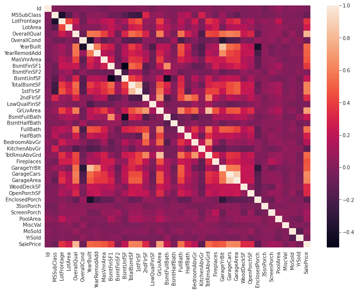
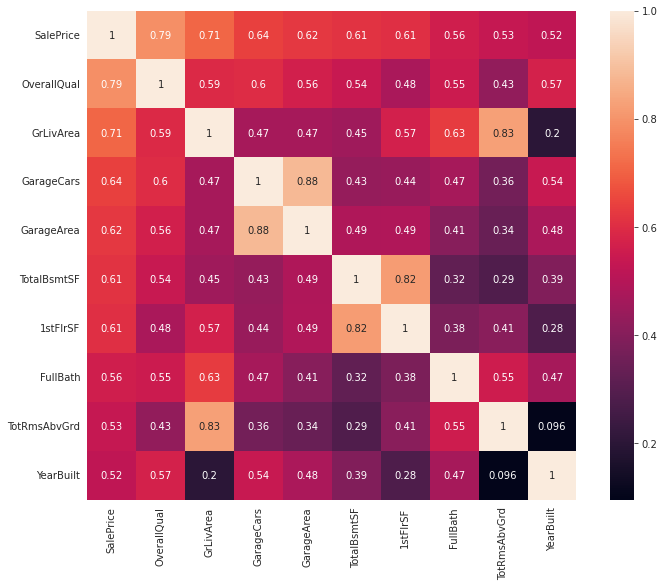
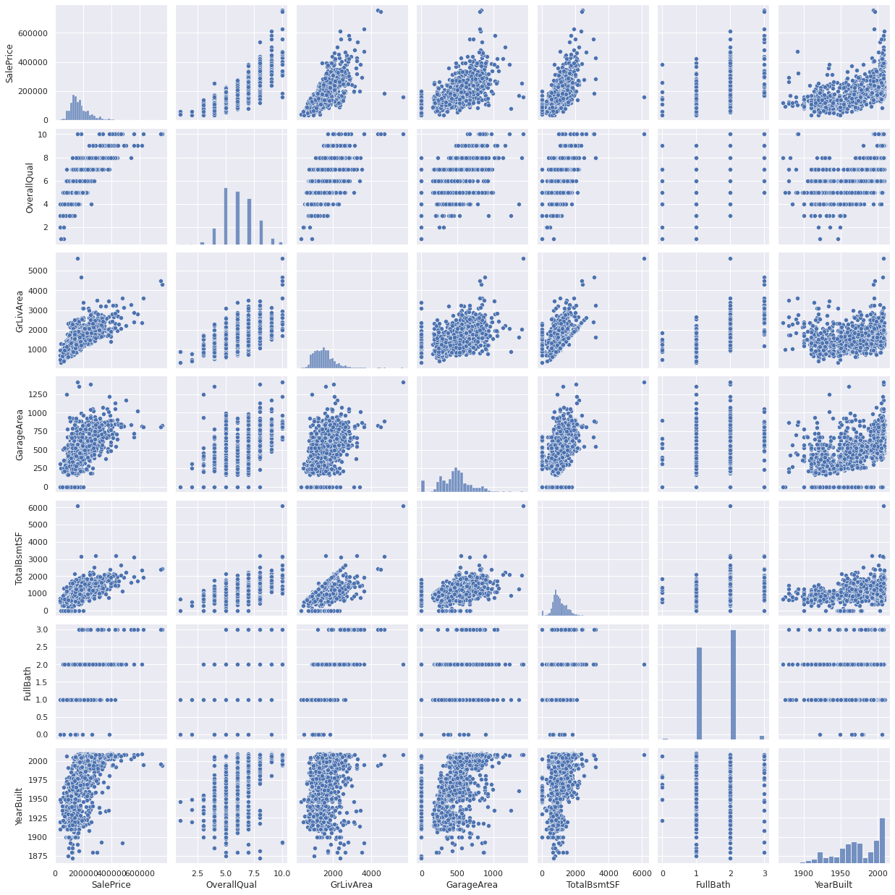
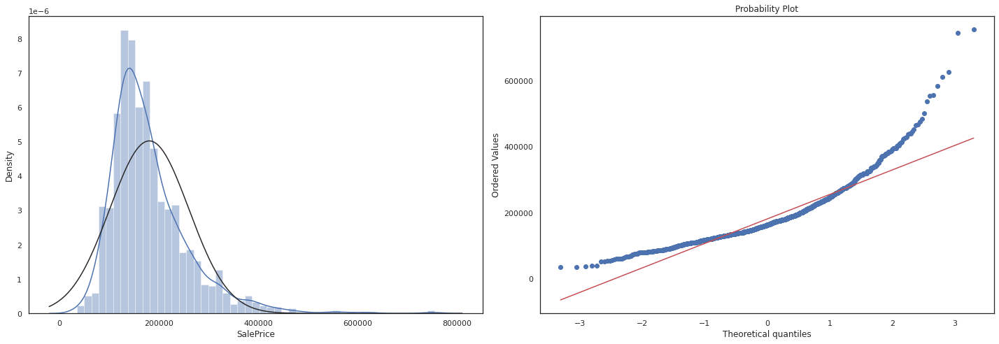
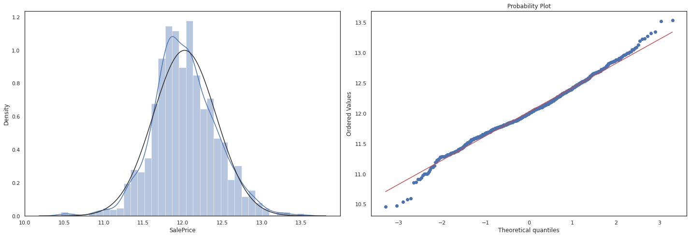
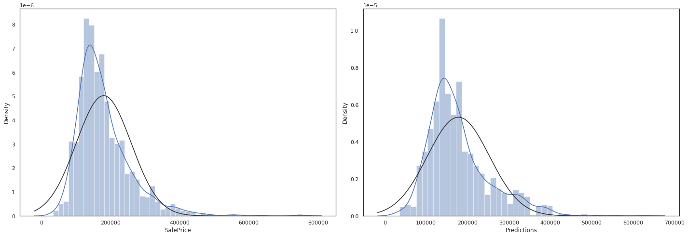

# HOUSING PRICE PREDICTION 

notebook by Rayen Feng 
Project start: July 9, 2022 
Project end: June 6, 2023  

There was a really long break in between this :)

This notebook intends to be for more or less my self learning. Therefore, I will mostly explain the concepts to myself throughout this notebook. 

## The problem and goal

The goal of this project is to use machine learning techniques to predict the housing prices of a given house. We're given a set of training data as well as testing data to accomplish this task.

## The outline 

Here are the steps that this analysis will take. 

1. **Understand the data** - this step will focus on looking at the varibles in the dataset and draft out some initial thoughts on what variables correlate to sale price. This will involve looking at each varibale and filtering out the useful ones from the one with little relevance.
2. **Data Cleaning** - once all the variables are skimmed through, some data cleaning will be done. This includes dealing with missing values, duplicate numbers, and outliers in any way. 
3. **Buidlding models** - once the data is clean, we can start building some models. Each one of these steps will most likely be refined as work is done, but this is the overall approach for it. We will use the training models to develop a model and use the test dataset to test it.

To answer the first question: 

**what variables are in relationship with saleprice?**


```python
import pandas as pd
import matplotlib.pyplot as plt
import seaborn as sns
import numpy as np
from scipy.stats import norm
from sklearn.preprocessing import StandardScaler
from scipy import stats
import warnings
warnings.filterwarnings('ignore')
%matplotlib inline
sns.set_style("whitegrid")
```


```python
# import data
df_train = pd.read_csv('../input/house-prices-advanced-regression-techniques/train.csv')
df_test = pd.read_csv('../input/house-prices-advanced-regression-techniques/test.csv')
df_sample = pd.read_csv('../input/house-prices-advanced-regression-techniques/sample_submission.csv')
```


```python
print(df_train.columns)
df_train.head()
```

    Index(['Id', 'MSSubClass', 'MSZoning', 'LotFrontage', 'LotArea', 'Street',
           'Alley', 'LotShape', 'LandContour', 'Utilities', 'LotConfig',
           'LandSlope', 'Neighborhood', 'Condition1', 'Condition2', 'BldgType',
           'HouseStyle', 'OverallQual', 'OverallCond', 'YearBuilt', 'YearRemodAdd',
           'RoofStyle', 'RoofMatl', 'Exterior1st', 'Exterior2nd', 'MasVnrType',
           'MasVnrArea', 'ExterQual', 'ExterCond', 'Foundation', 'BsmtQual',
           'BsmtCond', 'BsmtExposure', 'BsmtFinType1', 'BsmtFinSF1',
           'BsmtFinType2', 'BsmtFinSF2', 'BsmtUnfSF', 'TotalBsmtSF', 'Heating',
           'HeatingQC', 'CentralAir', 'Electrical', '1stFlrSF', '2ndFlrSF',
           'LowQualFinSF', 'GrLivArea', 'BsmtFullBath', 'BsmtHalfBath', 'FullBath',
           'HalfBath', 'BedroomAbvGr', 'KitchenAbvGr', 'KitchenQual',
           'TotRmsAbvGrd', 'Functional', 'Fireplaces', 'FireplaceQu', 'GarageType',
           'GarageYrBlt', 'GarageFinish', 'GarageCars', 'GarageArea', 'GarageQual',
           'GarageCond', 'PavedDrive', 'WoodDeckSF', 'OpenPorchSF',
           'EnclosedPorch', '3SsnPorch', 'ScreenPorch', 'PoolArea', 'PoolQC',
           'Fence', 'MiscFeature', 'MiscVal', 'MoSold', 'YrSold', 'SaleType',
           'SaleCondition', 'SalePrice'],
          dtype='object')


<div>
<style scoped>
    .dataframe tbody tr th:only-of-type {
        vertical-align: middle;
    }

    .dataframe tbody tr th {
        vertical-align: top;
    }

    .dataframe thead th {
        text-align: right;
    }
</style>
<table border="1" class="dataframe">
  <thead>
    <tr style="text-align: right;">
      <th></th>
      <th>Id</th>
      <th>MSSubClass</th>
      <th>MSZoning</th>
      <th>LotFrontage</th>
      <th>LotArea</th>
      <th>Street</th>
      <th>Alley</th>
      <th>LotShape</th>
      <th>LandContour</th>
      <th>Utilities</th>
      <th>...</th>
      <th>PoolArea</th>
      <th>PoolQC</th>
      <th>Fence</th>
      <th>MiscFeature</th>
      <th>MiscVal</th>
      <th>MoSold</th>
      <th>YrSold</th>
      <th>SaleType</th>
      <th>SaleCondition</th>
      <th>SalePrice</th>
    </tr>
  </thead>
  <tbody>
    <tr>
      <th>0</th>
      <td>1</td>
      <td>60</td>
      <td>RL</td>
      <td>65.0</td>
      <td>8450</td>
      <td>Pave</td>
      <td>NaN</td>
      <td>Reg</td>
      <td>Lvl</td>
      <td>AllPub</td>
      <td>...</td>
      <td>0</td>
      <td>NaN</td>
      <td>NaN</td>
      <td>NaN</td>
      <td>0</td>
      <td>2</td>
      <td>2008</td>
      <td>WD</td>
      <td>Normal</td>
      <td>208500</td>
    </tr>
    <tr>
      <th>1</th>
      <td>2</td>
      <td>20</td>
      <td>RL</td>
      <td>80.0</td>
      <td>9600</td>
      <td>Pave</td>
      <td>NaN</td>
      <td>Reg</td>
      <td>Lvl</td>
      <td>AllPub</td>
      <td>...</td>
      <td>0</td>
      <td>NaN</td>
      <td>NaN</td>
      <td>NaN</td>
      <td>0</td>
      <td>5</td>
      <td>2007</td>
      <td>WD</td>
      <td>Normal</td>
      <td>181500</td>
    </tr>
    <tr>
      <th>2</th>
      <td>3</td>
      <td>60</td>
      <td>RL</td>
      <td>68.0</td>
      <td>11250</td>
      <td>Pave</td>
      <td>NaN</td>
      <td>IR1</td>
      <td>Lvl</td>
      <td>AllPub</td>
      <td>...</td>
      <td>0</td>
      <td>NaN</td>
      <td>NaN</td>
      <td>NaN</td>
      <td>0</td>
      <td>9</td>
      <td>2008</td>
      <td>WD</td>
      <td>Normal</td>
      <td>223500</td>
    </tr>
    <tr>
      <th>3</th>
      <td>4</td>
      <td>70</td>
      <td>RL</td>
      <td>60.0</td>
      <td>9550</td>
      <td>Pave</td>
      <td>NaN</td>
      <td>IR1</td>
      <td>Lvl</td>
      <td>AllPub</td>
      <td>...</td>
      <td>0</td>
      <td>NaN</td>
      <td>NaN</td>
      <td>NaN</td>
      <td>0</td>
      <td>2</td>
      <td>2006</td>
      <td>WD</td>
      <td>Abnorml</td>
      <td>140000</td>
    </tr>
    <tr>
      <th>4</th>
      <td>5</td>
      <td>60</td>
      <td>RL</td>
      <td>84.0</td>
      <td>14260</td>
      <td>Pave</td>
      <td>NaN</td>
      <td>IR1</td>
      <td>Lvl</td>
      <td>AllPub</td>
      <td>...</td>
      <td>0</td>
      <td>NaN</td>
      <td>NaN</td>
      <td>NaN</td>
      <td>0</td>
      <td>12</td>
      <td>2008</td>
      <td>WD</td>
      <td>Normal</td>
      <td>250000</td>
    </tr>
  </tbody>
</table>
<p>5 rows × 81 columns</p>
</div>


### A quick dive into types of data and how to represent it

OK, we see that the overall condition scatter plot doesn't really tell us anything, or rather, it's really hard to tell what is being said in this graph. To better visualize this, we first need to understand some different types of data and the best way to represent each type. You can refer to the image below as a reference as I go over these concepts.  

There are two overall types of data. Qualitative and Quantitative. 

**Quantitative** - types of data that can be measured with numbers  
**Qualitative** - also known as **categorical** data, measures the qualitity of things, and cannot be measured with numbers

Okay, but what about the oveall condition? by definition, this is a type of qaltiative data because it describes the quality of the house, but it's also on a scale of 1 to 10, what does this mean? does it make this quantitative?  

In this case, the qualitative/categorical data can be represented into two sub-categories. The first of which is **Nominal** data, and the other is **ordinal** data. A good way to remember the difference is that ordinal data has natural order, where nominal does not. In this case, the overal condition of the house is ordinal data, the qualitiy of the house can be ranked in terms of 1 to 10. Something like the lot shape would be nominal data, it can be categorized into regualar, iregular 1 or irregular 2, but doesn't have any order to it. 

**Quantitative** continuous vs discrete

This one's easier to understand, discrete data just means that it's a whole number, or no numbers inbetween. For example, number of cars would be discreete as you can't have 1.24 cars, and lot size would be continuous because you can have a 120 sqft, 121 sqft or a 120.546 sqft area. 

If you'd like you can read more [here](https://www.mygreatlearning.com/blog/types-of-data/#:~:text=There%20are%20two%20types%20of,ordinal%2C%20discrete%2C%20and%20Continuous.)
<div>

</div>


```python
# extracting numerical data columns
quan_cols = list(df_train.describe().columns)
qual_cols= [x for x in list(df_train.columns) if x not in quan_cols]

print("\n ------ Quantatative data ---------\n")
print(quan_cols)
print("\n ------ Qualatative data ---------\n")
print(qual_cols)


# explore quant data, find most relavant
# explore qual data find most relavant 
# numerize qual data 
# split again into train test, then plug into ML and then pray 
# use anime list as reference 
# cross validate it 
# check results with test data 
```

    
     ------ Quantatative data ---------
    
    ['Id', 'MSSubClass', 'LotFrontage', 'LotArea', 'OverallQual', 'OverallCond', 'YearBuilt', 'YearRemodAdd', 'MasVnrArea', 'BsmtFinSF1', 'BsmtFinSF2', 'BsmtUnfSF', 'TotalBsmtSF', '1stFlrSF', '2ndFlrSF', 'LowQualFinSF', 'GrLivArea', 'BsmtFullBath', 'BsmtHalfBath', 'FullBath', 'HalfBath', 'BedroomAbvGr', 'KitchenAbvGr', 'TotRmsAbvGrd', 'Fireplaces', 'GarageYrBlt', 'GarageCars', 'GarageArea', 'WoodDeckSF', 'OpenPorchSF', 'EnclosedPorch', '3SsnPorch', 'ScreenPorch', 'PoolArea', 'MiscVal', 'MoSold', 'YrSold', 'SalePrice']
    
     ------ Qualatative data ---------
    
    ['MSZoning', 'Street', 'Alley', 'LotShape', 'LandContour', 'Utilities', 'LotConfig', 'LandSlope', 'Neighborhood', 'Condition1', 'Condition2', 'BldgType', 'HouseStyle', 'RoofStyle', 'RoofMatl', 'Exterior1st', 'Exterior2nd', 'MasVnrType', 'ExterQual', 'ExterCond', 'Foundation', 'BsmtQual', 'BsmtCond', 'BsmtExposure', 'BsmtFinType1', 'BsmtFinType2', 'Heating', 'HeatingQC', 'CentralAir', 'Electrical', 'KitchenQual', 'Functional', 'FireplaceQu', 'GarageType', 'GarageFinish', 'GarageQual', 'GarageCond', 'PavedDrive', 'PoolQC', 'Fence', 'MiscFeature', 'SaleType', 'SaleCondition']


## Exploring Quantataive Data 

The Quantatative data will be explored first. First, variables expected to have an impact will be plotted first. Then a heatmap using pearson and spearman correlation will be plotted to determine which variables have the highest correlation with the sale price. First, taking a look at the properties of sales_price


```python
display(df_train.describe().transpose())
```


<div>
<style scoped>
    .dataframe tbody tr th:only-of-type {
        vertical-align: middle;
    }

    .dataframe tbody tr th {
        vertical-align: top;
    }

    .dataframe thead th {
        text-align: right;
    }
</style>
<table border="1" class="dataframe">
  <thead>
    <tr style="text-align: right;">
      <th></th>
      <th>count</th>
      <th>mean</th>
      <th>std</th>
      <th>min</th>
      <th>25%</th>
      <th>50%</th>
      <th>75%</th>
      <th>max</th>
    </tr>
  </thead>
  <tbody>
    <tr>
      <th>Id</th>
      <td>1460.0</td>
      <td>730.500000</td>
      <td>421.610009</td>
      <td>1.0</td>
      <td>365.75</td>
      <td>730.5</td>
      <td>1095.25</td>
      <td>1460.0</td>
    </tr>
    <tr>
      <th>MSSubClass</th>
      <td>1460.0</td>
      <td>56.897260</td>
      <td>42.300571</td>
      <td>20.0</td>
      <td>20.00</td>
      <td>50.0</td>
      <td>70.00</td>
      <td>190.0</td>
    </tr>
    <tr>
      <th>LotFrontage</th>
      <td>1201.0</td>
      <td>70.049958</td>
      <td>24.284752</td>
      <td>21.0</td>
      <td>59.00</td>
      <td>69.0</td>
      <td>80.00</td>
      <td>313.0</td>
    </tr>
    <tr>
      <th>LotArea</th>
      <td>1460.0</td>
      <td>10516.828082</td>
      <td>9981.264932</td>
      <td>1300.0</td>
      <td>7553.50</td>
      <td>9478.5</td>
      <td>11601.50</td>
      <td>215245.0</td>
    </tr>
    <tr>
      <th>OverallQual</th>
      <td>1460.0</td>
      <td>6.099315</td>
      <td>1.382997</td>
      <td>1.0</td>
      <td>5.00</td>
      <td>6.0</td>
      <td>7.00</td>
      <td>10.0</td>
    </tr>
    <tr>
      <th>OverallCond</th>
      <td>1460.0</td>
      <td>5.575342</td>
      <td>1.112799</td>
      <td>1.0</td>
      <td>5.00</td>
      <td>5.0</td>
      <td>6.00</td>
      <td>9.0</td>
    </tr>
    <tr>
      <th>YearBuilt</th>
      <td>1460.0</td>
      <td>1971.267808</td>
      <td>30.202904</td>
      <td>1872.0</td>
      <td>1954.00</td>
      <td>1973.0</td>
      <td>2000.00</td>
      <td>2010.0</td>
    </tr>
    <tr>
      <th>YearRemodAdd</th>
      <td>1460.0</td>
      <td>1984.865753</td>
      <td>20.645407</td>
      <td>1950.0</td>
      <td>1967.00</td>
      <td>1994.0</td>
      <td>2004.00</td>
      <td>2010.0</td>
    </tr>
    <tr>
      <th>MasVnrArea</th>
      <td>1452.0</td>
      <td>103.685262</td>
      <td>181.066207</td>
      <td>0.0</td>
      <td>0.00</td>
      <td>0.0</td>
      <td>166.00</td>
      <td>1600.0</td>
    </tr>
    <tr>
      <th>BsmtFinSF1</th>
      <td>1460.0</td>
      <td>443.639726</td>
      <td>456.098091</td>
      <td>0.0</td>
      <td>0.00</td>
      <td>383.5</td>
      <td>712.25</td>
      <td>5644.0</td>
    </tr>
    <tr>
      <th>BsmtFinSF2</th>
      <td>1460.0</td>
      <td>46.549315</td>
      <td>161.319273</td>
      <td>0.0</td>
      <td>0.00</td>
      <td>0.0</td>
      <td>0.00</td>
      <td>1474.0</td>
    </tr>
    <tr>
      <th>BsmtUnfSF</th>
      <td>1460.0</td>
      <td>567.240411</td>
      <td>441.866955</td>
      <td>0.0</td>
      <td>223.00</td>
      <td>477.5</td>
      <td>808.00</td>
      <td>2336.0</td>
    </tr>
    <tr>
      <th>TotalBsmtSF</th>
      <td>1460.0</td>
      <td>1057.429452</td>
      <td>438.705324</td>
      <td>0.0</td>
      <td>795.75</td>
      <td>991.5</td>
      <td>1298.25</td>
      <td>6110.0</td>
    </tr>
    <tr>
      <th>1stFlrSF</th>
      <td>1460.0</td>
      <td>1162.626712</td>
      <td>386.587738</td>
      <td>334.0</td>
      <td>882.00</td>
      <td>1087.0</td>
      <td>1391.25</td>
      <td>4692.0</td>
    </tr>
    <tr>
      <th>2ndFlrSF</th>
      <td>1460.0</td>
      <td>346.992466</td>
      <td>436.528436</td>
      <td>0.0</td>
      <td>0.00</td>
      <td>0.0</td>
      <td>728.00</td>
      <td>2065.0</td>
    </tr>
    <tr>
      <th>LowQualFinSF</th>
      <td>1460.0</td>
      <td>5.844521</td>
      <td>48.623081</td>
      <td>0.0</td>
      <td>0.00</td>
      <td>0.0</td>
      <td>0.00</td>
      <td>572.0</td>
    </tr>
    <tr>
      <th>GrLivArea</th>
      <td>1460.0</td>
      <td>1515.463699</td>
      <td>525.480383</td>
      <td>334.0</td>
      <td>1129.50</td>
      <td>1464.0</td>
      <td>1776.75</td>
      <td>5642.0</td>
    </tr>
    <tr>
      <th>BsmtFullBath</th>
      <td>1460.0</td>
      <td>0.425342</td>
      <td>0.518911</td>
      <td>0.0</td>
      <td>0.00</td>
      <td>0.0</td>
      <td>1.00</td>
      <td>3.0</td>
    </tr>
    <tr>
      <th>BsmtHalfBath</th>
      <td>1460.0</td>
      <td>0.057534</td>
      <td>0.238753</td>
      <td>0.0</td>
      <td>0.00</td>
      <td>0.0</td>
      <td>0.00</td>
      <td>2.0</td>
    </tr>
    <tr>
      <th>FullBath</th>
      <td>1460.0</td>
      <td>1.565068</td>
      <td>0.550916</td>
      <td>0.0</td>
      <td>1.00</td>
      <td>2.0</td>
      <td>2.00</td>
      <td>3.0</td>
    </tr>
    <tr>
      <th>HalfBath</th>
      <td>1460.0</td>
      <td>0.382877</td>
      <td>0.502885</td>
      <td>0.0</td>
      <td>0.00</td>
      <td>0.0</td>
      <td>1.00</td>
      <td>2.0</td>
    </tr>
    <tr>
      <th>BedroomAbvGr</th>
      <td>1460.0</td>
      <td>2.866438</td>
      <td>0.815778</td>
      <td>0.0</td>
      <td>2.00</td>
      <td>3.0</td>
      <td>3.00</td>
      <td>8.0</td>
    </tr>
    <tr>
      <th>KitchenAbvGr</th>
      <td>1460.0</td>
      <td>1.046575</td>
      <td>0.220338</td>
      <td>0.0</td>
      <td>1.00</td>
      <td>1.0</td>
      <td>1.00</td>
      <td>3.0</td>
    </tr>
    <tr>
      <th>TotRmsAbvGrd</th>
      <td>1460.0</td>
      <td>6.517808</td>
      <td>1.625393</td>
      <td>2.0</td>
      <td>5.00</td>
      <td>6.0</td>
      <td>7.00</td>
      <td>14.0</td>
    </tr>
    <tr>
      <th>Fireplaces</th>
      <td>1460.0</td>
      <td>0.613014</td>
      <td>0.644666</td>
      <td>0.0</td>
      <td>0.00</td>
      <td>1.0</td>
      <td>1.00</td>
      <td>3.0</td>
    </tr>
    <tr>
      <th>GarageYrBlt</th>
      <td>1379.0</td>
      <td>1978.506164</td>
      <td>24.689725</td>
      <td>1900.0</td>
      <td>1961.00</td>
      <td>1980.0</td>
      <td>2002.00</td>
      <td>2010.0</td>
    </tr>
    <tr>
      <th>GarageCars</th>
      <td>1460.0</td>
      <td>1.767123</td>
      <td>0.747315</td>
      <td>0.0</td>
      <td>1.00</td>
      <td>2.0</td>
      <td>2.00</td>
      <td>4.0</td>
    </tr>
    <tr>
      <th>GarageArea</th>
      <td>1460.0</td>
      <td>472.980137</td>
      <td>213.804841</td>
      <td>0.0</td>
      <td>334.50</td>
      <td>480.0</td>
      <td>576.00</td>
      <td>1418.0</td>
    </tr>
    <tr>
      <th>WoodDeckSF</th>
      <td>1460.0</td>
      <td>94.244521</td>
      <td>125.338794</td>
      <td>0.0</td>
      <td>0.00</td>
      <td>0.0</td>
      <td>168.00</td>
      <td>857.0</td>
    </tr>
    <tr>
      <th>OpenPorchSF</th>
      <td>1460.0</td>
      <td>46.660274</td>
      <td>66.256028</td>
      <td>0.0</td>
      <td>0.00</td>
      <td>25.0</td>
      <td>68.00</td>
      <td>547.0</td>
    </tr>
    <tr>
      <th>EnclosedPorch</th>
      <td>1460.0</td>
      <td>21.954110</td>
      <td>61.119149</td>
      <td>0.0</td>
      <td>0.00</td>
      <td>0.0</td>
      <td>0.00</td>
      <td>552.0</td>
    </tr>
    <tr>
      <th>3SsnPorch</th>
      <td>1460.0</td>
      <td>3.409589</td>
      <td>29.317331</td>
      <td>0.0</td>
      <td>0.00</td>
      <td>0.0</td>
      <td>0.00</td>
      <td>508.0</td>
    </tr>
    <tr>
      <th>ScreenPorch</th>
      <td>1460.0</td>
      <td>15.060959</td>
      <td>55.757415</td>
      <td>0.0</td>
      <td>0.00</td>
      <td>0.0</td>
      <td>0.00</td>
      <td>480.0</td>
    </tr>
    <tr>
      <th>PoolArea</th>
      <td>1460.0</td>
      <td>2.758904</td>
      <td>40.177307</td>
      <td>0.0</td>
      <td>0.00</td>
      <td>0.0</td>
      <td>0.00</td>
      <td>738.0</td>
    </tr>
    <tr>
      <th>MiscVal</th>
      <td>1460.0</td>
      <td>43.489041</td>
      <td>496.123024</td>
      <td>0.0</td>
      <td>0.00</td>
      <td>0.0</td>
      <td>0.00</td>
      <td>15500.0</td>
    </tr>
    <tr>
      <th>MoSold</th>
      <td>1460.0</td>
      <td>6.321918</td>
      <td>2.703626</td>
      <td>1.0</td>
      <td>5.00</td>
      <td>6.0</td>
      <td>8.00</td>
      <td>12.0</td>
    </tr>
    <tr>
      <th>YrSold</th>
      <td>1460.0</td>
      <td>2007.815753</td>
      <td>1.328095</td>
      <td>2006.0</td>
      <td>2007.00</td>
      <td>2008.0</td>
      <td>2009.00</td>
      <td>2010.0</td>
    </tr>
    <tr>
      <th>SalePrice</th>
      <td>1460.0</td>
      <td>180921.195890</td>
      <td>79442.502883</td>
      <td>34900.0</td>
      <td>129975.00</td>
      <td>163000.0</td>
      <td>214000.00</td>
      <td>755000.0</td>
    </tr>
  </tbody>
</table>
</div>


### About Pearson Correlation

looking at the list of all the variables, we can go through them one by one and see which ones might have a chance of influencing the price of the house, and add those to the list of varibables, however, that's more work than I would like to do. I want to take a detailed look of the data after I do a quick sweep through. 

A better method instead of looking at each individual variable is to have python look at it for us instead. The question is how do we do this? well, there's a good function that does it for me. it's the '.corr' function, which probably stands for correlation. The documentenation uses a pairwise correlation of columns, but what does this mean?  

In summary, pairwise correlation uses Pearson’s correlation coefficient (r), which basically is a number from -1 to 1 which shows how direct the relationship is between two variables. A sample scale would be: 

- weak 0 < r < 0.3
- moderate 0.3 < r < 0.6
- strong 0.7 < r < 1.0 

Of course a strong negative relationship is denoted from 0 to -1. In our case, for example, a coefficent of 0.95 for floor area to sales price could indicate a good correlation between the two variables, and would be something to include in the model.  

If you want further reading, you can check out [this article](https://towardsdatascience.com/how-to-use-pairwise-correlation-for-robust-feature-selection-20a60ef7d10#:~:text=Using%20pairwise%20correlation%20for%20feature,as%20few%20features%20as%20possible.) from towardsdatascience which covers how you can use seaborn to visualize this

The image below helped the understanding of this concept better. However, something to be weary of is not to confuse this with slope


<div>

</div>


```python
methods = 'pearson'

houses_corrmat = df_train.corr(method= methods)
plt.subplots(figsize=(12, 9))
sns.heatmap(houses_corrmat)
```


    <AxesSubplot:>


    

    


```python
# extract the column names of the variables with the highest correlation with sale price 
k = 10 
cols_top_ten = houses_corrmat.nlargest(k,'SalePrice')['SalePrice'].index
corrmat_p_top_10 = df_train[cols_top_ten].corr()
corrmat_p_top_10
```


<div>
<style scoped>
    .dataframe tbody tr th:only-of-type {
        vertical-align: middle;
    }

    .dataframe tbody tr th {
        vertical-align: top;
    }

    .dataframe thead th {
        text-align: right;
    }
</style>
<table border="1" class="dataframe">
  <thead>
    <tr style="text-align: right;">
      <th></th>
      <th>SalePrice</th>
      <th>OverallQual</th>
      <th>GrLivArea</th>
      <th>GarageCars</th>
      <th>GarageArea</th>
      <th>TotalBsmtSF</th>
      <th>1stFlrSF</th>
      <th>FullBath</th>
      <th>TotRmsAbvGrd</th>
      <th>YearBuilt</th>
    </tr>
  </thead>
  <tbody>
    <tr>
      <th>SalePrice</th>
      <td>1.000000</td>
      <td>0.790982</td>
      <td>0.708624</td>
      <td>0.640409</td>
      <td>0.623431</td>
      <td>0.613581</td>
      <td>0.605852</td>
      <td>0.560664</td>
      <td>0.533723</td>
      <td>0.522897</td>
    </tr>
    <tr>
      <th>OverallQual</th>
      <td>0.790982</td>
      <td>1.000000</td>
      <td>0.593007</td>
      <td>0.600671</td>
      <td>0.562022</td>
      <td>0.537808</td>
      <td>0.476224</td>
      <td>0.550600</td>
      <td>0.427452</td>
      <td>0.572323</td>
    </tr>
    <tr>
      <th>GrLivArea</th>
      <td>0.708624</td>
      <td>0.593007</td>
      <td>1.000000</td>
      <td>0.467247</td>
      <td>0.468997</td>
      <td>0.454868</td>
      <td>0.566024</td>
      <td>0.630012</td>
      <td>0.825489</td>
      <td>0.199010</td>
    </tr>
    <tr>
      <th>GarageCars</th>
      <td>0.640409</td>
      <td>0.600671</td>
      <td>0.467247</td>
      <td>1.000000</td>
      <td>0.882475</td>
      <td>0.434585</td>
      <td>0.439317</td>
      <td>0.469672</td>
      <td>0.362289</td>
      <td>0.537850</td>
    </tr>
    <tr>
      <th>GarageArea</th>
      <td>0.623431</td>
      <td>0.562022</td>
      <td>0.468997</td>
      <td>0.882475</td>
      <td>1.000000</td>
      <td>0.486665</td>
      <td>0.489782</td>
      <td>0.405656</td>
      <td>0.337822</td>
      <td>0.478954</td>
    </tr>
    <tr>
      <th>TotalBsmtSF</th>
      <td>0.613581</td>
      <td>0.537808</td>
      <td>0.454868</td>
      <td>0.434585</td>
      <td>0.486665</td>
      <td>1.000000</td>
      <td>0.819530</td>
      <td>0.323722</td>
      <td>0.285573</td>
      <td>0.391452</td>
    </tr>
    <tr>
      <th>1stFlrSF</th>
      <td>0.605852</td>
      <td>0.476224</td>
      <td>0.566024</td>
      <td>0.439317</td>
      <td>0.489782</td>
      <td>0.819530</td>
      <td>1.000000</td>
      <td>0.380637</td>
      <td>0.409516</td>
      <td>0.281986</td>
    </tr>
    <tr>
      <th>FullBath</th>
      <td>0.560664</td>
      <td>0.550600</td>
      <td>0.630012</td>
      <td>0.469672</td>
      <td>0.405656</td>
      <td>0.323722</td>
      <td>0.380637</td>
      <td>1.000000</td>
      <td>0.554784</td>
      <td>0.468271</td>
    </tr>
    <tr>
      <th>TotRmsAbvGrd</th>
      <td>0.533723</td>
      <td>0.427452</td>
      <td>0.825489</td>
      <td>0.362289</td>
      <td>0.337822</td>
      <td>0.285573</td>
      <td>0.409516</td>
      <td>0.554784</td>
      <td>1.000000</td>
      <td>0.095589</td>
    </tr>
    <tr>
      <th>YearBuilt</th>
      <td>0.522897</td>
      <td>0.572323</td>
      <td>0.199010</td>
      <td>0.537850</td>
      <td>0.478954</td>
      <td>0.391452</td>
      <td>0.281986</td>
      <td>0.468271</td>
      <td>0.095589</td>
      <td>1.000000</td>
    </tr>
  </tbody>
</table>
</div>


### Looking at the heatmap...

So this matrix is quite hard to see. The way you would read this is if you pick any row and column and read the cell value, it would tell you the degree of correlation between the two. Again the closer to 1 or -1 this number is, the more related the two variables are. Something to notice is that the value is 1.00 for all variables along the diagonal, which means they are 100% related. This makes sense because for example, Id and Id are the same variable, so of course they would be directly related. Something to also notice is that this function takes out all the non-numerical data, which makes sense.  

The problem is, this is very hard to see, so the solution would be just pick the ones with the most correlation and then replot 


```python
plt.subplots(figsize=(12, 9))
sns.heatmap(corrmat_p_top_10, annot=True, square = True, annot_kws={"size": 10})
sns.set(font_scale=1.25)
```


    

    


### Quantitative Data Exploration Notes

We can now see quite clearly what variables relate to each other. Since we are only interested in the variables in relationship to saleprice, we can take a look at last row, or the last columm. remember, since the lighter colors are higher in value, listing the columns which output the lighter boxes means there's a strong relationship between the variables. Oveall, we can observe four total categories. 

notes: SF = square footage 

1. **Quality** - overall quality, overall condition 
2. **Area dependant** - Lot area, gros living area, basement area, garage area
3. **date dependant** -Year bulit, year remodeled 
4. **Amenities** - number of baths, bedrooms, fireplaces, garage cars 

For the following, I'll plot a scatter chart isolating these variables, and then see if there is a trend between these variables just in case we need to explore more for each of these trends. 

Notes:  

- Garage Cars was removed due to redundancy with Garage Area 


```python
sns.set_theme(style="whitegrid")
sns.set()
cols = ['SalePrice', 'OverallQual', 'GrLivArea', 'GarageArea', 'TotalBsmtSF', 'FullBath', 'YearBuilt']
sns.pairplot(df_train[cols], size = 2.5)
plt.show();
```


    

    


# Qualatative Data
With Qualatiative Data, it's a bit more tricky to analyze, but there are some ways we can still perform it. Here's list of variables that is avaiable to us.A simple idea is this. We can try to eliminate the two main numerical factors influencing the salesprice, which is the floor area. to help better isolate for the current analyzed variable. to do this: 

1. Divide the sales price by the floor area, to get price per sqft. 
2. Plot each variable with a boxplot. 
3. Inspect each one and see if there is any correlation.  

just as a reminder, here are the qualatiative featuers of our dataset. 


```python
print("\n ------ Qualatative data ---------\n")
print(qual_cols)
```

    
     ------ Qualatative data ---------
    
    ['MSZoning', 'Street', 'Alley', 'LotShape', 'LandContour', 'Utilities', 'LotConfig', 'LandSlope', 'Neighborhood', 'Condition1', 'Condition2', 'BldgType', 'HouseStyle', 'RoofStyle', 'RoofMatl', 'Exterior1st', 'Exterior2nd', 'MasVnrType', 'ExterQual', 'ExterCond', 'Foundation', 'BsmtQual', 'BsmtCond', 'BsmtExposure', 'BsmtFinType1', 'BsmtFinType2', 'Heating', 'HeatingQC', 'CentralAir', 'Electrical', 'KitchenQual', 'Functional', 'FireplaceQu', 'GarageType', 'GarageFinish', 'GarageQual', 'GarageCond', 'PavedDrive', 'PoolQC', 'Fence', 'MiscFeature', 'SaleType', 'SaleCondition']


### Variable analysis

1. **Lot Shaping** such as:  MSZoning, LotShape, LandContour, LotConfig, LandSlope have a low chance of influencing price, these are just not something that would influence price from a common sense standpoint. 
2. **Conditions** such as 'Condition1', 'ExterQual' etc, is already categorized into the general condition, which is better since it is numeric. 
3. **Material & Anemities** such as 'MasVnrType' or 'CentralAir' may influence the house price, however, these more influence the operational cost and have much less of an impact when compared to items such as sqft. 

which really only leaves us with something like neighboorhood which we can consider adding in, as this is something many people consider when choosing a house. To say it simply, you can have a really big house, but if it's in the middle of nowhere, then obviously the house price goes down. For now, each variable will be plotted with a boxplot and then compared to salesprice to see if I'm incorrect in my assumptions. 


```python
df_train['Price_per_sqft'] = df_train['SalePrice'] / df_train['GrLivArea'] 
df_train
```


<div>
<style scoped>
    .dataframe tbody tr th:only-of-type {
        vertical-align: middle;
    }

    .dataframe tbody tr th {
        vertical-align: top;
    }

    .dataframe thead th {
        text-align: right;
    }
</style>
<table border="1" class="dataframe">
  <thead>
    <tr style="text-align: right;">
      <th></th>
      <th>Id</th>
      <th>MSSubClass</th>
      <th>MSZoning</th>
      <th>LotFrontage</th>
      <th>LotArea</th>
      <th>Street</th>
      <th>Alley</th>
      <th>LotShape</th>
      <th>LandContour</th>
      <th>Utilities</th>
      <th>...</th>
      <th>PoolQC</th>
      <th>Fence</th>
      <th>MiscFeature</th>
      <th>MiscVal</th>
      <th>MoSold</th>
      <th>YrSold</th>
      <th>SaleType</th>
      <th>SaleCondition</th>
      <th>SalePrice</th>
      <th>Price_per_sqft</th>
    </tr>
  </thead>
  <tbody>
    <tr>
      <th>0</th>
      <td>1</td>
      <td>60</td>
      <td>RL</td>
      <td>65.0</td>
      <td>8450</td>
      <td>Pave</td>
      <td>NaN</td>
      <td>Reg</td>
      <td>Lvl</td>
      <td>AllPub</td>
      <td>...</td>
      <td>NaN</td>
      <td>NaN</td>
      <td>NaN</td>
      <td>0</td>
      <td>2</td>
      <td>2008</td>
      <td>WD</td>
      <td>Normal</td>
      <td>208500</td>
      <td>121.929825</td>
    </tr>
    <tr>
      <th>1</th>
      <td>2</td>
      <td>20</td>
      <td>RL</td>
      <td>80.0</td>
      <td>9600</td>
      <td>Pave</td>
      <td>NaN</td>
      <td>Reg</td>
      <td>Lvl</td>
      <td>AllPub</td>
      <td>...</td>
      <td>NaN</td>
      <td>NaN</td>
      <td>NaN</td>
      <td>0</td>
      <td>5</td>
      <td>2007</td>
      <td>WD</td>
      <td>Normal</td>
      <td>181500</td>
      <td>143.819334</td>
    </tr>
    <tr>
      <th>2</th>
      <td>3</td>
      <td>60</td>
      <td>RL</td>
      <td>68.0</td>
      <td>11250</td>
      <td>Pave</td>
      <td>NaN</td>
      <td>IR1</td>
      <td>Lvl</td>
      <td>AllPub</td>
      <td>...</td>
      <td>NaN</td>
      <td>NaN</td>
      <td>NaN</td>
      <td>0</td>
      <td>9</td>
      <td>2008</td>
      <td>WD</td>
      <td>Normal</td>
      <td>223500</td>
      <td>125.139978</td>
    </tr>
    <tr>
      <th>3</th>
      <td>4</td>
      <td>70</td>
      <td>RL</td>
      <td>60.0</td>
      <td>9550</td>
      <td>Pave</td>
      <td>NaN</td>
      <td>IR1</td>
      <td>Lvl</td>
      <td>AllPub</td>
      <td>...</td>
      <td>NaN</td>
      <td>NaN</td>
      <td>NaN</td>
      <td>0</td>
      <td>2</td>
      <td>2006</td>
      <td>WD</td>
      <td>Abnorml</td>
      <td>140000</td>
      <td>81.537566</td>
    </tr>
    <tr>
      <th>4</th>
      <td>5</td>
      <td>60</td>
      <td>RL</td>
      <td>84.0</td>
      <td>14260</td>
      <td>Pave</td>
      <td>NaN</td>
      <td>IR1</td>
      <td>Lvl</td>
      <td>AllPub</td>
      <td>...</td>
      <td>NaN</td>
      <td>NaN</td>
      <td>NaN</td>
      <td>0</td>
      <td>12</td>
      <td>2008</td>
      <td>WD</td>
      <td>Normal</td>
      <td>250000</td>
      <td>113.739763</td>
    </tr>
    <tr>
      <th>...</th>
      <td>...</td>
      <td>...</td>
      <td>...</td>
      <td>...</td>
      <td>...</td>
      <td>...</td>
      <td>...</td>
      <td>...</td>
      <td>...</td>
      <td>...</td>
      <td>...</td>
      <td>...</td>
      <td>...</td>
      <td>...</td>
      <td>...</td>
      <td>...</td>
      <td>...</td>
      <td>...</td>
      <td>...</td>
      <td>...</td>
      <td>...</td>
    </tr>
    <tr>
      <th>1455</th>
      <td>1456</td>
      <td>60</td>
      <td>RL</td>
      <td>62.0</td>
      <td>7917</td>
      <td>Pave</td>
      <td>NaN</td>
      <td>Reg</td>
      <td>Lvl</td>
      <td>AllPub</td>
      <td>...</td>
      <td>NaN</td>
      <td>NaN</td>
      <td>NaN</td>
      <td>0</td>
      <td>8</td>
      <td>2007</td>
      <td>WD</td>
      <td>Normal</td>
      <td>175000</td>
      <td>106.253795</td>
    </tr>
    <tr>
      <th>1456</th>
      <td>1457</td>
      <td>20</td>
      <td>RL</td>
      <td>85.0</td>
      <td>13175</td>
      <td>Pave</td>
      <td>NaN</td>
      <td>Reg</td>
      <td>Lvl</td>
      <td>AllPub</td>
      <td>...</td>
      <td>NaN</td>
      <td>MnPrv</td>
      <td>NaN</td>
      <td>0</td>
      <td>2</td>
      <td>2010</td>
      <td>WD</td>
      <td>Normal</td>
      <td>210000</td>
      <td>101.302460</td>
    </tr>
    <tr>
      <th>1457</th>
      <td>1458</td>
      <td>70</td>
      <td>RL</td>
      <td>66.0</td>
      <td>9042</td>
      <td>Pave</td>
      <td>NaN</td>
      <td>Reg</td>
      <td>Lvl</td>
      <td>AllPub</td>
      <td>...</td>
      <td>NaN</td>
      <td>GdPrv</td>
      <td>Shed</td>
      <td>2500</td>
      <td>5</td>
      <td>2010</td>
      <td>WD</td>
      <td>Normal</td>
      <td>266500</td>
      <td>113.888889</td>
    </tr>
    <tr>
      <th>1458</th>
      <td>1459</td>
      <td>20</td>
      <td>RL</td>
      <td>68.0</td>
      <td>9717</td>
      <td>Pave</td>
      <td>NaN</td>
      <td>Reg</td>
      <td>Lvl</td>
      <td>AllPub</td>
      <td>...</td>
      <td>NaN</td>
      <td>NaN</td>
      <td>NaN</td>
      <td>0</td>
      <td>4</td>
      <td>2010</td>
      <td>WD</td>
      <td>Normal</td>
      <td>142125</td>
      <td>131.841373</td>
    </tr>
    <tr>
      <th>1459</th>
      <td>1460</td>
      <td>20</td>
      <td>RL</td>
      <td>75.0</td>
      <td>9937</td>
      <td>Pave</td>
      <td>NaN</td>
      <td>Reg</td>
      <td>Lvl</td>
      <td>AllPub</td>
      <td>...</td>
      <td>NaN</td>
      <td>NaN</td>
      <td>NaN</td>
      <td>0</td>
      <td>6</td>
      <td>2008</td>
      <td>WD</td>
      <td>Normal</td>
      <td>147500</td>
      <td>117.436306</td>
    </tr>
  </tbody>
</table>
<p>1460 rows × 82 columns</p>
</div>


```python
# define that plots and sorts qual variable when compared to salesprice. 

def qual_var_calc(var):
    
    dep_var = 'SalePrice'
    df_var_sqft = df_train[[var , dep_var]]


    df_var_sqft_by_categ = df_var_sqft.groupby(var).mean()
    df_var_sqft_by_categ = df_var_sqft_by_categ.sort_values(by = dep_var, ascending = False)
    order_list = list(df_var_sqft_by_categ.index)

    plt.subplots(figsize=(9, 6))
    plt.title(str(var) + ' vs. SalePrice')
    plt.xticks(rotation=90)
    sns.boxplot(x=var, y=dep_var, data=df_var_sqft, order = order_list)

# for i in qual_cols:
#     qual_var_calc(i)
```

#### More on Boxplots 
What is a boxplot? let's just plot it first to find out. The image below summarizes it quite well.

<div>

</div>

The boxplots are a way of showing the data with the medium, first quartile (Q1), third quartile (Q3), and the maximum.


- median (Q2/50th Percentile): the middle value of the dataset.
- first quartile (Q1/25th Percentile): the middle number between the smallest number (not the “minimum”) and the median of the dataset.
- third quartile (Q3/75th Percentile): the middle value between the median and the highest value (not the “maximum”) of the dataset.
- interquartile range (IQR): 25th to the 75th percentile.
- “maximum”: Q3 + 1.5*IQR
- “minimum”: Q1 -1.5*IQR

The source of the image and information is from towards data science, which you can find [here](https://towardsdatascience.com/understanding-boxplots-5e2df7bcbd51)


# Filling in missing data.

Now that We've done some EDA to see some relationships with variables, it's time to see what needs to be cleaned up in the data. This is important becauese data needs to be complete and rid of errors in order to get accurate results. Some things to keep in mind when cleaning data are:  

Are the errors random, or do they have a pattern? 
what does this impact if I change it?  

A good first step in cleaning up data is to find out the null, or missing values 


```python
total_null_values = df_train.isnull().sum().sort_values(ascending = False)
percent_null_values = (df_train.isnull().sum()/df_train.isnull().count()).sort_values(ascending = False)

total_null_values
percent_null_values
missing_data = pd.DataFrame()

missing_data['no. of missing values'] = total_null_values
missing_data['percent of missing values'] = percent_null_values

display(missing_data.head(30))

# delete columsn 
cols_to_delete = missing_data[missing_data['percent of missing values'] > 0].index


df_train = df_train.drop(columns = list(cols_to_delete))

print("\n ------ Columns with no missing data ---------\n")
df_train.columns

```


<div>
<style scoped>
    .dataframe tbody tr th:only-of-type {
        vertical-align: middle;
    }

    .dataframe tbody tr th {
        vertical-align: top;
    }

    .dataframe thead th {
        text-align: right;
    }
</style>
<table border="1" class="dataframe">
  <thead>
    <tr style="text-align: right;">
      <th></th>
      <th>no. of missing values</th>
      <th>percent of missing values</th>
    </tr>
  </thead>
  <tbody>
    <tr>
      <th>PoolQC</th>
      <td>1453</td>
      <td>0.995205</td>
    </tr>
    <tr>
      <th>MiscFeature</th>
      <td>1406</td>
      <td>0.963014</td>
    </tr>
    <tr>
      <th>Alley</th>
      <td>1369</td>
      <td>0.937671</td>
    </tr>
    <tr>
      <th>Fence</th>
      <td>1179</td>
      <td>0.807534</td>
    </tr>
    <tr>
      <th>FireplaceQu</th>
      <td>690</td>
      <td>0.472603</td>
    </tr>
    <tr>
      <th>LotFrontage</th>
      <td>259</td>
      <td>0.177397</td>
    </tr>
    <tr>
      <th>GarageType</th>
      <td>81</td>
      <td>0.055479</td>
    </tr>
    <tr>
      <th>GarageYrBlt</th>
      <td>81</td>
      <td>0.055479</td>
    </tr>
    <tr>
      <th>GarageCond</th>
      <td>81</td>
      <td>0.055479</td>
    </tr>
    <tr>
      <th>GarageQual</th>
      <td>81</td>
      <td>0.055479</td>
    </tr>
    <tr>
      <th>GarageFinish</th>
      <td>81</td>
      <td>0.055479</td>
    </tr>
    <tr>
      <th>BsmtFinType2</th>
      <td>38</td>
      <td>0.026027</td>
    </tr>
    <tr>
      <th>BsmtExposure</th>
      <td>38</td>
      <td>0.026027</td>
    </tr>
    <tr>
      <th>BsmtQual</th>
      <td>37</td>
      <td>0.025342</td>
    </tr>
    <tr>
      <th>BsmtCond</th>
      <td>37</td>
      <td>0.025342</td>
    </tr>
    <tr>
      <th>BsmtFinType1</th>
      <td>37</td>
      <td>0.025342</td>
    </tr>
    <tr>
      <th>MasVnrType</th>
      <td>8</td>
      <td>0.005479</td>
    </tr>
    <tr>
      <th>MasVnrArea</th>
      <td>8</td>
      <td>0.005479</td>
    </tr>
    <tr>
      <th>Electrical</th>
      <td>1</td>
      <td>0.000685</td>
    </tr>
    <tr>
      <th>Id</th>
      <td>0</td>
      <td>0.000000</td>
    </tr>
    <tr>
      <th>Fireplaces</th>
      <td>0</td>
      <td>0.000000</td>
    </tr>
    <tr>
      <th>Functional</th>
      <td>0</td>
      <td>0.000000</td>
    </tr>
    <tr>
      <th>KitchenQual</th>
      <td>0</td>
      <td>0.000000</td>
    </tr>
    <tr>
      <th>KitchenAbvGr</th>
      <td>0</td>
      <td>0.000000</td>
    </tr>
    <tr>
      <th>BedroomAbvGr</th>
      <td>0</td>
      <td>0.000000</td>
    </tr>
    <tr>
      <th>HalfBath</th>
      <td>0</td>
      <td>0.000000</td>
    </tr>
    <tr>
      <th>FullBath</th>
      <td>0</td>
      <td>0.000000</td>
    </tr>
    <tr>
      <th>BsmtHalfBath</th>
      <td>0</td>
      <td>0.000000</td>
    </tr>
    <tr>
      <th>TotRmsAbvGrd</th>
      <td>0</td>
      <td>0.000000</td>
    </tr>
    <tr>
      <th>GarageCars</th>
      <td>0</td>
      <td>0.000000</td>
    </tr>
  </tbody>
</table>
</div>


    
     ------ Columns with no missing data ---------
    


    Index(['Id', 'MSSubClass', 'MSZoning', 'LotArea', 'Street', 'LotShape',
           'LandContour', 'Utilities', 'LotConfig', 'LandSlope', 'Neighborhood',
           'Condition1', 'Condition2', 'BldgType', 'HouseStyle', 'OverallQual',
           'OverallCond', 'YearBuilt', 'YearRemodAdd', 'RoofStyle', 'RoofMatl',
           'Exterior1st', 'Exterior2nd', 'ExterQual', 'ExterCond', 'Foundation',
           'BsmtFinSF1', 'BsmtFinSF2', 'BsmtUnfSF', 'TotalBsmtSF', 'Heating',
           'HeatingQC', 'CentralAir', '1stFlrSF', '2ndFlrSF', 'LowQualFinSF',
           'GrLivArea', 'BsmtFullBath', 'BsmtHalfBath', 'FullBath', 'HalfBath',
           'BedroomAbvGr', 'KitchenAbvGr', 'KitchenQual', 'TotRmsAbvGrd',
           'Functional', 'Fireplaces', 'GarageCars', 'GarageArea', 'PavedDrive',
           'WoodDeckSF', 'OpenPorchSF', 'EnclosedPorch', '3SsnPorch',
           'ScreenPorch', 'PoolArea', 'MiscVal', 'MoSold', 'YrSold', 'SaleType',
           'SaleCondition', 'SalePrice', 'Price_per_sqft'],
          dtype='object')


So the above table tells us what variables have missing values. Since in this particular case, there are not a lot of missing data, therefore we could consider to look at them one by one and then determine based on "feel" if they contribute to the price of the house. If I had to arbituraly decide what is a threshold that a variable is just straight up unsusable, I would say that it's above 20% missing. This means that variables such as PoolQC, MiscFeature and Alley might be just straight up irrelevant to determining the house prices, so we can go ahead and delete those.  

In this case, all the variables do not seem crutial to determining the price of the house. 


## Checking Sales Price

Now that we've done some EDA, it's time to finally analyze our dependant variable: Sales Price there are two particular things we are looking out for. 

Histogram - Kurtosis and skewness.
Normal probability plot - Data distribution should closely follow the diagonal that represents the normal distribution.

***Question*** what is skewness and kurtosis? and why does it matter? <br>
<br>
***Answer*** 

Skewness measures the asymmetry of a distribution. It indicates whether the data is skewed to the left (negative skewness) or to the right (positive skewness). A perfectly symmetrical distribution has a skewness of zero.
- Positive skewness: If the distribution has a longer tail on the right side and most of the data is concentrated on the left side, it is positively skewed.
- Negative skewness: If the distribution has a longer tail on the left side and most of the data is concentrated on the right side, it is negatively skewed.

Kurtosis measures the peakedness or flatness of a distribution. It provides information about the tails of the distribution and whether it has outliers compared to a normal distribution. A normal distribution has a kurtosis of 3 (referred to as mesokurtic).
- Leptokurtic distribution: If the distribution has a higher peak and heavier tails compared to a normal distribution, it is leptokurtic (kurtosis > 3).
- Platykurtic distribution: If the distribution has a flatter peak and lighter tails compared to a normal distribution, it is platykurtic (kurtosis < 3).<br>
<br>

**Certain machine learning algorithms assume that the data follows specific distributions, such as normality. Skewness and kurtosis provide insights into the departure from these assumptions. If the data violates these assumptions, it may affect the model's performance or the validity of certain statistical tests used in the modeling process.**


```python
sns.set_theme(style = 'white')
fig = plt.figure(figsize=(20,7))

fig1 = fig.add_subplot(121)

sns.distplot(df_train['SalePrice'], fit= norm)
fig2 = fig.add_subplot(122)
res = stats.probplot(df_train['SalePrice'], plot=plt)

plt.tight_layout()
plt.show()
```


    

    


```python
#log1p which applies log(1+x) to all elements of the column and normalizes the data. 

df_train['SalePrice'] = np.log1p(df_train['SalePrice'])

sns.set_theme(style = 'white')
fig = plt.figure(figsize=(20,7))

fig1 = fig.add_subplot(121)

sns.distplot(df_train['SalePrice'], fit= norm)
fig2 = fig.add_subplot(122)
res = stats.probplot(df_train['SalePrice'], plot=plt)

plt.tight_layout()
plt.show()
```


    

    


# Machine Learning

Once we've done some EDA, it's time to see if any ML algo can help us predict a house price. The general outline for this section is to: 

1. Create a Dataset which uses previously explored variables which have the highest correlation with sales price. 
2. Run different models and predict house prices
3. Compare which housing prices are most accuratly predicted using MAE, and RMSE to see if the algorithm is any good 

### Constructing Dataset for machine learning 


```python
# copy and keep most important variables 

df_train_ml = df_train.copy()
feat_var = ['SalePrice', 'OverallQual', 'GrLivArea', 'GarageArea', 'TotalBsmtSF', 'FullBath', 'YearBuilt','Neighborhood']
df_train_ml = df_train_ml[feat_var]


# check for mull values

print('\n -------- Null values -----------\n')
print(df_train_ml.isnull().sum())


# factorize neighboorhoods (convert to numeric)

arr, ind = df_train_ml['Neighborhood'].factorize()
df_train_ml['Neighborhood'] = arr
```

    
     -------- Null values -----------
    
    SalePrice       0
    OverallQual     0
    GrLivArea       0
    GarageArea      0
    TotalBsmtSF     0
    FullBath        0
    YearBuilt       0
    Neighborhood    0
    dtype: int64


### Training a ML model (notes)

For this, we will use python's scikit learn to build a machine learning model. To start, I just want to see what the machine learning predicts with a basic linear regession model. But before we get into that, I want to explore some basic machine learning concepts. 

The goal of machine learning is to enable computers to automatically learn from data and improve their performance on a specific task over time.  

**Supervised Learning:**
> Supervised learning is a type of machine learning where the algorithm is trained on labeled data. Labeled data refers to data that has both input features and corresponding target labels or outcomes. The goal of supervised learning is to learn a mapping function that can predict the correct output or label for new, unseen input data. The algorithm learns from the labeled examples provided during training and then generalizes to make predictions on new, unlabeled data. Supervised learning can be further classified into two main categories: regression and classification. In regression, the goal is to predict a continuous numerical value, while in classification, the goal is to predict a class or category.

**Unsupervised Learning:**
>Unsupervised learning, on the other hand, involves training an algorithm on unlabeled data. Unlabeled data refers to data that does not have any predefined target labels or outcomes. The goal of unsupervised learning is to discover patterns, structures, or relationships within the data. The algorithm learns from the inherent structure or statistical properties of the data and identifies similarities, clusters, or other patterns without any explicit guidance. Unsupervised learning algorithms are useful for tasks such as clustering, dimensionality reduction, and anomaly detection.

For supervised learning, there are two types: 

**Regression:**
>Regression is a type of supervised learning where the goal is to predict a continuous numerical value as the output. In regression, the target variable is a continuous variable, meaning it can take any value within a range. The task is to learn a mapping function from the input features to the continuous output variable. For example, predicting house prices, stock prices, or the temperature can be framed as regression problems. The algorithm learns from labeled examples where both the input features and their corresponding continuous output values are known. During training, the regression model tries to find the best fit or approximation to the underlying relationship between the input variables and the continuous target variable.

**Classification:**
>Classification, on the other hand, is a type of supervised learning where the goal is to assign input data points into predefined categories or classes. In classification, the target variable is discrete and represents specific classes or categories. The task is to learn a mapping function that can accurately classify new, unseen data points into one of the predefined classes. For example, email spam detection, sentiment analysis, or image classification tasks are all classification problems. During training, the classification algorithm learns from labeled examples where the input features are known, and each example is associated with a class or category label.

**for predicting prices, supervised learning with regression models will be used** 


more on unsupervised learning: 

In unsupervised learning, the focus is on extracting patterns, structures, or relationships from unlabeled data without the need for predefined target labels. Common techniques used in unsupervised learning include clustering, dimensionality reduction, and anomaly detection.

**Clustering:** Clustering algorithms aim to group similar data points together based on their inherent patterns or similarities. The goal is to identify natural clusters or subgroups within the data. Examples of clustering algorithms include k-means clustering, hierarchical clustering, and DBSCAN.

**Dimensionality Reduction:** Dimensionality reduction techniques are used to reduce the number of input features while preserving the essential information. These techniques help in visualizing high-dimensional data or reducing computational complexity. Principal Component Analysis (PCA) and t-SNE (t-Distributed Stochastic Neighbor Embedding) are popular dimensionality reduction techniques.

**Anomaly Detection:** Anomaly detection algorithms aim to identify unusual or abnormal data points that deviate significantly from the expected patterns. These algorithms can be used for fraud detection, intrusion detection, or identifying rare events. Examples of anomaly detection algorithms include statistical methods, clustering-based approaches, and autoencoders.


```python
# first linear model housing prediction. 


from sklearn import linear_model 
from sklearn.model_selection import train_test_split
from sklearn.metrics import mean_absolute_error
from sklearn.metrics import mean_squared_error

# feature selection based on EDA 
X = df_train_ml[['OverallQual', 'GrLivArea', 'GarageArea', 'TotalBsmtSF', 'FullBath', 'YearBuilt','Neighborhood']]
y = df_train_ml['SalePrice']

# split model 
train_X, val_X, train_y, val_y = train_test_split(X, y, random_state = 0)


# fit model (train the model to predict house prices)
house_pred_model = linear_model.LinearRegression()
house_pred_model.fit(train_X, train_y)
val_predictions = house_pred_model.predict(val_X)


# make dataframe to compare predicted and actual values 
predictions_df = pd.DataFrame() 
predictions_df['Predictions'] = val_predictions
predictions_df = predictions_df.set_index(keys = val_y.index)
predictions_df['Actual'] = val_y


# create df to refelct original prices 
og_predictions_price_df = np.expm1(predictions_df)
og_predictions_price_df


# calculate MAE and RSME to check model performance 
price_MAE = mean_absolute_error(og_predictions_price_df['Actual'], og_predictions_price_df['Predictions'])
price_RMSE = mean_squared_error(og_predictions_price_df['Actual'], og_predictions_price_df['Predictions'], squared = False)

print('\n -------- MAE price -----------\n')
print(price_MAE)
print('\n -------- RMSE price -----------\n')
print(price_RMSE)

```

    
     -------- MAE price -----------
    
    25026.732093087165
    
     -------- RMSE price -----------
    
    126421.24536952241


### Results Discussion: 

As you can see, we're not really off to a great start. This is because the model is predicting a house price that is off around 30,000 dollars according to the MAE, and 126,000 dollars accourding to the RMSE.  
This means that if you're house is worth at 500,000 dollars, it could be worth anywhere between 530,000 and 470,000 dollars. This is okay but let's see if we can get the number any lower than this number. We have a lot of ways to do that, so let me explain to myself first. 


**Question:** Why is the RMSE so much higher than the MAE?  
**Answer:** this is because the math behind how they are calculated. In general, the RMSE is much more sensetive to outliers, which means that you might get a much larger number. 

for reference: check out this page on [how MAE and RMSE are calcualted](https://towardsdatascience.com/what-are-rmse-and-mae-e405ce230383)

### What can I blame for the bad performance:

1. The ML Algorithm sucks, or it's just not good in this case

> Problem: This algorithm is not the right one for the job.  
Solution: Try out different models which use different computation methods and see which one fits the best. 

2. The training data was not representative of the whole dataset, aka, trained on the wrong data? 

> Problem: Basically, let's say that I have like my data had like 5 houses with a floor area of 10,000 sqft but only cost 2 dollars. Since my model would be trained on that, it would cause some problems  
Solution: Change the train test split and re-elvaluate.

3. The selected features are bad.

> Problem: well, I have too many features, which is causing overfitting. (more on this later)  
Solution: try out different combinations of features

### notes on model-cross validation 


Cross-validation is an essential technique in machine learning for model evaluation and selection. It involves dividing the available dataset into multiple subsets or folds to assess the model's performance on unseen data. The main reasons why cross-validation is important are:

1. Robust Performance Estimation: Cross-validation provides a more reliable estimate of the model's performance by using multiple evaluations on different subsets of the data. It helps to mitigate the impact of random variations in the dataset and provides a more robust estimate of the model's generalization ability.

2. Overfitting Detection: Cross-validation helps in identifying whether a model is overfitting the training data. Overfitting occurs when a model learns the specific patterns or noise in the training data to the extent that it performs poorly on new, unseen data. By evaluating the model on multiple folds, cross-validation can highlight instances where the model's performance degrades due to overfitting.

3. Hyperparameter Tuning: Machine learning models often have hyperparameters, which are settings or configurations that are not learned from the data but need to be set by the user. Cross-validation helps in finding the optimal values for these hyperparameters by repeatedly training and evaluating the model on different subsets of the data. It allows the selection of hyperparameter values that yield the best generalization performance.

K-fold cross-validation is a common cross-validation technique. It involves dividing the dataset into K equally sized folds or subsets. The cross-validation process then iterates K times, each time using a different fold as the validation set while the remaining folds are used for training. The steps of k-fold cross-validation are as follows:

- The dataset is randomly shuffled to ensure that the data is distributed evenly across folds.

- The dataset is divided into K equal-sized folds.

- The training and evaluation process is performed K times. In each iteration:

    - One fold is held out as the validation set.
    - The model is trained on the remaining K-1 folds.
    - The model's performance is evaluated on the validation set using an evaluation metric (e.g., accuracy, MAE, RMSE).
    - The performance results from the K iterations are averaged to obtain an overall performance estimate for the model.

K-fold cross-validation helps in achieving a better estimate of the model's performance by reducing the variance in performance estimation compared to a single train-test split. It allows for more thorough evaluation and comparison of different models or hyperparameter settings.

Typical values for K are 5 or 10, but it can vary depending on the size of the dataset and the computational resources available. Other variations of cross-validation, such as stratified k-fold or leave-one-out cross-validation, can also be used based on the specific requirements of the problem at hand.


```python
# importing and testing different ML models
from sklearn.tree import DecisionTreeRegressor
from sklearn import linear_model 
from sklearn.neighbors import NearestCentroid
from sklearn import svm
from sklearn.naive_bayes import GaussianNB
from sklearn.preprocessing import StandardScaler 


# create a function that test models with different ML models 

ML_alog = [DecisionTreeRegressor(),
           linear_model.LinearRegression(),
           linear_model.Ridge(alpha=.5),
           linear_model.BayesianRidge(),
          NearestCentroid(),
          svm.SVR()] 
```


```python
from sklearn.model_selection import cross_val_score
from sklearn.model_selection import KFold

def ml_model_cross_val(features,model):

    X = df_train_ml[features]
    y = df_train_ml['SalePrice']

    #cross validation 
    k_folds = KFold(n_splits = 5)
    scores = cross_val_score(model, X, y, cv = k_folds)
    return scores
```


```python
algo_scores = {}
feats_all = ['OverallQual', 'GrLivArea', 'GarageArea', 'TotalBsmtSF', 'FullBath', 'YearBuilt','Neighborhood']

for mod in ML_alog:

    score = ml_model_cross_val(feats_all,mod)
    algo_scores[str(mod)] = score.mean()
    

print('\n -------- Model cross validation scores -----------\n')
algo_scores
```

    
     -------- Model cross validation scores -----------
    


    {'DecisionTreeRegressor()': 0.6753158731560609,
     'LinearRegression()': 0.7989489108161099,
     'Ridge(alpha=0.5)': 0.7989492488152841,
     'BayesianRidge()': 0.7989073632186516,
     'NearestCentroid()': nan,
     'SVR()': 0.7736577239479618}


As we can see, the best performing model is the 'DecisionTreeRegressor'. We will be using this from now on. The next step is to make a function that tests different combinations of features, for this, every combination will be tested to see which one produces the lowest MAE and RMSE. 


```python
# creating a function that can adjust for different ML models and features
# returns the MAE and RMSE

def ml_model_selection(features,model):

    X = df_train_ml[features]
    y = df_train_ml['SalePrice']

    # split model 
    train_X, val_X, train_y, val_y = train_test_split(X, y, random_state = 0)


    # fit model (train the model to predict house prices)
    house_pred_model = model
    house_pred_model.fit(train_X, train_y)
    val_predictions = house_pred_model.predict(val_X)

    # make dataframe to compare predicted and actual values 
    predictions_df = pd.DataFrame() 
    predictions_df['Predictions'] = val_predictions
    predictions_df = predictions_df.set_index(keys = val_y.index)
    predictions_df['Actual'] = val_y

    predictions_df

    # create df to refelct original prices 
    og_predictions_price_df = np.expm1(predictions_df)
    og_predictions_price_df


    # calculate MAE and RSME to check model performance 
    price_MAE = mean_absolute_error(og_predictions_price_df['Actual'], og_predictions_price_df['Predictions'])
    price_RMSE = mean_squared_error(og_predictions_price_df['Actual'], og_predictions_price_df['Predictions'], squared = False)


    return price_MAE, price_RMSE
```


```python
### create function to get every combinations of features. 

import itertools

feat_combos = [] 

feats_all = ['OverallQual', 'GrLivArea', 'GarageArea', 'TotalBsmtSF', 'FullBath', 'YearBuilt','Neighborhood']
for L in range(len(feats_all) + 1):
    for subset in itertools.combinations(feats_all, L):
        feat_combos.append(list(subset))
        
feat_combos = feat_combos[1:]    

```


```python
feature_names = [] 
comb_mae = [] 
comb_rsme = [] 

for feat_c in feat_combos: 
    
    mae, rsme = ml_model_selection(feat_c, DecisionTreeRegressor())
    feature_names.append(feat_c)
    comb_mae.append(mae)
    comb_rsme.append(rsme)
    
d = {'feature_names':feature_names, 'comb_mae':  comb_mae,'comb_rsme':comb_rsme}
feat_combo_df = pd.DataFrame(data = d)


feat_combo_df['tot_err'] = feat_combo_df['comb_mae'] + feat_combo_df['comb_rsme']

print('\n -------- features with lowest MAE and RSME -----------\n')
print(feat_combo_df.sort_values(by = 'tot_err').iloc[0]['feature_names'])

print('\n')
display(feat_combo_df.sort_values(by = 'tot_err').head(1))

```

    
     -------- features with lowest MAE and RSME -----------
    
    ['OverallQual', 'GrLivArea', 'TotalBsmtSF', 'FullBath', 'YearBuilt', 'Neighborhood']
    
    


<div>
<style scoped>
    .dataframe tbody tr th:only-of-type {
        vertical-align: middle;
    }

    .dataframe tbody tr th {
        vertical-align: top;
    }

    .dataframe thead th {
        text-align: right;
    }
</style>
<table border="1" class="dataframe">
  <thead>
    <tr style="text-align: right;">
      <th></th>
      <th>feature_names</th>
      <th>comb_mae</th>
      <th>comb_rsme</th>
      <th>tot_err</th>
    </tr>
  </thead>
  <tbody>
    <tr>
      <th>123</th>
      <td>[OverallQual, GrLivArea, TotalBsmtSF, FullBath...</td>
      <td>24870.073404</td>
      <td>36856.824607</td>
      <td>61726.898011</td>
    </tr>
  </tbody>
</table>
</div>


```python
df_train2 = pd.read_csv('../input/house-prices-advanced-regression-techniques/train.csv')
df_train2['SalePrice'].mean()
```


    180921.19589041095


### Refined Model Discussion 

We've created a better model than the intial linear regression model. Although the MAE increased very slightly, the RMSE decreased by a significant amount, which shows the improvement be refinding the model and the features.  

Given that the average house price is around 181,000 dollars, given the error between the refined version of the model, we would be about a 13% error range, and about 20% for the RMSE. Since RMSE is more sensetive to outliers, that may be something to look into next time. Now time to apply it to a testing model and re-evaluate. We will simply just copy the last portion of the code and then replace the training with the testing model

## Test Model Input 

using the refined variables:

**Features:** ['OverallQual', 'GrLivArea', 'TotalBsmtSF', 'YearBuilt', 'Neighborhood']  
**Model** Decision Tree Regressor


```python
# copy and keep most important variables 

df_test_ml = df_test.copy()
feat_var_test = ['OverallQual', 'GrLivArea', 'TotalBsmtSF', 'YearBuilt', 'Neighborhood']
df_test_ml = df_test_ml[feat_var_test]


# check for mull values

print('\n -------- Null values -----------\n')
print(df_test_ml.isnull().sum())


# factorize neighboorhoods (convert to numeric)

arr, ind = df_test_ml['Neighborhood'].factorize()
df_test_ml['Neighborhood'] = arr


df_test_ml = df_test_ml.dropna()

print('\n -------- Null values check -----------\n')
print(df_test_ml.isnull().sum())
```

    
     -------- Null values -----------
    
    OverallQual     0
    GrLivArea       0
    TotalBsmtSF     1
    YearBuilt       0
    Neighborhood    0
    dtype: int64
    
     -------- Null values check -----------
    
    OverallQual     0
    GrLivArea       0
    TotalBsmtSF     0
    YearBuilt       0
    Neighborhood    0
    dtype: int64


```python
# set up training and test datasets 

train_X = df_train_ml[feat_var_test]
train_y = df_train_ml['SalePrice']
test_X = df_test_ml[feat_var_test]

house_pred_model = DecisionTreeRegressor()
house_pred_model.fit(train_X, train_y)
val_predictions = house_pred_model.predict(test_X)

# make dataframe to compare predicted and actual values 
predictions_df =  test_X.copy()
predictions_df['Predictions'] = np.expm1(val_predictions)

predictions_df.head()
```


<div>
<style scoped>
    .dataframe tbody tr th:only-of-type {
        vertical-align: middle;
    }

    .dataframe tbody tr th {
        vertical-align: top;
    }

    .dataframe thead th {
        text-align: right;
    }
</style>
<table border="1" class="dataframe">
  <thead>
    <tr style="text-align: right;">
      <th></th>
      <th>OverallQual</th>
      <th>GrLivArea</th>
      <th>TotalBsmtSF</th>
      <th>YearBuilt</th>
      <th>Neighborhood</th>
      <th>Predictions</th>
    </tr>
  </thead>
  <tbody>
    <tr>
      <th>0</th>
      <td>5</td>
      <td>896</td>
      <td>882.0</td>
      <td>1961</td>
      <td>0</td>
      <td>144000.0</td>
    </tr>
    <tr>
      <th>1</th>
      <td>6</td>
      <td>1329</td>
      <td>1329.0</td>
      <td>1958</td>
      <td>0</td>
      <td>140000.0</td>
    </tr>
    <tr>
      <th>2</th>
      <td>5</td>
      <td>1629</td>
      <td>928.0</td>
      <td>1997</td>
      <td>1</td>
      <td>131500.0</td>
    </tr>
    <tr>
      <th>3</th>
      <td>6</td>
      <td>1604</td>
      <td>926.0</td>
      <td>1998</td>
      <td>1</td>
      <td>200500.0</td>
    </tr>
    <tr>
      <th>4</th>
      <td>8</td>
      <td>1280</td>
      <td>1280.0</td>
      <td>1992</td>
      <td>2</td>
      <td>245500.0</td>
    </tr>
  </tbody>
</table>
</div>


### Final check 

Since we have no way to check if our predictions are right, I can at least take a look at the distribution which seems okay


```python
sns.set_theme(style = 'white')
fig = plt.figure(figsize=(20,7))

fig1 = fig.add_subplot(121)
sns.distplot(np.expm1(df_train['SalePrice']), fit= norm)

fig2 = fig.add_subplot(122)
sns.distplot(predictions_df['Predictions'], fit= norm)

plt.tight_layout()
plt.show()
```


    

    


## Conclusion

This has been a machine learning project intended to get me started on machine learning basics. In no way is this a super advance and comprehensive solution. This project however, is designed to get me more familiar with the concepts of data exploration, feature engineering, and using basic machine learning models to predict values.  

Strong points: 
- Quite robust EDA section, which explored all of the quantative data to find correlation between featuers and target variables 
- explored many different models to see which one was best suited to predict house prices 
- different combinations of features were tested. 


Improvements: 
- explore how to incorperate more ways to include categoical data. 
- for ML models, it would be good to understand at least the basics of the black box, it can help me know what models to use faster. 
- maybe also try using machine learning for the feature selection. 
- include more statical methods to reinforce findings. For instance, to see if the neighborhoods really have a strong effect on house prices (maybe ANOVA testing) 
- use deep neural networks such as tensorflow to see if a more accurate prediction can be made. 

### References 
https://www.kaggle.com/learn/intro-to-machine-learning
https://www.kaggle.com/code/mgmarques/houses-prices-complete-solution  
https://www.kaggle.com/code/pmarcelino/comprehensive-data-exploration-with-python   
https://towardsdatascience.com/7-of-the-most-commonly-used-regression-algorithms-and-how-to-choose-the-right-one-fc3c8890f9e3

COMPREHENSIVE DATA EXPLORATION WITH PYTHON' written by Pedro Marcelino   
MARCELO MARQUES, Houses Prices - Complete Solution
